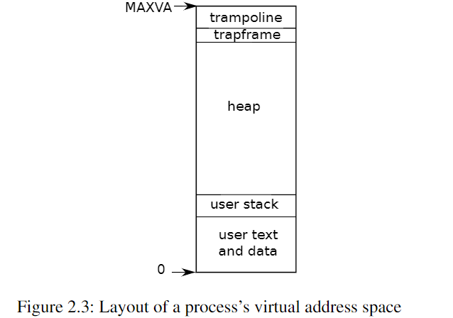

# Operating System Organization
An OS must fulfill
- Multiplexing
- Isolation
- Interaction

## Abstracting Physical Resources
Why bothered to have a OS? --- Library Approach
>  It’s more typical for applications to **not trust each other**, and to **have bugs**, so one often wants stronger isolation than a cooperative scheme provides 

- Isolation
- not to be aware of time-sharing
- Interaction Using File Descripters

## User/Supervised Mode,System Calls
application `foo` failed shouldn't fail the OS

>  To achieve **strong isolation**, the operating system must arrange that applications **cannot modify (or even read) the operating system’s data structures and instructions** and that applications **cannot access other processes’ memory**

RISC-V has 3 modes:
* machine mode: All instructions
* supervisor mode: Privileged instructions --- run on kernel space
* user mode: Limited ---run on user space

> CPUs provide a special instruction that **switches the CPU from user mode to supervisor mode** and **enters the kernel at an entry point** specified by the kernel

RISC-V: the `ecall` instruction

## Kernel Organization
> Monolithic Kernel: the **entire operating system resides in the kernel**, so that the implementations of all system calls run in supervisor mode
> 
> MicroKernel:  **minimize the amount of operating system code** that runs in supervisor mode, and execute the bulk of the operating system in user mode.
> 
> There is much debate among developers of operating systems about which organization is better, and there is no conclusive evidence one way or the other. Furthermore, **it depends much on what “better” means**: faster performance, smaller code size, reliability of the kernel, reliability of the complete operating system (including user-level services), etc.

## Code:xv6 Organization
The xv6 kernel sources are in the `kernel/` directory.

Inter-Module interfaces are defined in `defs.h`

## Process Overview
The unit of Isolation: Process

Mechanisms used by kernel to implement process:
- user/supervisor mode flag
- address spaces: by page-tables in xv6
- time-slicing of threads

> the **trampoline page** contains the code to **transition in and out of the kernel** and mapping the **trapframe** is necessary to **save/restore the state of the user process**

states of a process are stored in `struct proc`,located in `kernel/proc.h:85`

Each process has 2 stacks. Process’s thread alternates between actively using its **user stack** and its **kernel stack**.

- Process can make a system call using `ecall`
  - raise priviledge
  - change pc to a kernel-defined entry point
  - switch to kernel stack
  - execute kernel instructions
- Kernel can switch back using `sret`
  - switch to user stack
  - lower priviledge
  - resumes executing user instructions

`p->state`: whether the process is allocated, ready to run, running, waiting for I/O, or exiting.

`p->pagetable`: holds the process's pagetable

> In summary, a process bundles **two design ideas: an address space** to give a process the illusion of its own memory, and, **a thread**, to give the process the illusion of its own CPU

## Code:starting xv6,the first process and system call
An overview,see the corresponding part for detail.

## Security Model
- The operating system must assume that a **process’s user-level code will do its best to wreck the kernel or other processes**
- Kernel code is expected to be **bug-free**, and certainly to **contain nothing malicious**.

## Real World
Modern OS support **several threads within a process**, to allow a single process to exploit multiple CPUs.