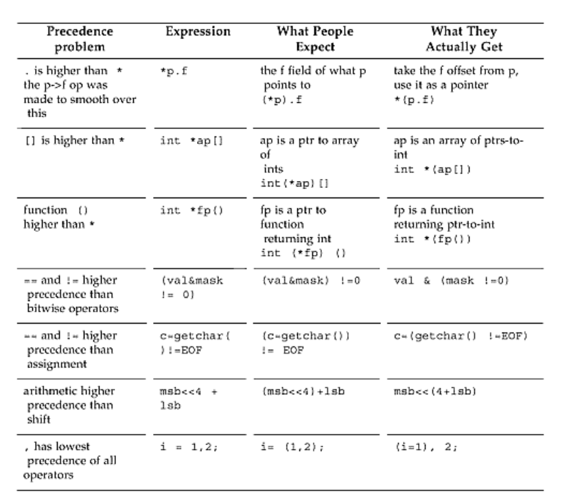
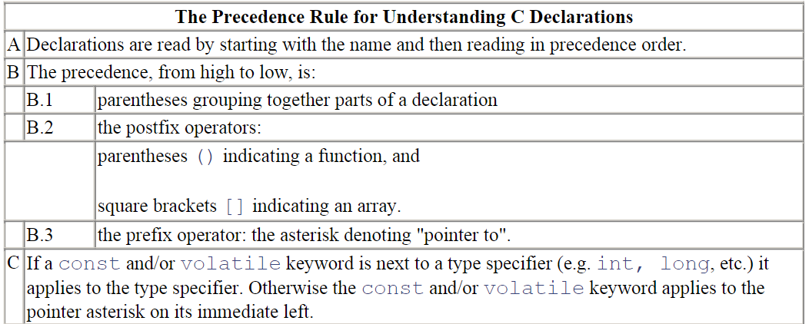
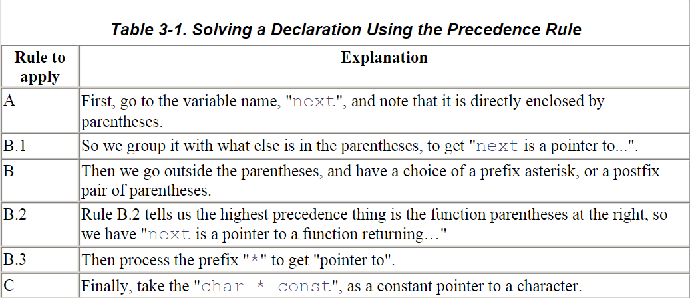

# The C Programming Language
> Macro use is best confined to **naming literal constants**, and **providing shorthand for a few well-chosen constructs**. **Define the macro name all in capitals** so that, in use, it's instantly clear it's not a function call. Shun any use of the C preprocessor that modifies the underlying language so that it's no longer C. 

```C
// Use Macro to nami=e literal constans
#define PI 3.14

// Use Macro as a shorthand
#define a(y) a_expanded(y)  
a(x); 
// expands into: 
a_expanded(x);
```

> **Prototype everything new** you write and **ensure the prototype is in scope for every call**.

```C
// better not to omit the name which may contain info useful to programmer
char* strcpy(char* dst,const char* src);
```

> The keyword **`const` doesn't turn a variable into a constant**! A symbol with the const qualifier **merely means that the symbol cannot be used for assignment**. This makes the value ***read-only*** through that symbol; it does not prevent the value from being modified through some other means internal (or even external) to the program. It is **pretty much useful only for qualifying a pointer parameter, to indicate that this function will not change the data that argument points to**, but other functions may

```C
const int limit = 10;
const int* limitp = &limit;

int i = 10;
limitp = &i;
// limitp is "a pointer points to a const int"
// but itself can be changed
```

> Avoid unnecessary complexity by **minimizing your use of unsigned types**. Specifically,don't use an unsigned type to represent a quantity just because it will never be negative.
> **Only use unsigned types for bitfields or binary masks**. Use casts in expressions, to make all the operands signed or unsigned, so the compiler does not have to choose the result type.

```C
// To define the size of an array
#define TOTAL_ELEMENTS (sizeof(array) / sizeof(array[0]))
// It allows the type of element in the array to change
```

> **Always put parentheses around** an expression that mixes Booleans, arithmetic, or bit-twiddling with anything else.
> There are only two precedence levels to remember in C: **multiplication and division come before addition and subtraction.Everything else should be in parentheses**.



> Lint is your software conscience. It tells you when you are doing bad things. Always use lint. Listen to your conscience. 

```C
// review the struct definition
struct optional_tag { 
    type_1 identifier_1;  
    type_2 identifier_2;  
    ...  
    type_N identifier_N;  
} optional_variable_definitions;
// But prefer 
struct optional_tag foo,bar;
// variable declarations should be separate from the type declaration
// write once and read many times
```

To parse a declaration:

follows an example


```C
// typedef can be a really handy function
void (*signal(int sig, void (*func)(int)) ) (int);
// can be write as
// typedef act like declaring
typedef void (*ptr_to_func) (int);  // now ptr_to_func can be used
ptr_to_func signal(int, ptr_to_func); 
```
Handling the Declaration part is much like constructing a parser in a complier. So if you are going to build a complier, remind yourself of this part in C.

Refer to ==Expert in C: ch3== to read the code. You will benefit from that! 