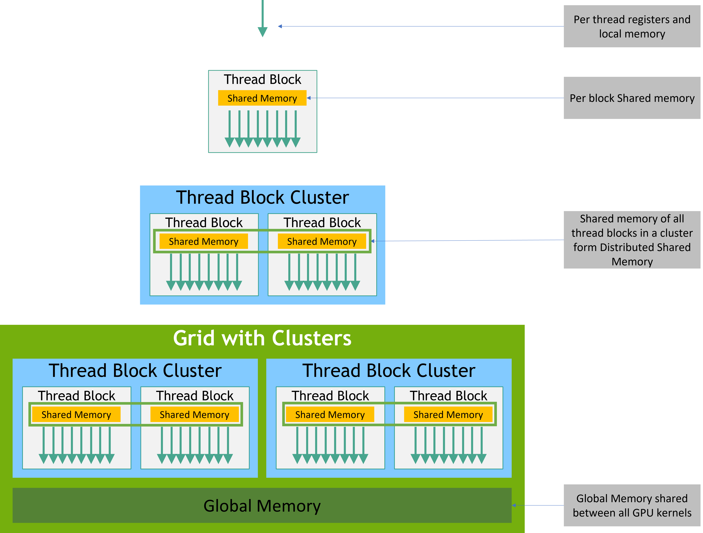

# Cuda Programming
## Documents
[Cuda Reference](https://docs.nvidia.com/cuda/index.html)
[Cuda C Programming Guide](https://docs.nvidia.com/cuda/cuda-c-programming-guide/index.html)
[Cuda C Best Practices Guide](https://docs.nvidia.com/cuda/cuda-c-best-practices-guide/index.html)
[cuFFT API](https://docs.nvidia.com/cuda/cufft/index.html)
## Self-Teaching Notes
Quick Links:
- [Cuda Programming](#cuda-programming)
  - [Documents](#documents)
  - [Self-Teaching Notes](#self-teaching-notes)
    - [Configuration](#configuration)
    - [Programming Model {#model}](#programming-model-model)
    - [Programming Interface {#interface}](#programming-interface-interface)
    - [API](#api)
      - [cuFFT](#cufft)
    - [Profile](#profile)
      - [Docs](#docs)
      - [Notes](#notes)
        - [Nsight System](#nsight-system)
### Configuration
`nvidia-smi` to see which version of cuda to be installed
Go to [cuda-toolkit-Download-Site](https://developer.nvidia.com/cuda-toolkit) to download the corresponding version

### Programming Model {#model}
A GPU is built around an array of Streaming Multiprocessors.A multithreaded program is partitioned into blocks of threads that execute independently from each other, so that a GPU with more multiprocessors will automatically execute the program in less time than a GPU with fewer multiprocessors.

```c++
// Kernel definition: The code will be execute on GPU
__global__ void VecAdd(float* A, float* B, float* C)
{
    // threadIdx is a 3-component vector
    // for a 2D block with size (Dx,Dy)
    // the thread ID of a thread of index (x,y) is (x + y * Dx)
    // i.e. thread is placed first on x Dimension,then y,then z
    int i = threadIdx.x;
    C[i] = A[i] + B[i];
}

int main()
{
    ...
    // Kernel invocation with N threads
    VecAdd<<<1, N>>>(A, B, C);
    ...
}
```
```c++
// 2D block
// Kernel definition
__global__ void MatAdd(float A[N][N], float B[N][N],
                       float C[N][N])
{
    int i = threadIdx.x;
    int j = threadIdx.y;
    // Note that this is not a good style
    // Adjacent threads are not accessing adjacent elements
    // ex: thread 0 and 1 will have i=0,1 and j=0,0
    // Which means they access the different row of elements
    C[i][j] = A[i][j] + B[i][j];
}

int main()
{
    ...
    // Kernel invocation with one block of N * N * 1 threads
    int numBlocks = 1;
    dim3 threadsPerBlock(N, N);
    MatAdd<<<numBlocks, threadsPerBlock>>>(A, B, C);
    ...
}
```
On current GPUs, a thread block may contain up to 1024 threads.
The number of threads per block and the number of blocks per grid specified in the <<<...>>> syntax can be of type `int` or `dim3`

Each block within the grid can be identified by a one-dimensional, two-dimensional, or three-dimensional unique index accessible within the kernel through the built-in `blockIdx` variable. The dimension of the thread block is accessible within the kernel through the built-in `blockDim` variable.
```c++
// Kernel definition
__global__ void MatAdd(float A[N][N], float B[N][N],
float C[N][N])
{
    // 2D Grid and 2D Block
    // Carefully Check the index
    int i = blockIdx.x * blockDim.x + threadIdx.x;
    int j = blockIdx.y * blockDim.y + threadIdx.y;
    if (i < N && j < N)
        C[i][j] = A[i][j] + B[i][j];
}

int main()
{
    ...
    // Kernel invocation
    dim3 threadsPerBlock(16, 16);
    dim3 numBlocks(N / threadsPerBlock.x, N / threadsPerBlock.y);
    MatAdd<<<numBlocks, threadsPerBlock>>>(A, B, C);
    ...
}
```
Thread blocks are required to execute independently: It must be possible to execute them in any order, in parallel or in series. This independence requirement allows thread blocks to be scheduled in any order across any number of cores, enabling programmers to write code that scales with the number of cores.

Similar to how threads in a thread block are guaranteed to be co-scheduled on a streaming multiprocessor, thread blocks in a cluster are also guaranteed to be co-scheduled on a GPU Processing Cluster (GPC) in the GPU.

Thread blocks that belong to a cluster have access to the Distributed Shared Memory. 

the CUDA programming model assumes that the CUDA threads execute on a physically separate device that operates as a coprocessor to the host running the C++ program. This is the case, for example, when the kernels execute on a GPU and the rest of the C++ program executes on a CPU.
The CUDA programming model also assumes that both the host and the device maintain their own separate memory spaces in DRAM, referred to as host memory and device memory, respectively. 

> Asychronous Model May be an advanced way of Programming --- Left to be learnt

The compute capability of a device is represented by a version number, also sometimes called its “SM version”. This version number identifies the features supported by the GPU hardware and is used by applications at runtime to determine which hardware features and/or instructions are available on the present GPU.

The compute capability comprises a major revision number X and a minor revision number Y and is denoted by X.Y.
type `nvidia-smi --query-gpu=compute_cap --format=csv` to get your compute capability
> On my Lenovo,it is 6.1,which is the Pascal architecture

### Programming Interface {#interface}
`nvcc` is a compiler driver that simplifies the process of compiling C++ or PTX code: It provides simple and familiar command line options and executes them by invoking the collection of tools that implement the different compilation stages.

Binary code is architecture-specific. A cubin object is generated using the compiler option `-code` that specifies the targeted architecture: For example, compiling with `-code=sm_80` produces binary code for devices of compute capability 8.0. Binary compatibility is guaranteed from one minor revision to the next one, but not from one minor revision to the previous one or across major revisions. In other words, a cubin object generated for compute capability X.y will only execute on devices of compute capability X.z where z≥y.

Device memory can be allocated either as linear memory or as CUDA arrays.

Linear memory is typically allocated using `cudaMalloc()` and freed using `cudaFree()` and data transfer between host memory and device memory are typically done using `cudaMemcpy()`

```c++
// Device code
__global__ void VecAdd(float* A, float* B, float* C, int N)
{
    int i = blockDim.x * blockIdx.x + threadIdx.x;
    if (i < N)
        C[i] = A[i] + B[i];
}

// Host code
int main()
{
    int N = ...;
    size_t size = N * sizeof(float);
    // Allocate input vectors h_A and h_B in host memory
    float* h_A = (float*)malloc(size);
    float* h_B = (float*)malloc(size);
    float* h_C = (float*)malloc(size);
    // Initialize input vectors
    ...
    // Allocate vectors in device memory
    float* d_A;
    cudaMalloc(&d_A, size);
    float* d_B;
    cudaMalloc(&d_B, size);
    float* d_C;
    cudaMalloc(&d_C, size);
    // Copy vectors from host memory to device memory
    cudaMemcpy(d_A, h_A, size, cudaMemcpyHostToDevice);
    cudaMemcpy(d_B, h_B, size, cudaMemcpyHostToDevice);
    // Invoke kernel
    int threadsPerBlock = 256;
    int blocksPerGrid =
            (N + threadsPerBlock - 1) / threadsPerBlock;
    VecAdd<<<blocksPerGrid, threadsPerBlock>>>(d_A, d_B, d_C, N);
    // Copy result from device memory to host memory
    // h_C contains the result in host memory
    cudaMemcpy(h_C, d_C, size, cudaMemcpyDeviceToHost);
    // Free device memory
    cudaFree(d_A);
    cudaFree(d_B);
    cudaFree(d_C);
    // Free host memory
    ...
}
```
Linear memory can also be allocated through `cudaMallocPitch()` and `cudaMalloc3D()`. These functions are recommended for allocations of 2D or 3D arrays as it makes sure that the allocation is appropriately padded to meet the alignment requirements described in Device Memory Accesses, therefore ensuring best performance when accessing the row addresses or performing copies between 2D arrays and other regions of device memory (using the `cudaMemcpy2D()` and `cudaMemcpy3D()` functions). The returned pitch (or stride) must be used to access array elements.

```c++
// Host code
int width = 64, height = 64;
float* devPtr;
size_t pitch;
cudaMallocPitch(&devPtr, &pitch,
                width * sizeof(float), height);
MyKernel<<<100, 512>>>(devPtr, pitch, width, height);

// Device code
__global__ void MyKernel(float* devPtr,
                         size_t pitch, int width, int height)
{
    for (int r = 0; r < height; ++r) {
        float* row = (float*)((char*)devPtr + r * pitch);
        for (int c = 0; c < width; ++c) {
            float element = row[c];
        }
    }
}
```
```c++
// access global variables
__constant__ float constData[256];
float data[256];
cudaMemcpyToSymbol(constData, data, sizeof(data));
cudaMemcpyFromSymbol(data, constData, sizeof(data));

__device__ float devData;
float value = 3.14f;
cudaMemcpyToSymbol(devData, &value, sizeof(float));

__device__ float* devPointer;
float* ptr;
cudaMalloc(&ptr, 256 * sizeof(float));
cudaMemcpyToSymbol(devPointer, &ptr, sizeof(ptr));
```
`cudaGetSymbolAddress()` is used to retrieve the address pointing to the memory allocated for a variable declared in global memory space. The size of the allocated memory is obtained through `cudaGetSymbolSize()`.
### API
#### cuFFT 
Self-Optimization for FFT see [My FFT Notes](./fft.md).This section is just for describing the use of cuFFT,lay the foundation of `How to Profiler the performance` Section.

To call cuFFT routines in `foo.cu`,include file `cufft.h` or `cufftXt.h` into `foo.cu` and include the library in the link line like the following:

`nvcc [options] filename.cu … -I/usr/local/cuda/inc -L/usr/local/cuda/lib -lcufft`

### Profile
#### Docs
[Nsight Systems](https://docs.nvidia.com/nsight-systems/index.html)
[Nsight Compute](https://docs.nvidia.com/nsight-compute/index.html)
#### Notes
##### Nsight System
`nsys --help` to get common uses
- `nsys profile foo`: specify options and begin analysis.
- interactive commands 


