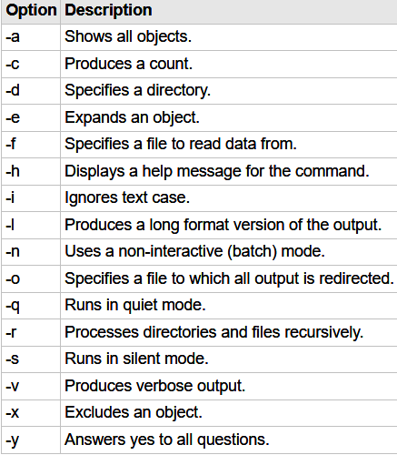

# Linux Command Line and Shell Script Bible
## Table of Contents
- [ch1](#ch1-linux-shell)
- [ch2](#ch2-getting-to-the-shell)
- [ch3](#ch3-bash-shell-basic-commands)
- [ch4](#ch4-more-base-shell-commands)
- [ch17](#ch17)
- [ch19](#ch19introducting-sed-and-gawk)

## ch1: Linux Shell
- Kernel
  - System Memory Management
    - swap space
  - Software
    - init process
    - runlevel
    - unit file:Link processes
    - target:Define runlevels
  - Hardware
    - device file
  - File System Management
- GNU utilities
  - coreutils 
  - shell
- Desktop
## ch2: Getting to the Shell
- Reaching the Command Line
  - in the GUI: `ctrl + alt + T` --- Go in to the simulator
  - outside the GUI: `ctrl + alt F1/F2/F...` --- Go into the Virtual Terminal
  - GNOME Terminal
  - Shortcuts
    - Create and Delete `tab/window`
    - `Resize` window
    - `move/switch` tab
## ch3: Bash shell basic commands
- usr configurations are in `/etc/passwd`
- prompt
- bash `man`
  - `man command`
  - `man -k keyword`
  - `man section topic`

  - `info info`
  - `command -h/--help`
- root 
  - mount point 

- traversing dirs
  - `cd` `pwd`
  - absolute path
  - relative path `.` `..`
  - `ls -F(file/dir) -R(recursive) -a(all) -l(list)`
  - wildcard
    - `scri?t`:a single char
    - `scri*t`:any number of char
    - `scri[pq]t`:one of chars in the bracket
    - `scri[a-i]t`:one of chars from a - i
    - `scri[!p]t`:except the char
  - file opearation
    - create:`touch foo`
    - copy: `cp -i(avoid overwriting) foo foobar`
  - tab completion
  - Linking files
    - symbolic link: a pointer
    - hard link: the same file
  - `mv` : move file or rename
  - `rm` : remove file
  - `mkdir`: make directory.
    - `mkdir -p(parent)` : auto create parent dir
- Look into Files
  - `file`: Check type
  - `cat -n(number the lines) -b(number except blank lines)` : read from stdin and write to stdout line by line
  - `less` : a useful pager
  - `tail -n(number of lines) num file`
  - `head -n(number of lines) num file`
## ch4: More Base Shell Commands
## ch5:
## ch6:
## ch10: Text Editor
This chapter is skipped.
## ch11: Basic Scripts
- specify the shell to be used in the first line
  - `#!/bin/bash`
  - enter command and add a `\n`
  - `chmod u+x foo.sh`
- `echo -n(don't output newline)`
- reference a variable by prefix a `$` to it
- assignment: `x=5` 
  - Don't add space between literals and `=`
- command substitution
  - using backquotes: foo=\`date\`
  - using brackets: foo=${date}
```shell
#!/bin/bash
# an example of command substitution
# create a log file named log.{date}
today=${date +%Y%m%d}
ls ./* > log.$today
```
- Redirection
  - `>(output redirection --- overwrite)` `>> (append)` 
  - `<(input redirection)` `<<(inline input redirection)`
- pipe: `command_a | command_b`
- Do some Math
  - use brackets
  - use `bc` command
```shell
#!/bin/bash
# Use bracket to do math(only Interger Math)
var1=100
var2=40
var3=$[$var1 - $var2]
```
```shell
#!/bin/bash
# Use bc to do math
 
var1=10.46
var2=43.67
var3=33.2
var4=71
# inline input redirection
var5=$(bc << EOF
scale = 4
a1 = ( $var1 * $var2)
b1 = ($var3 * $var4)
a1 + b1
EOF
)
```
- Use `echo $?` to check the exit status

- `exit num` to specify your own exit status code
## ch12: Structured Commands
```shell
# if command's exit status is 0,then execute commands
if command
then
    commands
elif command 
    commands
else
    commands
fi
# Use `test condition` to make it act like bool
# man test to see what can be test
# in short,test can test number,String and file
if test {condition}
then 
    commands
fi
# A shortway to write this
if [ condition ] # note the space is a must
then
    commands
fi
# Only && and || can be used as bool operator
if [ condition_1 ] && [ condition_2 ]
then
    commands
fi
## Advanced Features of if-then
# run commands in subshell using ()
if (command)
# use advanced expr by (()),needn't escape < or >
if (( $val ** 2 > 90 ))
# Pattern Match using [[]]
if [[ string == patt*rn ]] # treat as wildcards
if [[ string =~ pattee*n ]] # treat as regex
```
```shell
# case statement
case variable in 
pattern1 | pattern2) commands1;;
pattern3) commands2;;
*) default commands;;
esac
```
## ch13:More Structured Commands
```shell
#!/bin/bash
# for Loop
for var in list
do 
  commands
done
# for loop assumes list is separated by spaces --- blank,tab,newline
# read var from variable
list="A B C D E"
list=$list" F" # a shortway to concatenate list
for char in $list
do
  echo "Current character is $char"
done
# read var from file(separated by space)
file="states.txt"
for state in $(cat $file)
do 
  echo "beautiful state: $state"
done
# read var from wildcards
for file in /home/*
do
  commands
done
# can be piped or redirection
for file in /home/*
do 
  echo "file"
done | sort > output.txt
# Modify variable IFS to use your own delimiter
# The default value of IFS is built into the shell itself. It's not something external to the shell you can find without looking at the shell's source code
IFS=$'\n' # use \n as delimiter
# in the following case,\n and : and ; and " are all delimiters
IFS=$'\n:;"' # use more than one delimiter

# C-like for loop
for (( i=1; i <= 10; i++ ))
do
  echo $i
done
```
```shell
# while Loop
while test command
do
  commands
done
# Just like if-then
# Multi-test: Only the last command will be used to terminate the loop
while command1 command2
do
  doSomething
done
##################
# until Loop: when test is not successful
until test command
do
  commands
done
# example
until [ $var -eq 0 ] 
dp
  echo $var
  var=$[ $var - 25 ]
done
```
Appendix:
- break and continue acts C-like
  - break n:by default,`n=1`,means the level to jump out
  - continue n:similar as `break n`
## ch14:Handling User Input
- Positional Parameter
  - `$0 $1-$9 ${10}-...`
```shell
# Using basename with $0 
name = $(basename $0)
echo this script name is $name
exit
# before using positional parameter,You must check if it is empty
if [ -n $1 ]
then
  do something with $1
fi
# Using $# to get number of parameters
echo The number of paramters is $#
echo The last parameter is ${!#} # Note that ${$#} won't work
# Using $* and $@ to traversing the parameters
# $* will treat all parameters as one
# $@ will treat parameters as a list
for param in "$*"
do
  echo $param # only print once
done

for param in "$@"
do
  echo $param # print parmas' number times,one by one
done
# Using shift to shift position of parameters
while [ -n $1 ]
do 
  echo $1
  shift  # $1=$2,$2=$3...
  # you can also shift n times
  shift 2 # $1,2,3... = $3,4,5...
done
# Using Shift and Case to handle options
while [ -n $1 ]
do
  case "$1" in 
    -a) echo "-a Option Found";;
    -b) echo "...";;
    -c) echo "...";;
    *) echo "$1 is Not an Option";;
  esac
done
# Using getopt to handle parameters
# `man opt` to get help
set -- $(getopt -q ab:cd "$@") # substitute the position parameters with $()
echo
while [ -n $1 ]
do
  case "$!" in
    ...
  esac
done
# getopt will treat "param1 param2" as "param1 | param2",i.e.2 params
# Using getopts
# `man getopts` to get help
while getopts :ab:c opt
do
  case $opt in
    ... 
  esac
done
``` 

Appendix:
- `read`: see [command-note](./cmd_note.md)
## ch15: Presenting Data
```shell
# error redirection in shell
ls -al badfile 2> error.log # prefix file descripter to > 
ls -al badfile &> output.log # stdout and stderr both send to output.log
# Temporary Redirection in script
echo "this is an error" >&2 # output to &2 fd,which is stderr
# Permanent Redirection in script
exec 1>out.log # redirect stdout to out.log
exec 2>error.log # redirect stderr to error.log
exec 0<input.txt # redirect stdin
# example 
exec 0< testfile
while read line
do
  echo "LIne in the file: $line"
done
# Create your own fd
exec 3>myfd.txt
echo "To my file descripter" >&3
# redirect fd
exec 3>&1 # redirect &3 to &1
# read/write using different fd:if only one,the pointer is hard to control
# close a fd
exec 3>&-
# Use lsof to check fd being used
# `man lsof` to get help
lsof -a -p $$ -d 0,1,2
# discard output
ls -ad > /dev/null
# flush file: needn't rm and touch again
cat /dev/null > testfile
# Use mktemp to create temporary file in /tmp.`man mktemp` to get help
# Use tee to simutaneously write and display
echo hello world | tee testfile
echo hello another world | tee -a testfile
```
## ch16:
## ch17:Creating Functions
```shell
# Declare function
function name {
  ...
}
# another way
name() {
  ...
}
# to call a function,just type it like a command
function name {
  echo hello world
}
name
# function should be declared before called
# re-declare function will overwrite
##################################
# return value of function can be one of the followings:
# 1. the return value of the last command in the function(default)
# 2. use `return value`
# 3. use $(function name): the output of name
function db {
  read -p "enter a value:" value
  return $value
}

function db {
  read -p "enter a value:" value
  echo $[ $value * 2 ]
}
result=${db}
# Functions are like tiny script,You can use position parameters
# You can use $# to get the total number of parameters
# To pass script params to functions,You should do it manually
# This is a bad example
function bad {
  echo $[ $1 + $2 ]
}
bad # not work
bad $1 $2 # correct
# global variables : declared outside the function
# if function modify the variable,the effect is permanent
# to handle this,use `local`
value=1
function modify {
  value = $[ $value + 1 ] # value will be modified even outside the function
  local value = $[ $value + 1 ] # only in the funciton
}
# use `source foo` to activate foo in the current context
# suppose in file foo
function add {
  echo $[ $1 + $2 ]
}
# and in another file bar
# we want to use function add
source ./foo # activate foo in the bar's context,`. ./foo` is also correct
add 10 15
```
## ch18:
## ch19:Introducting sed and gawk
### sed
`sed` is for `stream editor`
```shell
# sed won't modify in-place,it just process the input and send to output
echo "This is a test" | sed 's/test/big test/' # s is substitute
# To use more command,specify -e or -f
sed -e 's/pattern a/pattern b/; s/pattern c/pattern d/' foo.txt
sed -f command_list.txt foo.txt # command stored in a file line by line
```
```shell
# More Commands of sed
# Substitution
```
### gawk
`gawk` is for `GNU awk`
```shell
# a gawk script should be wrap using {}
# Besides, it will be treat as a string,so '' is also needed
gawk '{print hello world}' foo.txt
```
## ch20:Regular Expresstions 
## ch21:Advanced sed
## ch22:Advanced gawk