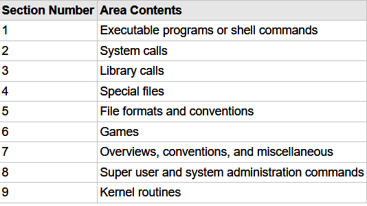
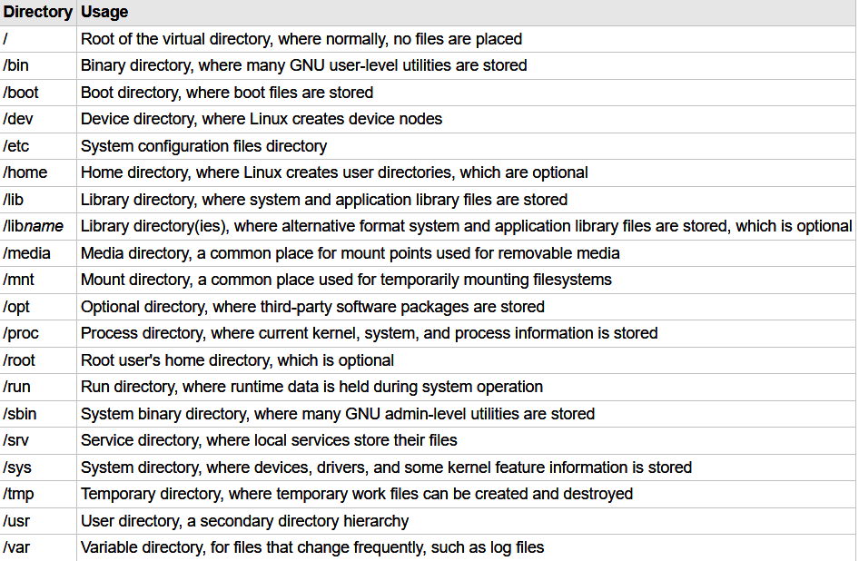
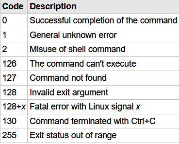

# Linux Command Line and Shell Script Bible
## ch1: Linux Shell
- Kernel
  - System Memory Management
    - swap space
  - Software
    - init process
    - runlevel
    - unit file:Link processes
    - target:Define runlevels
  - Hardware
    - device file
  - File System Management
- GNU utilities
  - coreutils 
  - shell
- Desktop
## ch2: Getting to the Shell
- Reaching the Command Line
  - in the GUI: `ctrl + alt + T` --- Go in to the simulator
  - outside the GUI: `ctrl + alt F1/F2/F...` --- Go into the Virtual Terminal
  - GNOME Terminal
  - Shortcuts
    - Create and Delete `tab/window`
    - `Resize` window
    - `move/switch` tab
## ch3: Bash shell basic commands
- usr configurations are in `/etc/passwd`
- prompt
- bash `man`
  - `man command`
  - `man -k keyword`
  - `man section topic`

  - `info info`
  - `command -h/--help`
- root 
  - mount point 

- traversing dirs
  - `cd` `pwd`
  - absolute path
  - relative path `.` `..`
  - `ls -F(file/dir) -R(recursive) -a(all) -l(list)`
  - wildcard
    - `scri?t`:a single char
    - `scri*t`:any number of char
    - `scri[pq]t`:one of chars in the bracket
    - `scri[a-i]t`:one of chars from a - i
    - `scri[!p]t`:except the char
  - file opearation
    - create:`touch foo`
    - copy: `cp -i(avoid overwriting) foo foobar`
  - tab completion
  - Linking files
    - symbolic link: a pointer
    - hard link: the same file
  - `mv` : move file or rename
  - `rm` : remove file
  - `mkdir`: make directory.
    - `mkdir -p(parent)` : auto create parent dir
- Look into Files
  - `file`: Check type
  - `cat -n(number the lines) -b(number except blank lines)` : read from stdin and write to stdout line by line
  - `less` : a useful pager
  - `tail -n(number of lines) num file`
  - `head -n(number of lines) num file`
## ch4: More Base Shell Commands
## ch10: Text Editor
This chapter is skipped.
## ch11: Basic Scripts
- specify the shell to be used in the first line
  - `#!/bin/bash`
  - enter command and add a `\n`
  - `chmod u+x foo.sh`
- `echo -n(don't output newline)`
- reference a variable by prefix a `$` to it
- assignment: `x=5` 
  - Don't add space between literals and `=`
- command substitution
  - using backquotes: foo=\`date\`
  - using brackets: foo=${date}
```shell
#!/bin/bash
# an example of command substitution
# create a log file named log.{date}
today=${date +%Y%m%d}
ls ./* > log.$today
```
- Redirection
  - `>(output redirection --- overwrite)` `>> (append)` 
  - `<(input redirection)` `<<(inline input redirection)`
- pipe: `command_a | command_b`
- Do some Math
  - use brackets
  - use `bc` command
```shell
#!/bin/bash
# Use bracket to do math(only Interger Math)
var1=100
var2=40
var3=$[$var1 - $var2]
```
```shell
#!/bin/bash
# Use bc to do math
 
var1=10.46
var2=43.67
var3=33.2
var4=71
# inline input redirection
var5=$(bc << EOF
scale = 4
a1 = ( $var1 * $var2)
b1 = ($var3 * $var4)
a1 + b1
EOF
)
```
- Use `echo $?` to check the exit status

- `exit num` to specify your own exit status code
## ch12: Structured Commands
```shell
# if command's exit status is 0,then execute commands
if command
then
    commands
elif command 
    commands
else
    commands
fi
# Use `test condition` to make it act like bool
# man test to see what can be test
# in short,test can test number,String and file
if test {condition}
then 
    commands
fi
# A shortway to write this
if [ condition ] # note the space is a must
then
    commands
fi
# Only && and || can be used as bool operator
if [ condition_1 ] && [ condition_2 ]
then
    commands
fi
## Advanced Features of if-then
# run commands in subshell using ()
if (command)
# use advanced expr by (()),needn't escape < or >
if (( $val ** 2 > 90 ))
# Pattern Match using [[]]
if [[ string == patt*rn ]] # treat as wildcards
if [[ string =~ pattee*n ]] # treat as regex
```
```shell
# case statement
case variable in 
pattern1 | pattern2) commands1;;
pattern3) commands2;;
*) default commands;;
esac
```
## ch13:More Structured Commands
```shell
#!/bin/bash
# for Loop
for var in list
do 
  commands
done
# for loop assumes list is separated by spaces --- blank,tab,newline
# read var from variable
list="A B C D E"
list=$list" F" # a shortway to concatenate list
for char in $list
do
  echo "Current character is $char"
done
# read var from file(separated by space)
file="states.txt"
for state in $(cat $file)
do 
  echo "beautiful state: $state"
done
# read var from wildcards
for file in /home/*
do
  commands
done
# can be piped or redirection
for file in /home/*
do 
  echo "file"
done | sort > output.txt
# Modify variable IFS to use your own delimiter
# The default value of IFS is built into the shell itself. It's not something external to the shell you can find without looking at the shell's source code
IFS=$'\n' # use \n as delimiter
# in the following case,\n and : and ; and " are all delimiters
IFS=$'\n:;"' # use more than one delimiter

# C-like for loop
for (( i=1; i <= 10; i++ ))
do
  echo $i
done
```
```shell
# while Loop
while test command
do
  commands
done
# Just like if-then
# Multi-test: Only the last command will be used to terminate the loop
while command1 command2
do
  doSomething
done
##################
# until Loop: when test is not successful
until test command
do
  commands
done
# example
until [ $var -eq 0 ] 
dp
  echo $var
  var=$[ $var - 25 ]
done
```
Appendix:
- break and continue acts C-like
  - break n:by default,`n=1`,means the level to jump out
  - continue n:similar as `break n`