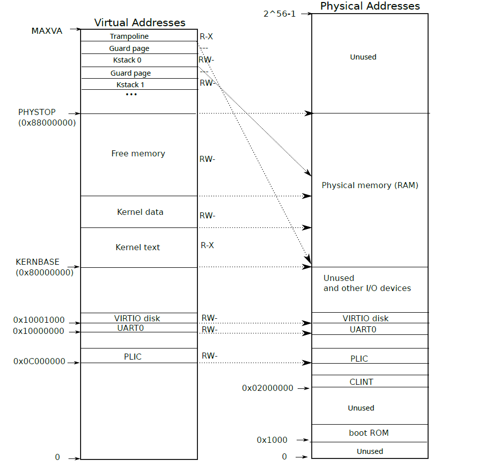
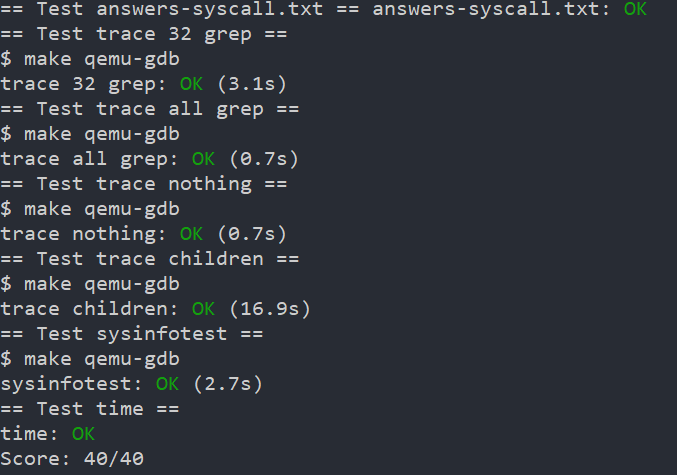

# System Calls
## Prerequisites
This lab requires you to read `xv6Book/ch2` and `xv6Book/ch4.3,4.4`.
And Your should also read the following source files:
* `user/usys.S` and `user/user.h`: route system calls into kernel
* `kernel/syscall.c` and `kernel/syscall.h`: route a system call to kernel function that implements it
* `kernel/proc.h` and `kernel/proc.c`:Process-related code

```bash
# To start the lab
git fetch
git checkout syscall
make clean
# To grade 
make grade
```
## Tasks
### Using GDB
run `make qemu-gdb` in one window and `gdb-multiarch` in another
> May have warning after enter gdb.follow the instructions in the prompts
#### Backtrace
then run the follows:
- `b syscall`
- `c`
- `layout src`
- `backtrace`

!!! question Looking at the backtrace output, which function called syscall?
the `usertrap()` at `kernel/trap.c:67`
#### Print Variables
- press `n` a few times until pass `struct proc *p = myproc();`
- type `p /x *p`:prints the current process's proc struct(`kernel/proc.h`) in hex

!!! question What is the value of `p->trapframe->a7` and what does that value represent?
type `p /x p->trapframe->a7` and get the answer `a7=0x7`,which is the syscall number of `exec`
#### Print registers
type `p /x $sstatus`

!!! question What was the previous mode that the CPU was in?

at `kernel/riscv.h: 45`,we can see that the previous mode is stored in the `SPP` bit,which is the 9th bit of the register.

now that we get `sstatus=0x22`,so `SPP = 0`,the previous mode is `user mode`
#### Debug Example
- replace `num = p->trapframe->a7;` with `num = * (int* ) 0;` at `syscall.c:137` to cause a page-fault
- search for the `sepc` value printed in the error message in `kernel/kernel.asm`

!!! question Write down the assembly instruction the kernel is panicing at. Which register corresponds to the varialable num?

`    80001ff6:	00002683          	lw	a3,0(zero) # 0 <_entry-0x80000000>`

- fire up `gdb` and set breakpoint at the faulting `epc`

`b *0x80001ff6`
`layout asm`
`c`

!!! question Why does the kernel crash? Hint: look at figure 3-3 in the text; is address 0 mapped in the kernel address space? Is that confirmed by the value in scause above?



address 0 is not mapped.
`scause = 0xd`
### System call tracing
- follow the 1st and 2nd hints to succeed the complilation
- Add a new variable `mask` in the `struct proc` in `kernel/proc.h`
- in `fork()`,copy `mask` from parent to child

```C
// in syscall.c:syscall()
// after the return value is put into a0
int isSet = (p->mask >> num) & 0x1;
if (isSet){
    printf("%d: syscall %s -> %d\n",p->pid,syscallNames[num],p->trapframe->a0);
}

```
### Sysinfo
```C
uint64
sys_sysinfo(void)
{
  // Get infos
  struct sysinfo info;
  info.freemem = getFreeMem(); // numOfElem in freelist * PGSIZE
  info.nproc = getNumOfProcNotUsed(); // Traverse the proc list
  // Get User pointer to sysinfo
  struct proc *p = myproc();
  uint64 usrInfo;
  argaddr(0,&usrInfo); // argument 0,not 1
  // Copy info to usrinfo
  if (copyout(p->pagetable,usrInfo,(char* )&info,sizeof(info))){
    return -1;
  }
  return 0;
}
```
## Conclusion
| GDB | Tracing | SysInfo |
| --- | --- | --- |
| -  | 45' | 60' |



This lab is easier than the last one, just to strengthen the understanding of the knowledge.

## Bugs
Pass wrong position to the `argaddr`