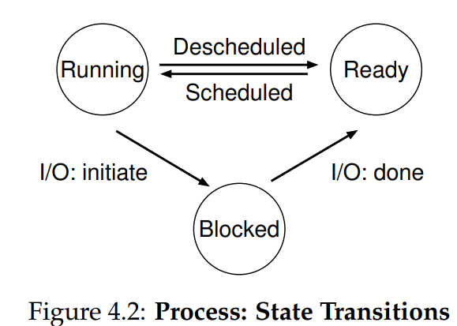
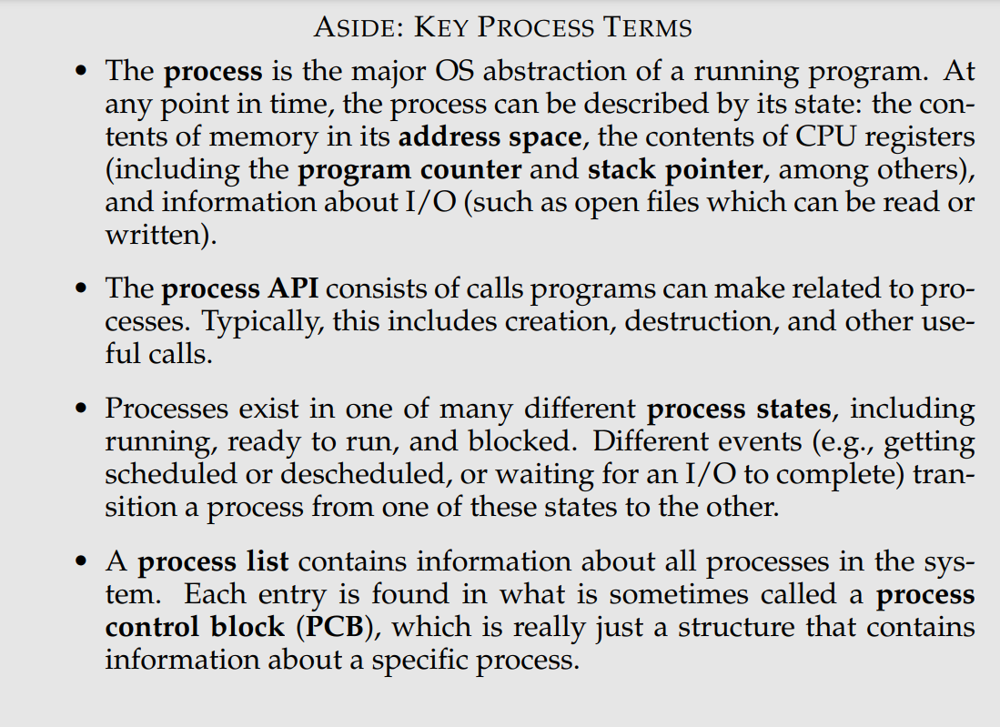
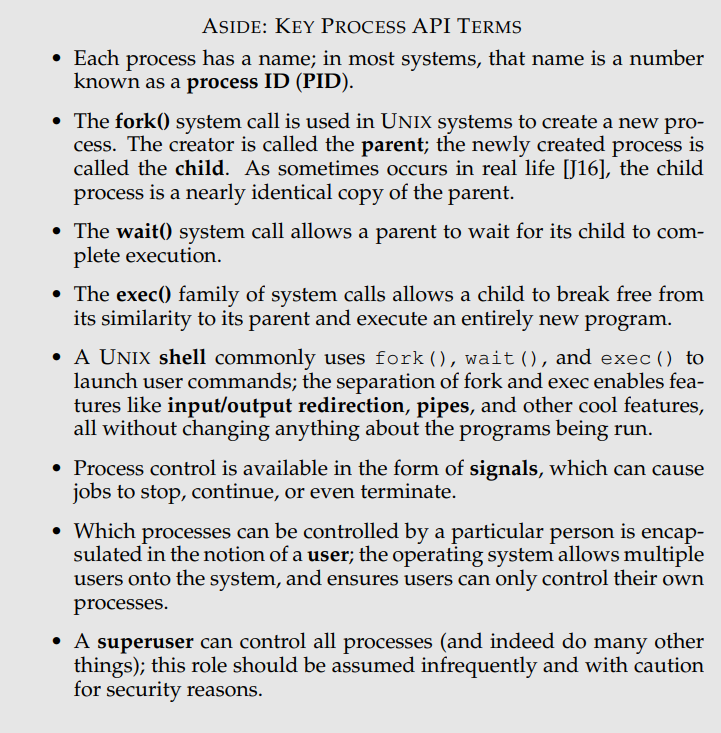

# Virtualization
## Process
### Notes
- a process is simply a running program
  - memory
  - registers
  - I/O information
  - `mechanism`: providing the answer to a `how` question about a system
    - for example, how does an operating system perform a contextswitch?
  - `policy`: provides the answer to a `which` question
    - for example,which process should the operating system run right now
- what must be included in any interface of an operating system
  - Create
  - Destroy
  - Wait
  - Miscellaneous Control
  - Status
- Process Creation
  - Load Code and Static Data 
  - Allocate memory for run-time stack
  - Allocate memory for heap
  - Other works like I/O Setup
  - start the program running at the entry point
- Process State
  - Running
  - Ready
  - Blocked 
- Data Structures
  - process list
  - register context
  - 

## Process API
### Notes
- `fork()` is used to create a new process
  - the process that is created is an (almost) exact copy of the calling process
  - the new process just comes into life as if it had called fork() itself. 
  - the value it returns to the caller of `fork()` is different.
    - the parent receives the PID of the newly-created child
    - the child receives a return code of zero
- `wait()`: parent waits for a child process to finish what it has been doing
- `exec()`: run a program that is different from the calling program
  - it does not create a new process; rather, it transforms the currently running program into a different running program.
  - a successful call to exec() never returns.
- `kill()`: send signals
- `signal()`: catch signals
- user tools
  - ps: see which processes are running
  - top: displays the processes of the system and how much CPU and other resources they are eating up
  - kill: send signals
- relevant reads
  - APUE:chapters on Process Control, Process Relationships, and Signals
  - “A fork() in the road” by Andrew Baumann, Jonathan Appavoo, Orran Krieger, Timothy Roscoe. HotOS ’19, Bertinoro, Italy
