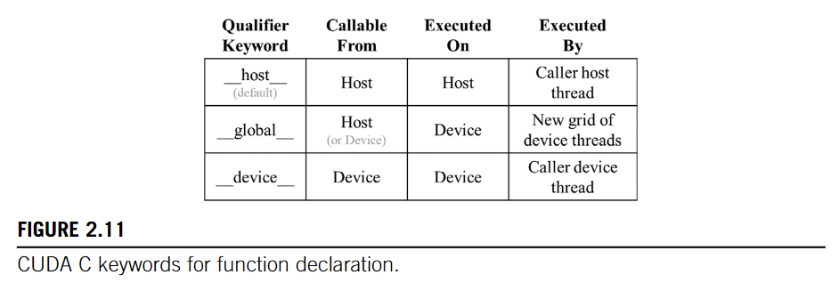
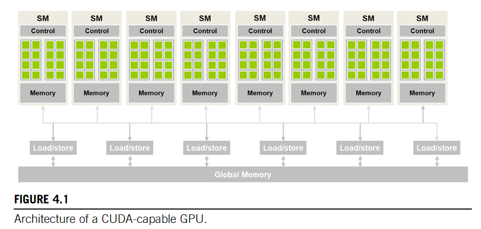
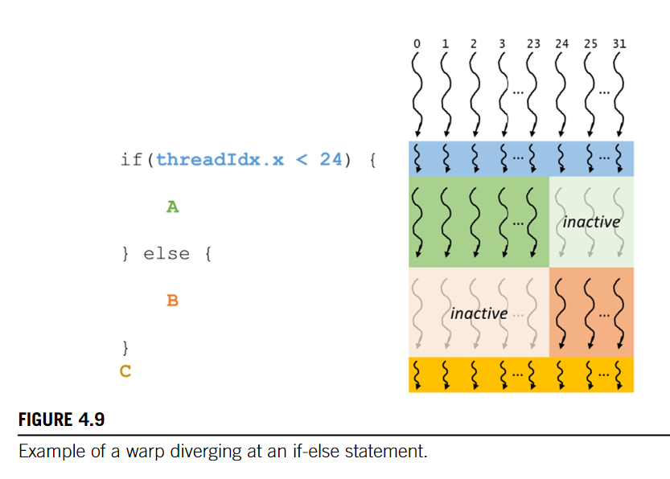
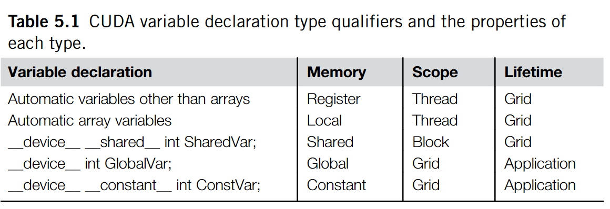
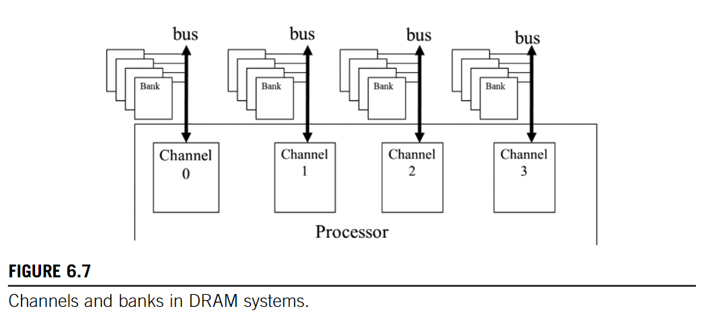
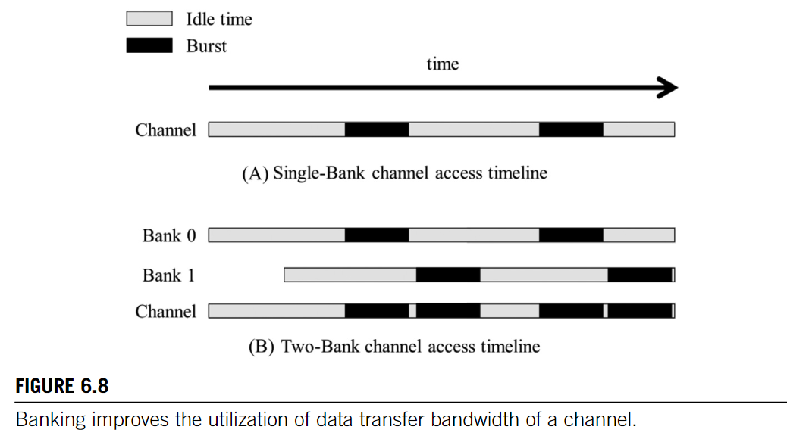
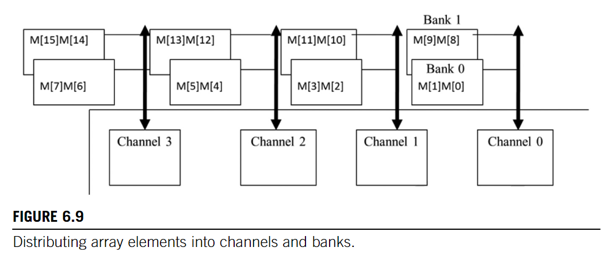
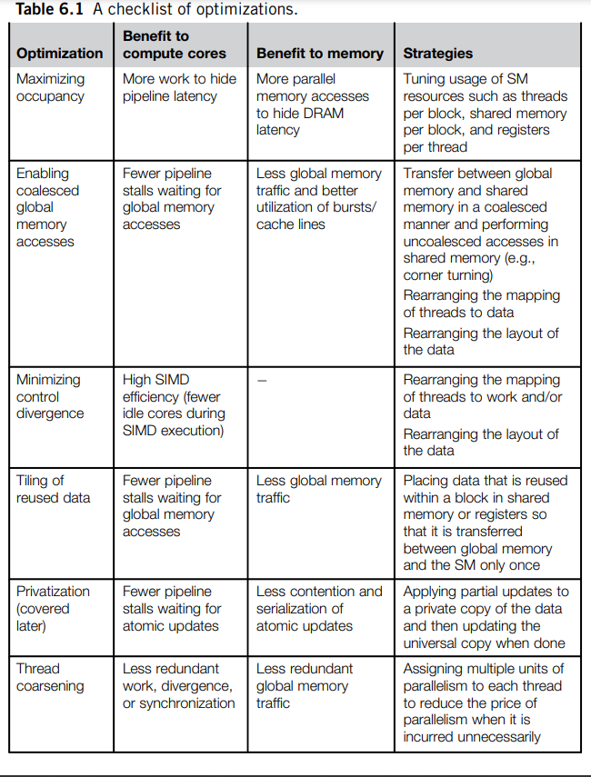

# CUDA Programming
## CUDA “Hello World"
```C
void vecadd(float *A_h, float *B_h, float *C_h, int n){
    // suffix _h indicate that the corresponding memory on host
    // _d indicates on device
    for(int i = 0; i < n; i++){
        C_h[i] = A_h[i] + B_[i];
    }
}

int main(int argc, char* argv[]){
    ...
    vecadd(A,B,C,N);
}
```

`vecadd` is a obvious example of **Data Parallelism**. We can launch a lot of threads, each thread calcutes one result.

```C
__global__ 
void vecAddKernel(float *A, float *B, float *C, int n){
    // calc thread coordinates
    int i = threadIdx.x + blockDim.x * blockIdx.x;  
    if (i < n)  // Check Bounds
        C[i] = A[i] + B[i];
}
```


You should allocate and free the kernel memory manually, and specify Grid Parameters to call the kernel

```C
void vecAdd(float *A, float *B, float *C, int n){
    float *A_d, *B_d, *C_d;
    int size = n * sizeof float;

    // Allocate memory on device
    // (void **) may be confusing
    // indeed, cudaMalloc gets the addr of A_d, and set the pointer
    // as a pointer pointing to memory on GPU. So it need &A_d
    cudaMalloc((void **)&A_d, size);
    cudaMalloc((void **)&B_d, size);
    cudaMalloc((void **)&C_d, size);
    // You should copy your memory from CPU to GPU
    cudaMemcpy(A_d, A, size, cudaMemcpyHostToDevice);
    cudaMemcpy(B_d, B, size, cudaMemcpyHostToDevice);
    // Invoke the kernel
    // launch a Grid: blocks specified in the first parameter
    // threads per block specified in the second parameter
    // Refer to CUDA programming guide for more ways of configuration
    vecAddKernel<<<ceil(n/256.0), 256>>>(A_d, B_d, C_d, n);
    // when calculation done, copy the result from device to host
    // Normally, CPU couldn't directly access GPU memory
    // To further process the data, memory should be copied back
    // cudaMemcpyAsync() may benefit this
    cudaMemcpy(C, C_d, size, cudaMemcpyDeviceToHost);
    // You must manually free the memory
    cudaFree(A_d);
    cudaFree(B_d);
    cudaFree(C_d);
}
```

## Multidimensional Grid Organization
* a **Grid** is a 3D array of **Blocks**
* a **Block** is a 3D array of **Threads**

```C
// declare the configuration 
dim3 dimGrid(32,1,1)    // (x,y,z)
dim3 dimBlock(128,1,1)
// launch the kernel
vecAddKernel<<<dimGrid, dimBlock>>>(...);
// a handy way to launch 1D block with 1D thread
vecAddKernel<<<ceil(n/256.0), 256>>>(A_d, B_d, C_d, n);
```
CUDA uses **row-major** to linearize a multidimensional array.
* Place all elements of the same row into consecutive locations.
* The rows are then placed one after another into the memory space.

## Architecture
* SM: **S**treaming **M**ultiprocessors


The assignment of threads to SMs on a **block-by-block** basis guarantees that **threads in the same block are scheduled simultaneously on the same SM**. This guarantee makes it possible for **threads in the same block to interact with each other** in ways that threads across different blocks cannot

* `__syncthreads()`: Barrier Synchronization
```C
// bad case
if(threadIdx.x % 2 == 0){
    ...
    __syncthreads();
} else {
    ...
    __syncthreads();
}
// will cause undefined behavior
```

Once a block has been assigned to an SM, it is further divided into 32-thread units called **Warps**
An SM is designed to execute all threads in a warp following the **Single-instruction, Multiple-data (SIMD)** model.

Control Flow has Divergence:


The ratio of the number of warps assigned to an SM to the maximum number it supports is referred to as **Occupancy**
The execution resources in an SM include:
* registers
* shared memory
* thread block slots
* thread slots

These resources are **dynamically partitioned** across threads to support their execution. 

Dynamic partitioning of resources can lead to subtle **interactions between resource limitations**, which can cause underutilization of resources.

It is possible to query the device properties. RTFM to learn how to do that.

## Memory 
**The compute to global memory access ratio**, defined as **the number of FLOPs performed for each byte access from the global memory within a region of a program**. This ratio is sometimes also referred to as **arithmetic intensity** or **computational intensity** in the literature.

**memory-bound programs**: Programs whose execution speed is limited by memory bandwidth.



* `__shared__`: reside in shared memory
    * threads in a block can colaborate using shared memory
* `__constant__`: reside in global memory but cached. 
    * with appropriate access patterns, accessing constant memory is extremely fast and parallel.
* `__device__`: reside in global memory
    * here is currently no easy way to 
        * synchronize between threads from different thread blocks 
        * ensure data consistency across threads in accessing global memory other than **using atomic operations or terminating the current kernel execution**

## Performance Considerations
### Memory Coalescing
This technique takes advantage of the fact that **threads in a warp execute the same instruction at any given point in time**. 

When all threads in a warp execute a `load` instruction, the hardware detects **whether they access consecutive global memory locations**. In other words, the most favorable access pattern is achieved when all threads in a warp access consecutive global memory locations.

In this case, the hardware **combines, or coalesces, all these accesses into a consolidated access** to consecutive DRAM locations.

strategies for optimizing code to achieve memory coalescing:
* rearrange how threads are mapped to the data
* rearrange the layout of the data itself
* transfer the data between global memory and shared memory in a coalesced manner and carry out the unfavorable access pattern in shared memory

### banks and channels






### Thread Coarsening
Finest Granularity:
- advantages:
    - enhances transparent scalability
- disadvantages:
    - when there is a **price** to be paid for parallelizing that work
        * redundant loading of data by different thread blocks
        * redundant work
        * synchronization overhead

Pitfalls:
* not to apply the optimization when it is unnecessary
    * like `vecAdd`
* not to apply so much coarsening that the hardware resources become underutilized
* avoid increasing resource consumption to such an extent that it hurts occupancy



## Profiler