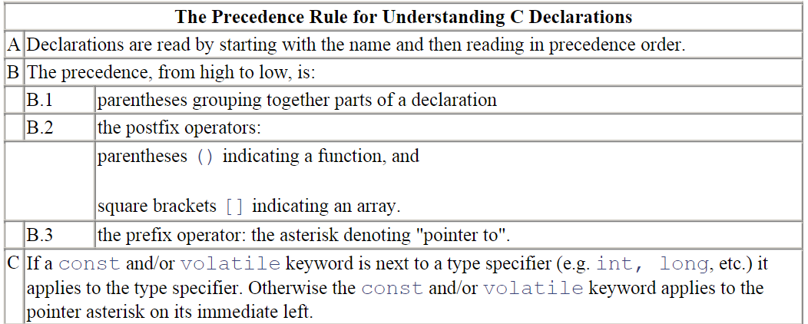

# The C Programming Language
```C
// Use Macro to nami=e literal constans
#define PI 3.14

// Use Macro as a shorthand
#define a(y) a_expanded(y)  
a(x); 
// expands into: 
a_expanded(x);
```

```C
// Prototype everything new 
// better not to omit the name which may contain info useful to programmer
char* strcpy(char* dst,const char* src);
```

```C
// const dosen't turn a variable into a constant
// it just means the symbol cannot be used for assignment
const int limit = 10;
const int* limitp = &limit;

int i = 10;
limitp = &i;
// limitp is "a pointer points to a const int"
// but itself can be changed
```
```C
// To define the size of an array
#define TOTAL_ELEMENTS (sizeof(array) / sizeof(array[0]))
// It allows the type of element in the array to change
```

```C
// review the struct definition
struct optional_tag { 
    type_1 identifier_1;  
    type_2 identifier_2;  
    ...  
    type_N identifier_N;  
} optional_variable_definitions;
// But prefer 
struct optional_tag foo,bar;
// variable declarations should be separate from the type declaration
// write once and read many times
```

To parse a declaration:


```C
// typedef can be a really handy function
void (*signal(int sig, void (*func)(int)) ) (int);
// typedef act like declaring
// the above example can be write as
typedef void (*ptr_to_func) (int);  // now ptr_to_func can be used
ptr_to_func signal(int, ptr_to_func); 
```
