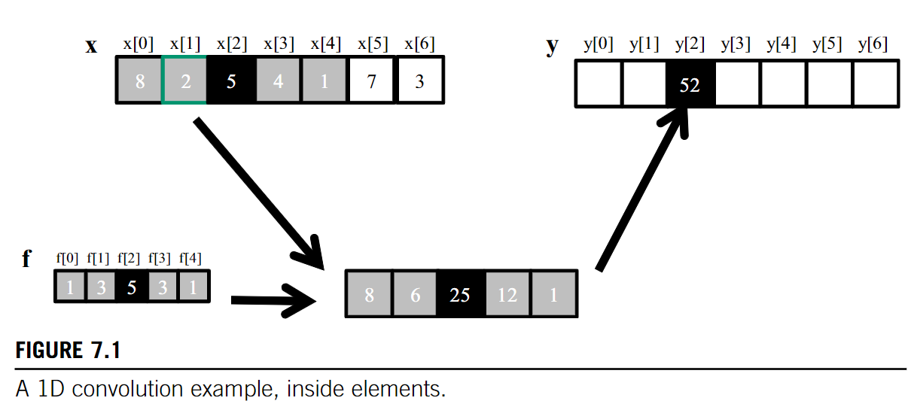
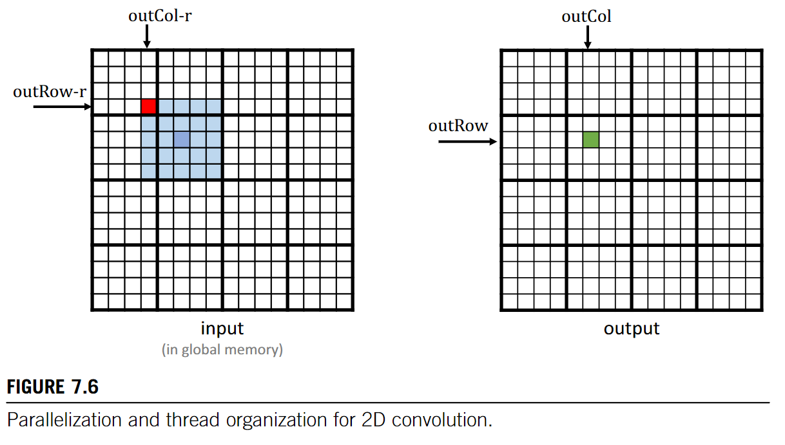
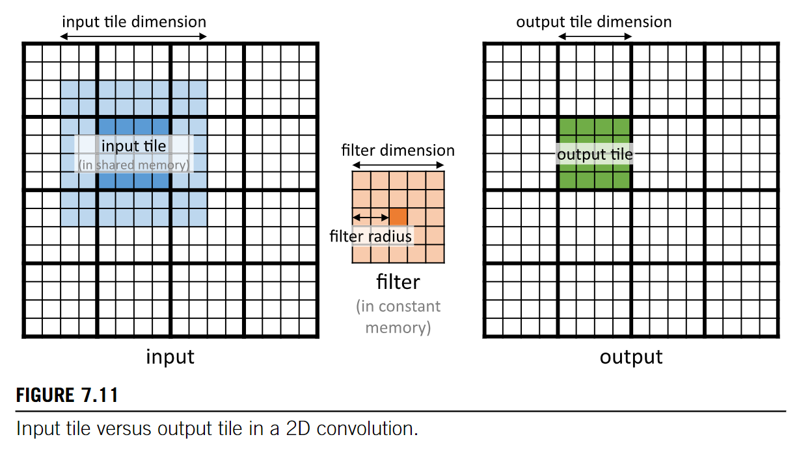

# Convolution

* padding 0 when reaching the bound of `x`

## Naive Implementation

```cpp
// 2D convolution
/**
  * @N: Input
  * @F: Filter
  * @P: Output
  * @r: radius of the filter
  * @width: I/O array width
  * @height: I/O array height
*/
__global__ void
convolution 2D basic kernel(float *N,float *F,float *P,int r,int width,int height){
  int outCol = blockIdx.x*blockDim.x + threadIdx.x;
  int outRow = blockIdx.y*blockDim.y + threadIdx.y;
  float Pvalue = 0.0f;
  for (int fRow = 0;fRow < 2*r+1;fRow++){
    for (int fCol = 0;fCol < 2*r+1;fCol++){
      inRow = outRow - r + fRow;
      inCol = outCol - r + fCol;
      if (inRow > 0 && inRow < height && inCol >= 0 && inCol < width){
        // 0.25OP/B: 2 operation(+,*) with 2 words load from global memory
        Pvalue += F[fRow][fCol]*N[inRow*width+inCol];
      }
    }
  }
  P[outRow][outCol] = Pvalue;
}
```

## Constant Memory
Observations: 
* **small** radius
* Content of the Filter **don't change**
* All threads access the **same element** in Filter in the **same order**

```cpp
// Using Constant memory
#define FILTER_RADIUS 2
__constant__ float F[2*FILTER_RADIUS + 1][2*FILTER_RADIUS + 1]
// F_h is the init filter in the host
// instead of copy F_h to F_d
// use cudaMemcpyToSymbol(dst,src,size)
cudaMemcpyToSymbol(F,F_h,(2*FILTER_RADIUS+1)*(2*FILTER_RADIUS+1) * sizeof float)
// Then access the contant memory as global variables
// The kernel is unchanged, but F is now constant memory keep on **Constant Cache**
// By now 
Pvalue += F[fRow][fCol]*N[inRow*width+inCol];
// 0.5 OP/B
```

## Tiled Convolution


* launches thread blocks whose dimension matches that of the **input tiles**.
  * simplify loading
  * some threads need to be disabled during Output Calculation
  * reduce the efficiency of execution **resource utilization**
* launches blocks whose dimension matches that of the **output tiles**
  * complex loading
  * simplify calculation

```cpp
#define FILTER_RADIUS 2
#define IN_TILE_DIM 32
#define OUT_TILE_DIM ((IN_TILE_DIM) - 2 * FILTER_RADIUS)
#define FILTER_WIDTH 2*FILTER_RADIUS + 1

__constant__ float F_c[FILTER_WIDTH][FILTER_WIDTH];
__global__ void 
convolution_kernel(float *N, float *P, int width, int height)
{
  int col = blockIdx.x * OUT_TILE_DIM + threadIdx.x - FILTER_RADIUS;
  int row = blockIdx.y * OUT_TILE_DIM + threadIdx.y - FILTER_RADIUS;
  // * Loading Input Tile
  __shared__ N_s[IN_TILE_DIM][IN_TILE_DIM];
  if(row >= 0 && row < height && col >= 0 && col < width)
    N_s[threadIdx.y][threadIdx.x] = N[row*width + col];
  else 
    N_s[threadIdx.y][threadIdx.x] = 0.0;
  __syncthreads();

  int tileCol = threadIdx.x - FILTER_RADIUS;
  int tileRow = threadIdx.y - FILTER_RADIUS;

  if(row >= 0 && row < height && col >= 0 && col < width){
    // diable the threads around
    if(tileRow >= 0 && tileRow < OUT_TILE_DIM && tileCol >= 0 && tileCol < OUT_TILE_DIM){
      float Pvalue = 0.0f;
      for (int fRow = 0; fRow < FILTER_WIDTH;fRow++){
        for (int fCol = 0; fCol < FILTER_WIDTH; fCol++){
          Pvalue += F_c[fRow][fCol]*N_s[tileRow+fRow][tileCol+fCol];
        }
      }
      P[row*width+col] = Pvalue;
    }
  }
}
```
OP/B can be obtained by considering Operations and Global Memory Loads **per Tile**

## Caches for Halo Cells
* halo cells already in the L2 cache
* access them directly

```cpp
// Only load necessary cells into shared memory
// IN_TILE_DIM == OUT_TILE_DIM
  __shared__ N_s[TILE_DIM][TILE_DIM];
  if(row >= 0 && row < height && col >= 0 && col < width)
    N_s[threadIdx.y][threadIdx.x] = N[row*width + col];
  else 
    N_s[threadIdx.y][threadIdx.x] = 0.0;
  __syncthreads();
// Load halo cells directly during calculation
// for halo cells, access N
// for tile cells, access N_s
```
