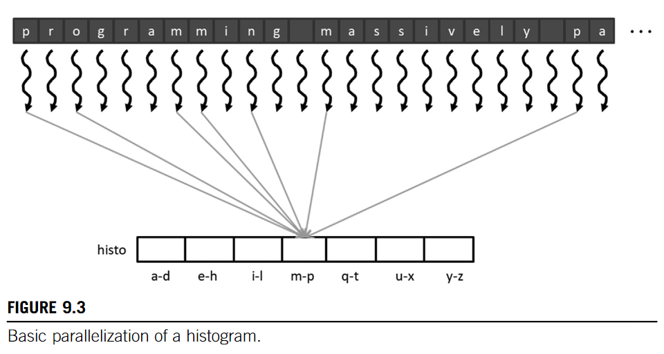
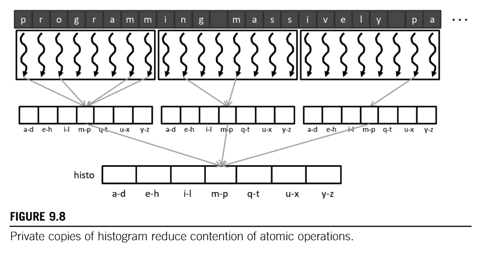
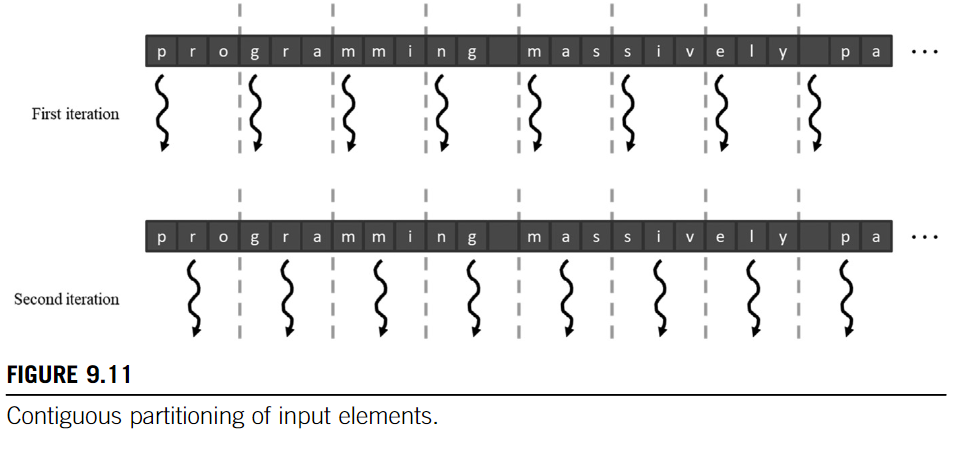
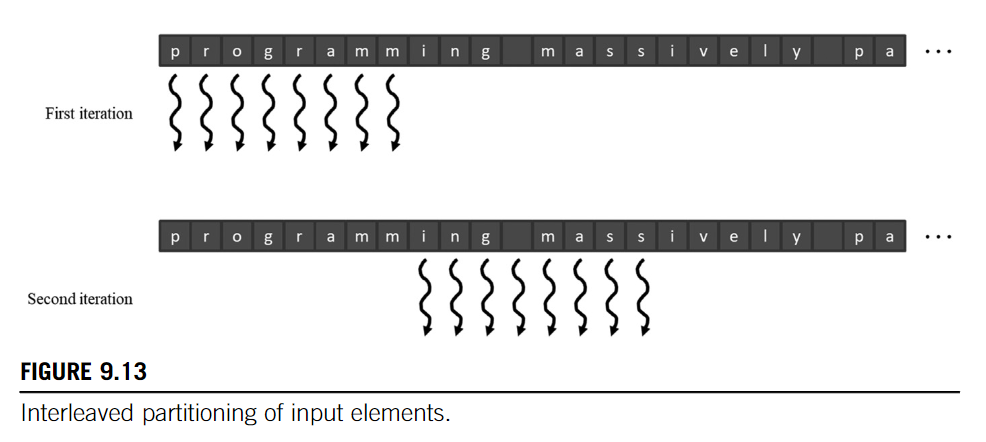

# Parallel Histogram
Histogram
: a display of the **number count or percentage of occurrences** of data values in a dataset

## Example
Suppose we want to compute the histogram of a given sentence. 

### Sequential

```C
void histogram_sequential(char *sentence, int *histogram, int size)
{
  for(int i = 0; i < size; i++){
    int alpha_pos = sentence[i] - 'a';
    if(alpha_pos >= 0 && alpha_pos < 26){
      histogram[alpha_pos/4]++; // interval of 4
    }
  }
}
```
* Time Complexity: $O(n)$
* Cache Friendly

### Parallel

#### Basic


* Read-Modify-Write (RMW) problem
* Need to use atomic operation `int atomicAdd(int *addr, int val)`

```cpp
// cuda kernel to histogram
__global__ void histogram_kernel(char *sentence, int *histogram, int size)
{
  int tid = blockIdx.x * blockDim.x + threadIdx.x;
  if(tid < size){
    int alpha_pos = sentence[tid] - 'a';
    if(alpha_pos >= 0 && alpha_pos < 26){
      atomicAdd(&histogram[alpha_pos/4], 1);
    }
  }
}
```

* Atomic operation costs too much time
  * perform atomic operation on the last-level cache
  * Privatization

#### Privatization with Shared Memory



```cpp
__global__ void histogram_kernel(char *sentence, int *histogram, int size)
{
  __shared__ int shared_histogram[NUM_BINS];
  // initialize shared memory
  if(threadIdx.x < NUM_BINS){
    shared_histogram[threadIdx.x] = 0;
  }
  __syncthreads();
  // histogram
  int tid = blockIdx.x * blockDim.x + threadIdx.x;
  if(tid < size){
    int alpha_pos = sentence[tid] - 'a';
    if(alpha_pos >= 0 && alpha_pos < 26){

      atomicAdd(&shared_histogram[alpha_pos/4], 1);
    }
  }
  __syncthreads();
  // write back to global memory
  for(int bin = threadIdx.x; bin < NUM_BINS; bin += blockDim.x){
    atomicAdd(&histogram[bin], shared_histogram[bin]);
  }
}
```

* private compute
* final commit to global memory
* reduce contension

#### Thread Coarsing

Assign more work to each thread
* Contiguous
* Interleaving

 


#### Aggregation
```cpp
// An Aggregation Kernel
__global__ void histogram_kernel(char *sentence, int *histogram, int size)
{
  __shared__ int shared_histogram[NUM_BINS];
  // initialize shared memory
  if(threadIdx.x < NUM_BINS){
    shared_histogram[threadIdx.x] = 0;
  }
  __syncthreads();
  // histogram
  int accumulator = 0;
  int prevBinIdx = -1;
  for(int i = threadIdx.x; i < size; i += blockDim.x){
    int alpha_pos = sentence[i] - 'a';
    if(alpha_pos >= 0 && alpha_pos < 26){
      int binIdx = alpha_pos/4;
      // Core Logic
      if(binIdx == prevBinIdx){
        accumulator++;
      }else{
        if(accumulator > 0){
          atomicAdd(&shared_histogram[prevBinIdx], accumulator);
        }
        accumulator = 1;
        prevBinIdx = binIdx;
      }
    }
  }
  if(accumulator > 0){
    atomicAdd(&shared_histogram[prevBinIdx], accumulator);
  }
  __syncthreads();
  // write to global memory
  for(int binIdx = threadIdx.x; binIdx < NUM_BINS; binIdx += blockDim.x){
    atomicAdd(&histogram[binIdx], shared_histogram[binIdx]);
    }
}
```


