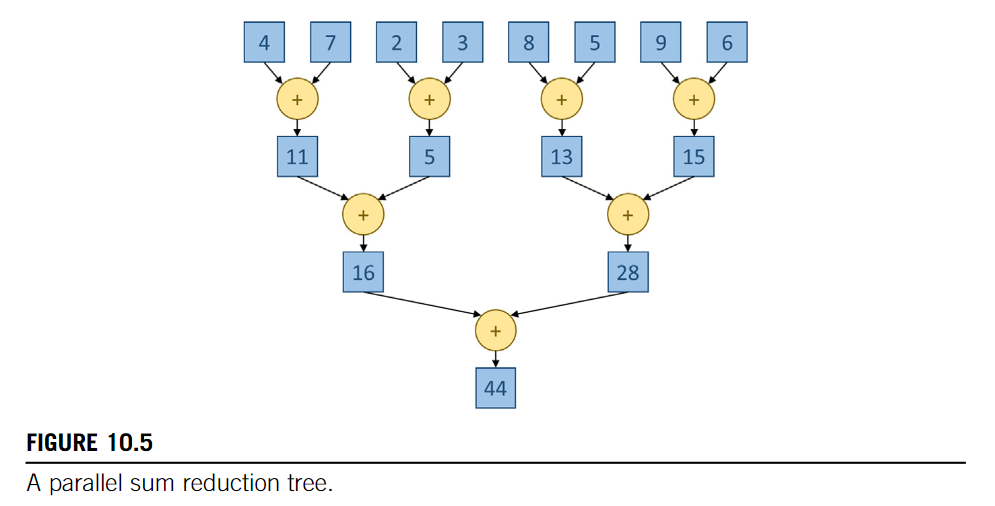
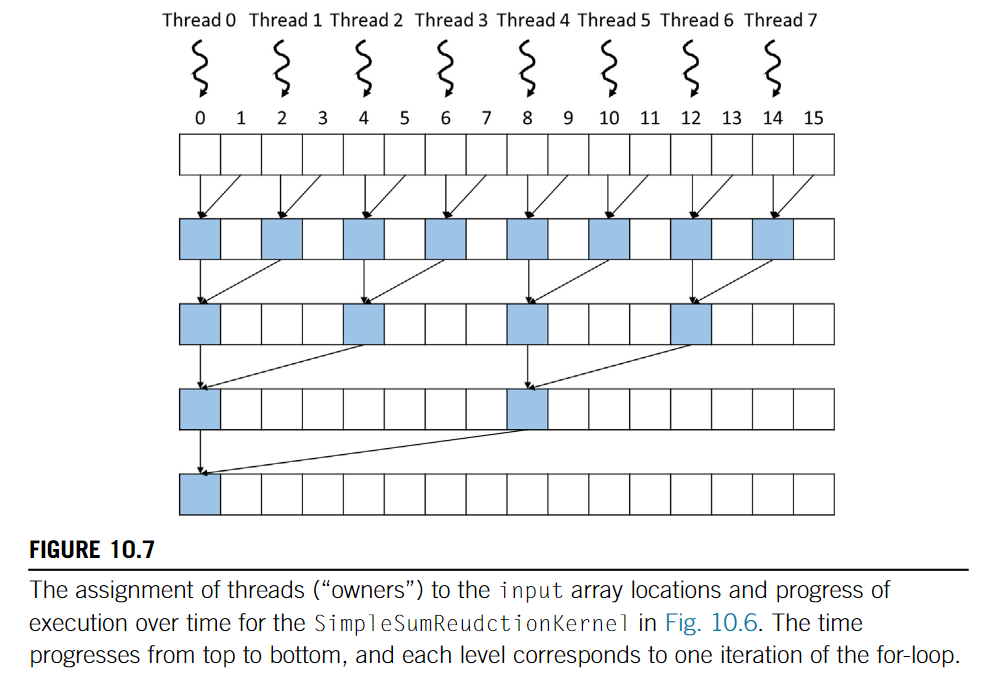
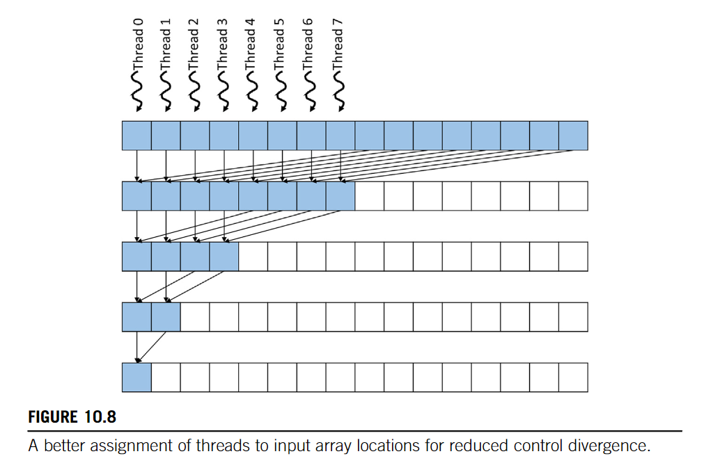
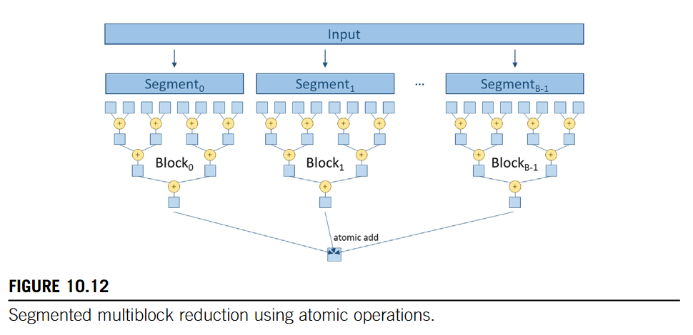
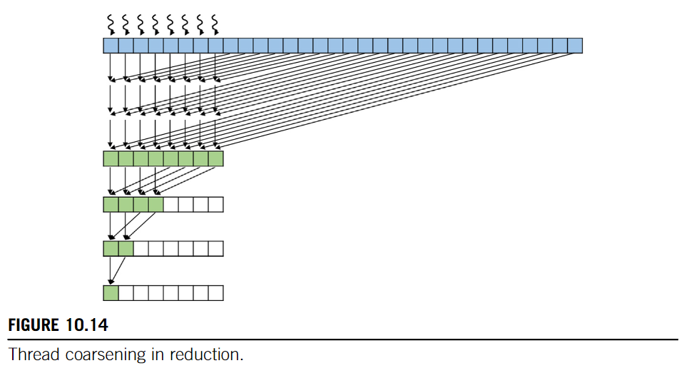

# Reduction
Reduction 
: derives a single value from an array of values.

## Example
Calculate the sum of an array of integers.

### Sequential
```c
int sum = 0;
for (int i = 0; i < N; i++) {
    sum += array[i];
}
```
### Parallel
To rearrange:
* associativity: to rearrange operators
* commutativity: to rearrange operands

Reduction Tree
* operations needed not change 
* time steps reduce by **Log**



#### Rearrange Operands


```cpp
// cuda reduction naive 
__global__ void reduceNaive(float *input, float *output){
  int i = 2 * threadIdx.x;
  for(int stride = 1; stride < blockDim.x; stride *= 2){
    if(threadIdx.x % stride == 0){
      input[i] += input[i + stride];
    }
    __syncthreads();
  }
  if(threadIdx.x == 0){
    output[0] = input[0];
  }
}
```

* Bad Active/Inactive threads Management 
  * Refer to PMPP Chapter 10.4 to see how to analyse



```cpp
__global__ void ConvergentSumReductionKernel(float *input, float *output){
  int i = threadIdx.x;
  for(int stride = blockDim.x; stride > 1; stride /= 2){
    if(threadIdx.x < stride){
      input[i] += input[i + stride];
    }
    __syncthreads();
  }
  if(threadIdx.x == 0){
    output[0] = input[0];
  }
}
```

* Lower Degree of Control Divergence
* Better Memory Coarsing

#### Shared Memory
```cpp
__global__ void reduceShared(float *input, float *output){
  __shared__ input_s[BLOCK_DIM];
  int i = threadIdx.x;
  input_s[i] = input[i] + input[i + blockDim.x];
  for(int stride = blockDim.x / 2; stride > 1; stride /= 2){
    __syncthreads();
    if(threadIdx.x < stride){
      input_s[i] += input_s[i + stride];
    }
  }
  if(threadIdx.x == 0){
    output[0] = input_s[0];
  }
}
```
#### Arbitrary Input Length



