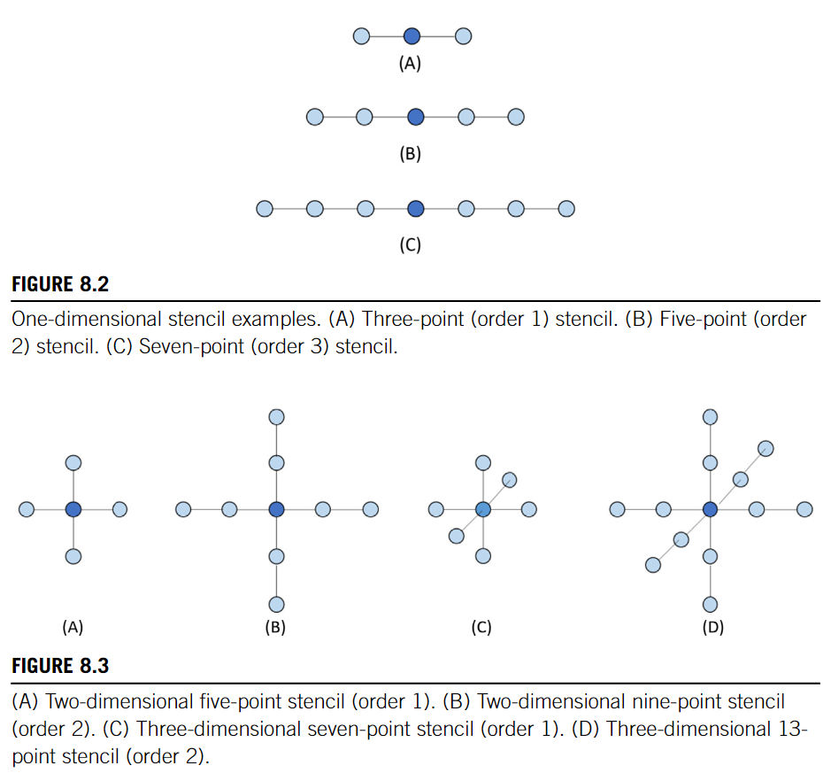
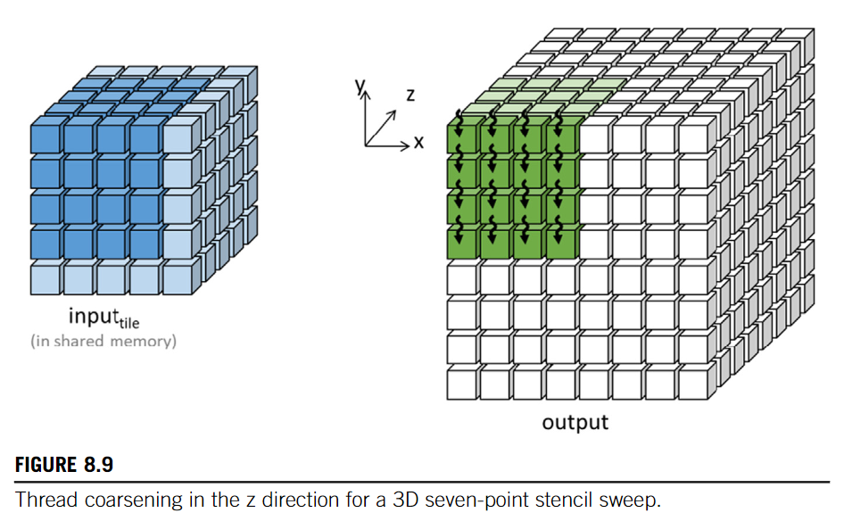

# Stencil
Stencil
  : a geometric pattern of weights applied at each point of a structured grid
    * The pattern specifies: 
      * How the **values of the grid point** of interest can be derived 
      * from the values at **neighboring points**
      * using a **numerical approximation routine**



For example, a 1-order 1D stencil is like:
$$
  f'(x) = \dfrac{f(x+h) - f(x-h)}{3h} + O(n^2)
$$

## Basic Implementation
A 3D 1-order kernel
```cpp
__global__ void stencil(float *in, float *out, unsigned int N){
  unsigned int i = blockIdx.z * blockDim.z + threadIdx.z;
  unsigned int j = blockIdx.y * blockDim.y + threadIdx.y;
  unsigned int k = blockIdx.x * blockDim.x + threadIdx.x;
  if (
    i >= 1 && i < N-1 &&
    j >= 1 && j < N-1 && 
    k >= 1 && k < N-1 
  ){
    // (7 mul + 6 add)/(7 * 4bytes) = 0.46OP/B
    out[i*N*N + j*N + k] = 
      c0 * in[i*N*N + j*N + k] +
      c1 * in[i*N*N + j*N + k-1] +
      c2 * in[i*N*N + j*N + k+1] + 
      c3 * in[i*N*N + (j-1)*N + k] + 
      c4 * in[i*N*N + (j+1)*N + k] + 
      c5 * in[(i-1)*N*N + j*N + k] + 
      c6 * in[(i+1)*N*N + j*N + k];
  }
}
```

## Tiling
```cpp
#define IN_TILE_DIM
#define OUT_TILE_DIM 
__global__ void stencil(float *in, float *out, unsigned int N){
  unsigned int i = blockIdx.z * OUT_TILE_DIM + threadIdx.z - 1;
  unsigned int j = blockIdx.y * OUT_TILE_DIM + threadIdx.y - 1;
  unsigned int k = blockIdx.x * OUT_TILE_DIM + threadIdx.x - 1;

  // Load input Tile
  __shared__ float in_s[IN_TILE_DIM][IN_TILE_DIM][IN_TILE_DIM];
  if(
    i >= 0 && i < N &&
    j >= 0 && j < N && 
    k >= 0 && k < N    
  ){
    in_s[threadIdx.z][threadIdx.y][threadIdx.x] = in[i*N*N + j*N + k];
  }
  __syncthreads();
  
  // Calculation
  if (
    i >= 1 && i < N-1 &&
    j >= 1 && j < N-1 && 
    k >= 1 && k < N-1 
  ){
    if (
      threadIdx.z >= 1 && threadIdx.z < IN_TILE_DIM - 1 &&
      threadIdx.y >= 1 && threadIdx.y < IN_TILE_DIM - 1 &&
      threadIdx.x >= 1 && threadIdx.x < IN_TILE_DIM - 1
    ){
      /**
       * Input Tile Dimension: T
       * Active Threads: (T-2)^3
       * (T-2)^3 * 13 OP / (T^3 * 4 bytes) = 13/4 * (1 - 2/T)^3 OP/B
       * asymptotically 3.25 OP/B  
       */
      out[i*N*N + j*N + k] = 
        c0 * in_s[threadIdx.z][threadIdx.y][threadIdx.x] + 
        c1 * in_s[threadIdx.z][threadIdx.y][threadIdx.x - 1] + 
        c2 * in_s[threadIdx.z][threadIdx.y][threadIdx.x + 1] + 
        c3 * in_s[threadIdx.z][threadIdx.y + 1][threadIdx.x] + 
        c4 * in_s[threadIdx.z][threadIdx.y - 1][threadIdx.x] + 
        c5 * in_s[threadIdx.z + 1][threadIdx.y][threadIdx.x] + 
        c6 * in_s[threadIdx.z - 1][threadIdx.y][threadIdx.x] + 
    }
  }
}
```

* 3D mostly, shared memory grows too fast 
* Too many halo cells
* Memory Coarsing not efficient
  * for $ 8*8*8 $ tile, a warp need to access 4 distant rows

## Thread Coarsing


```cpp
#define IN_TILE_DIM
#define OUT_TILE_DIM
__global__ void stencil(float *in, float *out, unsigned int N){
  int iStart = blockIdx.z * OUT_TILE_DIM;
  int j = blockIdx.y * OUT_TILE_DIM + threadIdx.y - 1;
  int k = blockIdx.x * OUT_TILE_DIM + threadIdx.x - 1;

  // 1-order, form a prev-cur-next pattern
  __shared__ float inPrev_s[IN_TILE_DIM][IN_TILE_DIM];
  __shared__ float inCur_s[IN_TILE_DIM][IN_TILE_DIM];
  __shared__ float inNext_s[IN_TILE_DIM][IN_TILE_DIM];

  // initially, load prev and cur, next will be iterative load
  if (
    iStart-1 >= 0 && iStart < N &&
    j >= 0 && j < N &&
    k >= 0 && k < N 
  ){
    inPrev_s[threadIdx.y][threadIdx.x] = in[(iStart-1)*N*N + j*N + k];
  }
  if (
    iStart >= 0 && iStart < N &&
    j >= 0 && j < N &&
    k >= 0 && k < N 
  ){
    inCur_s[threadIdx.y][threadIdx.x] = in[iStart*N*N + j*N + k];
  }

  for (int i = iStart; i < iStart + OUT_TILE_DIM; ++i){
    // Load inNext_s
    if (
      i + 1 >= 0 && i + 1 < N &&
      j >= 0 && j < N &&
      k >= 0 && k < N 
    ){
      inNext_s[threadIdx.y][threadIdx.x] = in[(i+1)*N*N + j*N + k];
    }
    __syncthreads();
    // Calculate the result 
    if (
      i >= 1 && i < N - 1 &&
      j >= 1 && j < N - 1 &&
      k >= 1 && k < N - 1
    ){
      if (
        threadIdx.y >= 1 && threadIdx.y < IN_TILE_DIM - 1 &&
        threadIdx.x >= 1 && threadIdx.x < IN_TILE_DIM - 1
      ){
        out[i*N*N + j*N + k] = 
          c0 * inCur_s[threadIdx.y][threadIdx.x] + 
          c1 * inCur_s[threadIdx.y][threadIdx.x+1] + 
          c2 * inCur_s[threadIdx.y][threadIdx.x-1] + 
          c3 * inCur_s[threadIdx.y+1][threadIdx.x] + 
          c4 * inCur_s[threadIdx.y-1][threadIdx.x] + 
          c5 * inPrev_s[threadIdx.y][threadIdx.x] + 
          c6 * inNext_s[threadIdx.y][threadIdx.x];
      }
    }
    __syncthreads();
    // Move cur to prev, next to cur, enter next iteration
    inPrev_s[threadIdx.y][threadIdx.x] = inCur_s[threadIdx.y][threadIdx.x];
    inCur_s[threadIdx.y][threadIdx.x] = inNext_s[threadIdx.y][threadIdx.x];
  }
}
```

!!! note Each Thread calculates Dim.z outputs

* Thread Block Size:  $T^2$
* Shared Memory: $3T^2$, but will change when the order changes.
* Threads share the `inCur_s` only, so `inPrev_s, inNext_s` can be stored in registers.

## Register Tiling
```cpp
// This kernel is subtly different from the previous one 
#define IN_TILE_DIM
#define OUT_TILE_DIM
__global__ void stencil(float *in, float *out, unsigned int N){
  int iStart = blockIdx.z * OUT_TILE_DIM;
  int j = blockIdx.y * OUT_TILE_DIM + threadIdx.y - 1;
  int k = blockIdx.x * OUT_TILE_DIM + threadIdx.x - 1;

  // 1-order, form a prev-cur-next pattern
  // Using registers instead
  // __shared__ float inPrev_s[IN_TILE_DIM][IN_TILE_DIM];
  __shared__ float inCur_s[IN_TILE_DIM][IN_TILE_DIM];
  // __shared__ float inNext_s[IN_TILE_DIM][IN_TILE_DIM];
  float inPrev, inCur, inNext;

  // initially, load prev and cur, next will be iterative load
  if (
    iStart-1 >= 0 && iStart < N &&
    j >= 0 && j < N &&
    k >= 0 && k < N 
  ){
    // TODO 
    inPrev = in[(iStart-1)*N*N + j*N + k];
  }
  if (
    iStart >= 0 && iStart < N &&
    j >= 0 && j < N &&
    k >= 0 && k < N 
  ){
    // TODO 
    inCur = in[iStart*N*N + j*N + k];
    inCur_s[threadIdx.y][threadIdx.x] = inCur;
  }

  for (int i = iStart; i < iStart + OUT_TILE_DIM; ++i){
    // Load inNext_s
    if (
      i + 1 >= 0 && i + 1 < N &&
      j >= 0 && j < N &&
      k >= 0 && k < N 
    ){
      // TODO 
      inNext_s = in[(i+1)*N*N + j*N + k];
    }
    __syncthreads();
    // Calculate the result 
    if (
      i >= 1 && i < N - 1 &&
      j >= 1 && j < N - 1 &&
      k >= 1 && k < N - 1
    ){
      if (
        threadIdx.y >= 1 && threadIdx.y < IN_TILE_DIM - 1 &&
        threadIdx.x >= 1 && threadIdx.x < IN_TILE_DIM - 1
      ){
        out[i*N*N + j*N + k] = 
          c0 * inCur_s[threadIdx.y][threadIdx.x] + 
          c1 * inCur_s[threadIdx.y][threadIdx.x+1] + 
          c2 * inCur_s[threadIdx.y][threadIdx.x-1] + 
          c3 * inCur_s[threadIdx.y+1][threadIdx.x] + 
          c4 * inCur_s[threadIdx.y-1][threadIdx.x] + 
          // TODO 
          c5 * inPrev_s + 
          c6 * inNext_s;
      }
    }
    __syncthreads();
    // Move cur to prev, next to cur, enter next iteration
    // TODO: 
    inPrev = inCur;
    inCur = inNext;
    inCur_s[threadIdx.y][threadIdx.x] = inNext;
  }
}
```

* Shared Memory: $ T^2 $ only 
* Read Register is faster
