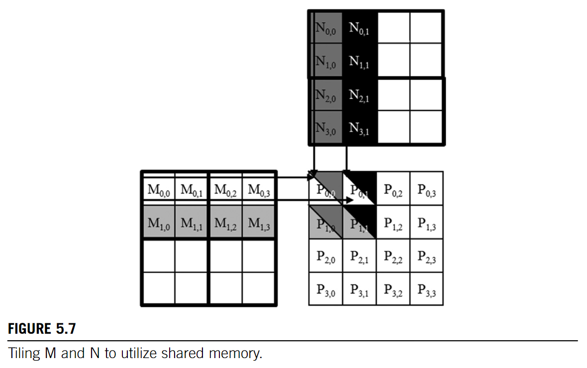
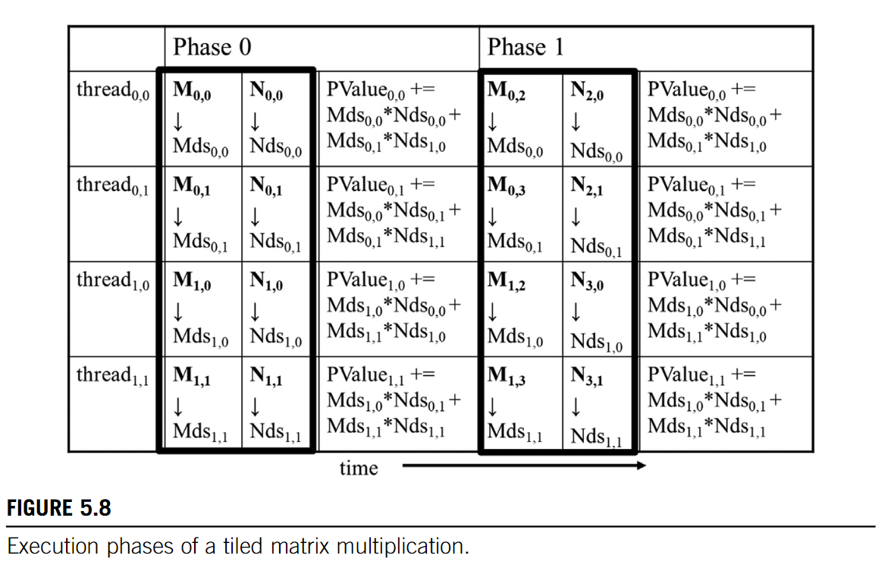

# Tiling
* The global memory is large but slow
* the shared memory is small but fast

!!! tip Method: Partition the data into subsets(tiles) 

## Matrix Multiplication




```C
/* This kernel assums:
    - the width of the matrices is a multiple of the width of thread blocks
    - the matrices are square matrices
*/
#define TILE_WIDTH 16
__global__ void matMulKernel(float* M, float* N, float* P, int Width){
    __shared__ float Mds[TILE_WIDTH][TILE_WIDTH];
    __shared__ float Nds[TILE_WIDTH][TILE_WIDTH];

    int bx = blockIdx.x; int by = blockIdx.y;
    int tx = threadIdx.x; int ty = threadIdx.y;

    int row = by * TILE_WIDTH + ty; // We choose the tile width = block width
    int col = bx * TILE_WIDTH + tx;

    float Pvalue = 0;

    for(int ph = 0; ph < Width/TILE_WIDTH; ++ph){
        Mds[ty][tx] = M[row * Width + ph * TILE_WIDTH + tx];
        Nds[ty][tx] = N[(ph * TILE_WIDTH + ty) * Width + col];
        __syncthreads();

        for(int k = 0; i < TILE_WIDTH; ++k){
            Pvalue += Mds[ty][k] * Nds[k][tx];
        }
        __syncthreads();
    }

    P[row * Width + col] = Pvalue;
}

```