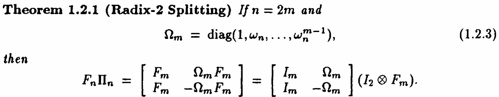
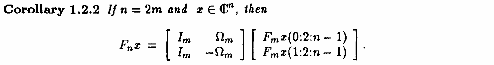
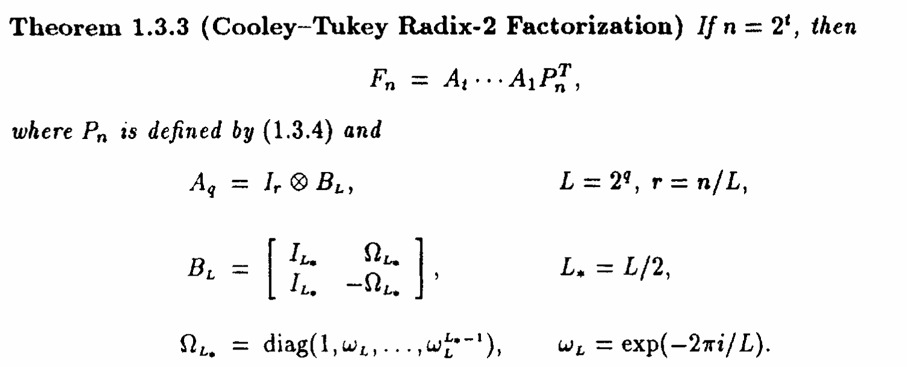
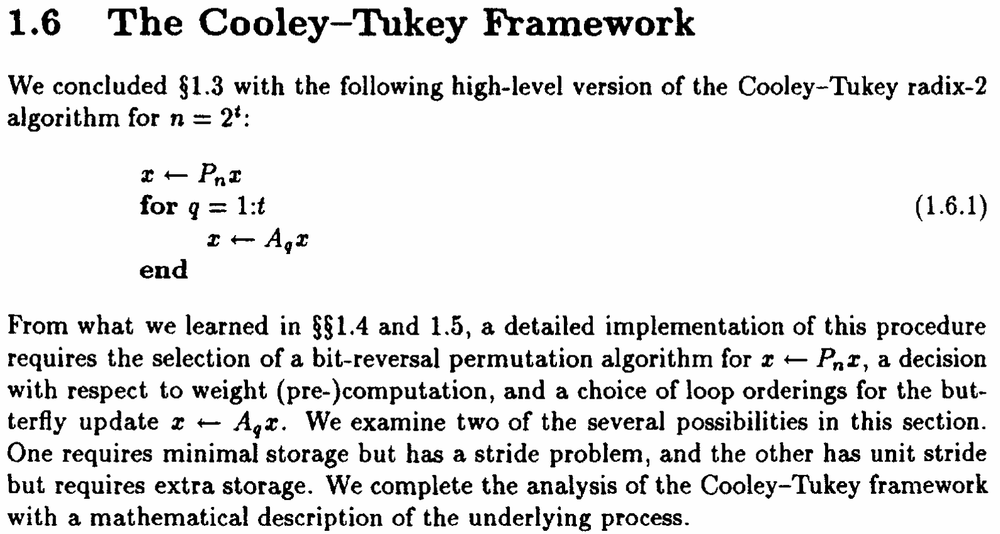

# Fast Fourier Transform
## Lemmas

Based on this,We can compute $F_{2n}$ from $F_{n}$

And we can get a chain:

## The Cooley-Tukey Framework

And Now we see carefully on each step.
- $x \leftarrow P_n x$
a bit-reversal permutation algorithm should be apply here.

- $x \leftarrow A_q x$
weight (pre)computations

- $x \leftarrow A_q x$
a choice of loop orderings