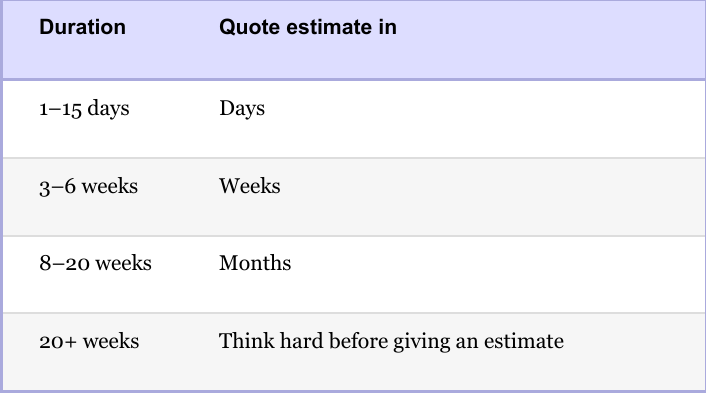
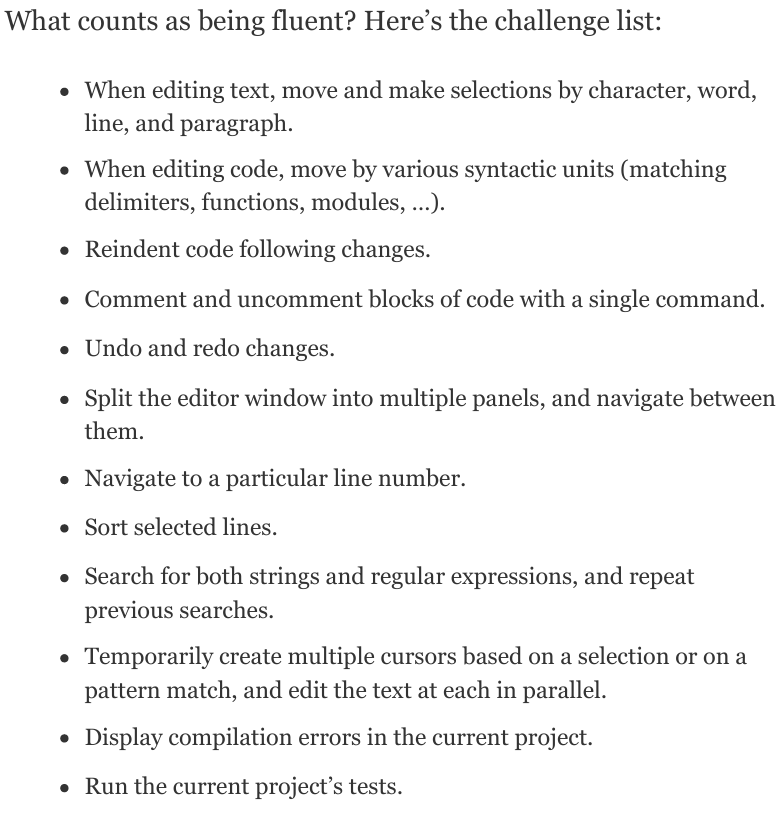
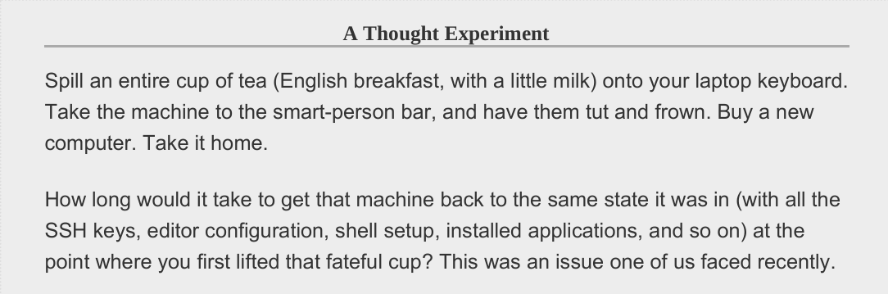
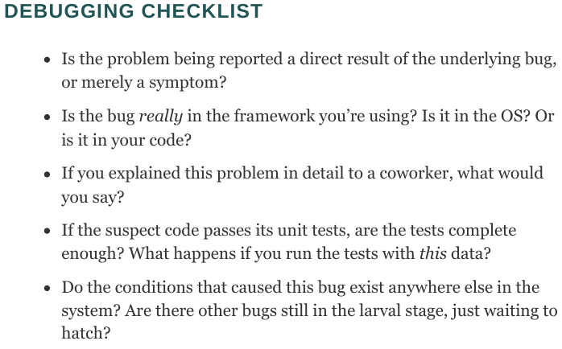
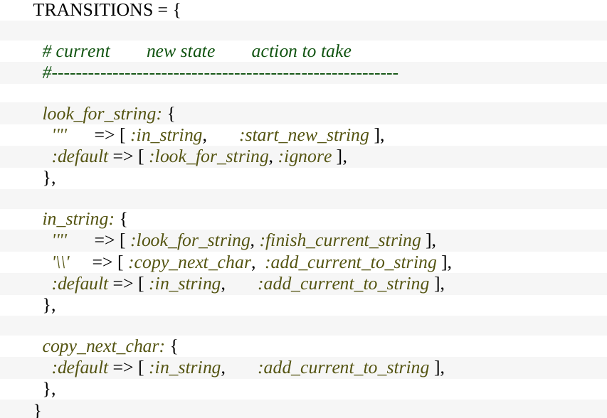
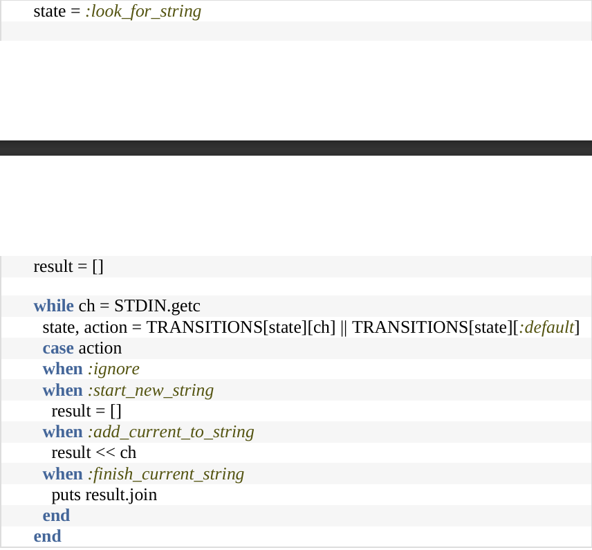

# 程序员修炼之道
## Preface
- like new things and quick adaptation
- curiosity
- critical thinking
- try to deeply understand the problem
- Focus on your skills
- Think what you are doing now

**Pragmatic and Persistent**
## ch1

- Try to change when not satisfied
- Give Options,not Excuses(what you can do for this situation?)
- Don't ignore Broken Windows(Fix Bug as soon as possible,at least Left `TODO: `)
  - Don't leave Broken windows
  - Don't add broken windows when fix one
  - Minimize the damage as possible as you can
- Do things step by step.And every `tiny` step has amazing feedback --- approach your goal with persistency
- Always Remember the whole scope
- Design with Requirements --- to know when to stop
- Invest on Knowledge
  - Periodic Investment
    - Learn a new Programming Language periodicly
    - Take a course periodicly
    - Read Blogs frequently
    - Learn new techniques actively
  - Variety
  - Risk
  - Assessment
- Ask why
  - Who benefits?
  - Background
  - when and where would work
  - why it is a problem?
  - whether a basic model exists
- Communicaition
  - Be familiar with your audience
  - what do you want to express?
  - choose a proper time
  - pick a proper style
  - make it look well
  - interact with audience
  - be a good listener
  - react actively

## ch2
- ETC: Easy to change? --- Make it Replacable
- DRY: Don't Repeat Yourself
  - Express the same knowledge at no more than one place
  - Don't copy/paste your `Knowledge` or `Intent`
  - Ask frequently: "Have you done the same thing before?"
- Orthogonality: Remove impacts from irrelevant modules --- Aggregate
  - Don't Depend on things you can't control
  - Don't reference Global Data --- create a context and pass it as a parameter
- Reversiblity: Easy to undo
  - Don't make final decision: Only one way will lead to disaster
  - Don't pursue fashion: Be ready to deal with environment's change
- Trace Bulltes: Instaneous Feedback
  - A simple but enough framework to know how the system would work
  - Easy to elaborate 
  - In cpu: implement an `add` instruction
- Prototype: to better understand,not to implement
  - Could ignore sth like:
    - Rightness
    - Completeness
    - Robust
    - Format
  - Or: Just for Presentation
    - How the system is organized
    - what is the responsibily of each module
- Domain Languages
  - Program close to the Program Domain
  - Internal Domain Language and External Domain Language
    - Extension(like chisel) or DIY
- Estimating
  - 
  - Ask someone who has done it before
  - Understand -> Model -> Decompose -> Give value on params -> Calculate
  - Iterate the Schedule with the Code
  - "I will get back to you"

## ch3
- Plain Text:printable characters in a form that convey `information`
  -  Insurance against obsolescence --- Meaningful Information
  -  Leverage existing tool --- Nearly everything can operate on plain text
  -  Easy Testing
-  GUI versus CLI: Use the Power of Command Shells
   -  GUI advantage: what you see is what you get
   -  GUI disvantage: what you see is all you get
-  Achieve Edit Fluency
   -  
   -  When Repeat doing one thing,try to search a convenient way
   -  When Learning a new Feature,Keep using it until being familiar with it.
-  Always Use Version Control
   -  
   -  Learn to use Git
-  Debugging
   -  Fix the Problem,not the Blame
   -  Failing Test Before Fixing Code
      -  we want a bug that can be reproduced with a single command. It’s a lot harder to fix a bug if you have to go through 15 steps to get to the point where the bug shows up.
   -  
-  Learn a Text Manipulation Language
-  Write Engineering Daybooks
   -  Using Pen and Paper
   -  record what you did,things you'd learned,sketches of ideas,readings from meters .etc.
   -  When the notebook became full,write the date range on the spine,then stick it on the shelf next to the previous daybooks.
## ch4
- DBC: Design by Contract
  - Preconditions: what must be true before called
  - Postconditions: what must be done after called
  - Class Invariants: what must hold before and after
- Crash Early: Crash,Don't Trash
  - A dead program normally does a lot less damage than a crippled one.
- Use Assertions to Prevent the Impossible
  - But don't use it to handle the errors
- Finish what you Start
  -  the function or object that allocates a resource should be responsible for deallocating it.
  -  More than one resource
     -  Deallocate in reverse order
     -  keep the Allocate order when 2 or more process shared the same resources
        -  A owns 1 and wants get 2
        -  B owns 2 and wants get 1
        -  then DeadLock happens
        -  Solution: 2 must be allocated after 1
-  Don't Outrun your HeadLights
   -  Always take small steps
      -  Make current things replacable
      -  Avoid Fortune-Telling:Predict sth far beyond now

## ch5
- Decoupled Code is ETC
  - Tell, Don't ask: You should't make decisions based on the internal stat es of the object
  - In other words,ask yourself:How much do you need to get from the object to finish your work?
  - Don't chain method calls if relying on the internal implementations
  - Avoid Global Data
    - Global Data include Singleton
    - Global Data include external resources
    -  If It’s Important Enough to Be Global, Wrap It in an API
-  Responsive Applications
   -  Coding using Finite State Machine
      -  Use Map to specify a state transition
      -  Suppose State IDLE,WORK,DONE
         -  map_idle,map_work,map_done
         -  every map stores input-nstat entries and input-action entries
         -  State Declaration:
         -  
         -  Kernel:
         -  
   -  Observer Pattern
   -  Publish/Subscribe
      -  Like a FIFO
      -  In the pubsub model, we have publishers and subscribers.These are connected via channels.
      -  Subscribers register interest in one or more of these named channels, and publishers write events to them.
   -  Streams
-  Functional Programming or Transforming Programming
   -  Don’t Hoard State; Pass It Around
-  Don't Pay Inheritance Tax
   -  Prefer Interfaces to Express Polymorphism
   -  Delegate to Services: Has-A Trumps Is-A
   -  Use Mixins to Share Functionality
   -  INHERITANCE IS RARELY THE ANSWER
      -  When you want to use inheritance,try to find another way
         -  interface
         -  delegate
         -  mixin
-   Parameterize Your App Using External Configuration
    -   Configuration as a service
  
## ch6
- Breaking Temporal Coupling
  -  Analyze Workflow to Improve Concurrency
-  Shared State is Incorrect State
   -  Nonatomic Updates
   -  Semaphores(信号量/锁) and other forms of exclusion
   -  Make the resource transactional
   -  Random Failures Are Often Concurrency Issues
-  Actors and Processes
   -  Message in the mailbox will be consumed one by one
   -  No explicit concurrency
-  Use Blackboards to Coordinate Workflow