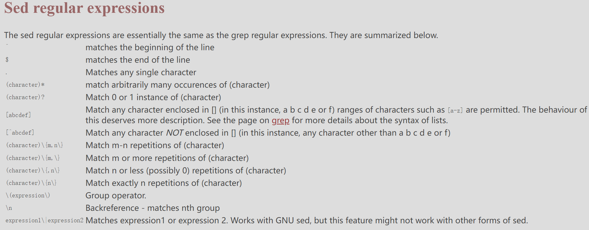

# Sed
`sed` is for `stream editor`
> sed reads the standard input into the pattern space, performs a sequence of editing commands on the pattern space, then writes the pattern space to STDOUT.


## General Usage
```bash
# consequently apply command to a file 
sed -e 'command1' -e 'command2' -e 'command3' file
# pipe to sed
{shell command}|sed -e 'command1' -e 'command2'
# apply a sed script to a file
sed -f sedscript.sed file
# pipe to sed 
{shell command}|sed -f sedscript.sed
```

## Common Commands
* substitution: `[address1[ ,address2]]s/pattern/replacement/[flags]`
    * flags: 
        * `n`: replace `nth` instance of pattern with replacement
        * `g`: replace `all` instances of pattern with replacement
        * `p`: `write pattern space to STDOUT` if a successful substitution takes place
        * `w file`: `Write the pattern space to file` if a successful substitution takes place
    * delimeters: can be `@` `,` `:` `;` `%`
* deletion: `[address1[ , address2 ] ]d`

## Examples
```bash
# global substitution
> cat file
the black cat was chased by the brown dog

> sed -e 's/black/white/g' file
the white cat was chased by the brown dog

# match address 
> cat file
the black cat was chased by the brown dog.
the black cat was not chased by the brown dog

> sed -e '/not/s/black/white/g' file
the black cat was chased by the brown dog.
the white cat was not chased by the brown dog.

# deletion
> cat file
line 1 (one)
line 2 (two)
line 3 (three)

> sed -e '1,2d' file
line 3 (three)

# deletion by specifing the address 
> cat file
hello
this text is wiped out
Wiped out
hello (also wiped out)
WiPed out TOO!
goodbye
(1) This text is not deleted
(2) neither is this ... ( goodbye )
(3) neither is this
hello
but this is
and so is this
and unless we find another g**dbye
every line to the end of the file gets deleted

> sed -e '/hello/,/goodbye/d' file
(1) This text is not deleted
(2) neither is this ... ( goodbye )
(3) neither is this
```


## resources
[sed-guide](https://www.panix.com/%7Eelflord/unix/sed.html)
