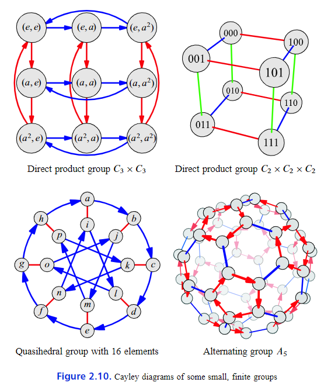

# Visual Group Theory
Observations on the cube:
* There is a predefined list of moves that never changes
* Every move is reversible
* Every move is deterministic.
* Moves can be combined in any sequence.

**Group** 
  : a system or collection of **actions** satisfying
    1. There is a predefined list of actions that never changes.
        * a.k.a generators: generate other actions 
    2. Every action is reversible.
    3. Every action is deterministic.
    4. Any sequence of consecutive actions is also an action
        * permit further moves

Thoughts:
* Does Rule 4 imply that every group must contain infinitely many actions? 
  * No, it implies this only when the **order** of actions matters.
* Devise a situation that satisfies all of the four rules **except Rule 2**.
  * tear a paper into halves
* Devise a situation that satisfies all of the four rules **except Rule 3**.
  * cook
* Devise a situation that satisfies all of the four rules **except Rule 4**.
  * finite resources like move a coin from left pocket to right, but initially there are only 5 coins in each pocket
  
Cayley Diagram
  :  clearly show **all possible paths** and include **every configuration**

