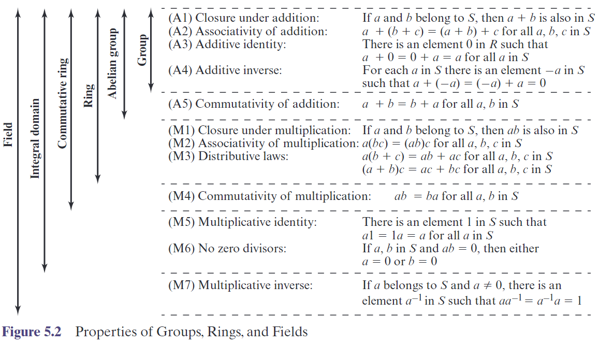
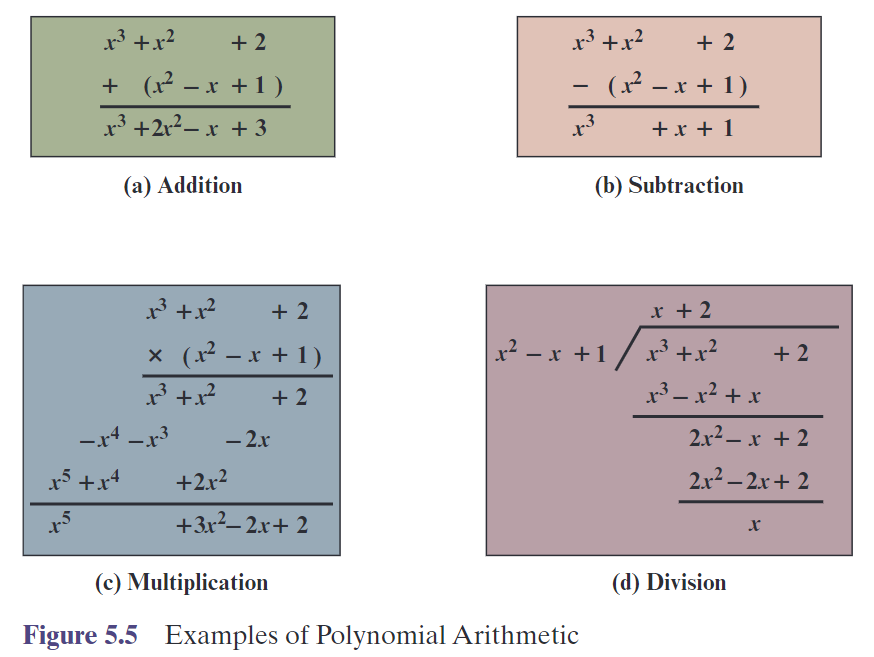

# Finite Fields
## Group
Group
: a group $G$, sometimes denote by $\{ G,\cdot \}$, is a set $G$ together with a binary operation $\cdot$ such that
- Closure: $\forall a,b\in G$, $a\cdot b\in G$
- Associativity: $\forall a,b,c\in G$, $(a\cdot b)\cdot c=a\cdot (b\cdot c)$
- Identity: $\exists e\in G$, $\forall a\in G$, $e\cdot a=a\cdot e=a$
- Inverse: $\forall a\in G$, $\exists b\in G$, $a\cdot b=b\cdot a=e$

Finite Group
: a group $G$ is finite if it has finite number of elements. (order)

Abelian Group
: a group $G$ is abelian if $\forall a,b\in G$, $a\cdot b=b\cdot a$.

Cyclic Group
: a group $G$ is cyclic if $\exists g\in G$, $\forall a\in G$, $a=g^n$ for some integer $n$.

## Rings
Ring
: a ring $R$, sometimes denote by $\{ R,+,\cdot \}$, is a set $R$ together with two binary operations $+$ and $\cdot$ such that

- $(R,+)$ is an abelian group
- $(R,\cdot)$ is a monoid
  - Closure: $\forall a,b\in R$, $a\cdot b\in R$
  - Associativity: $\forall a,b,c\in R$, $(a\cdot b)\cdot c=a\cdot (b\cdot c)$

- Distributivity: $\forall a,b,c\in R$, $a\cdot (b+c)=a\cdot b+a\cdot c$ and $(b+c)\cdot a=b\cdot a+c\cdot a$

A ring is said to be **Communicative** if $(R,\cdot)$ is also a abelian.

Integral Domain
: a communicative ring with
  * Multiplicative identity: $\exists 1\in R$, $\forall a\in R$, $1\cdot a=a\cdot 1=a$
  * No zero divisors: $\forall a,b\in R$, $a\cdot b=0\Rightarrow a=0$ or $b=0$

## Field
Field
: a field $F$ denoted by $\{F, +, \times \}$ is a integral domain with
  * Multiplicative inverse: $\forall a\in F$, $a\neq 0$, $\exists b\in F$, $a\cdot b=b\cdot a=1$

## Finite Fields
Finite Fields
: a finite field is a field with finite number of elements. (order)

GF: Galois Field
: a Galois Field is a finite field with prime power order. (order is a prime power)

### GF(p)
GF(p)
: the set $Z_p$ of integers together with the arithmetic operations modulo $p$, where $p$ is a prime number.

Finding the Multiplicative Inverse using Extended Euclidean Algorithm
: apply the algorithm to equation $nx + by = d$ gives the multiplicative inverse $x$ of $b$ modulo $n$.

## Polynomial Arithmetic
A polynomial $f(x)$ over a field $F$ is a formal sum
$$
f(x)=a_0+a_1x+\cdots+a_nx^n
$$
where $a_i\in F$ and $n$ is a non-negative integer. $n$ is called **Degree**

Constant Polynomial
: a polynomial with degree 0.

Monic Polynomial
: a polynomial with leading coefficient $ a_n = 1$.

### Polynomial Arithmetic with Coefficients in $Z_p$

