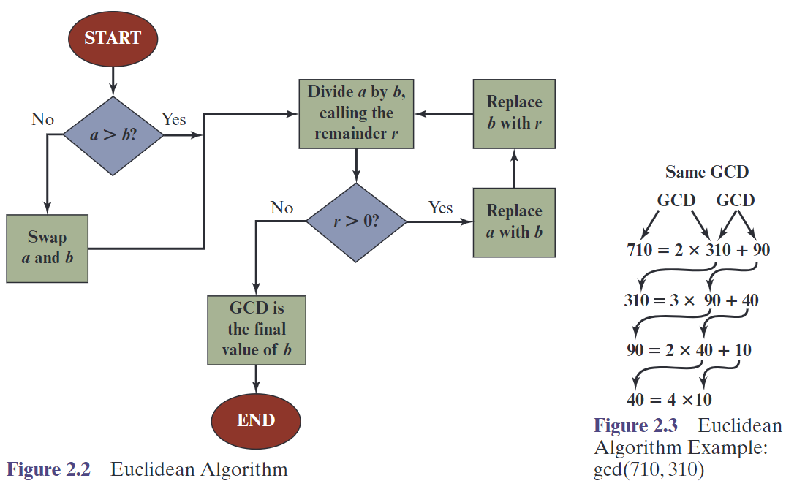
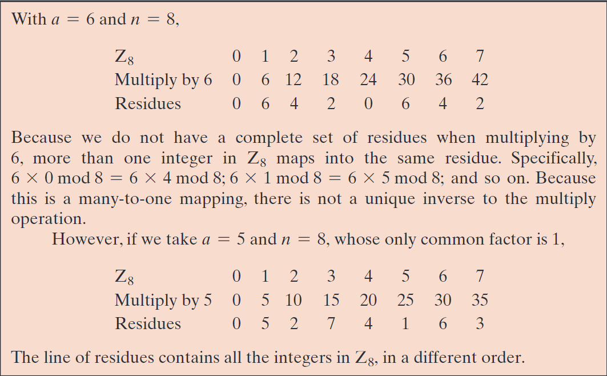
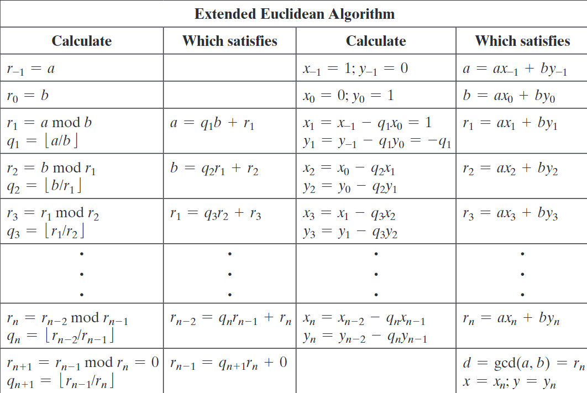
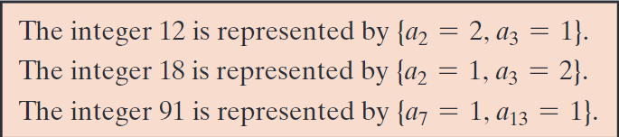
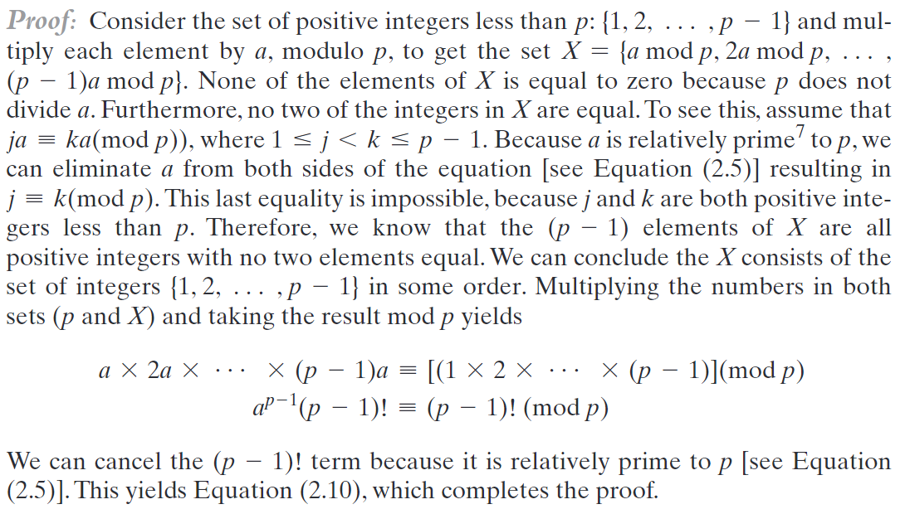
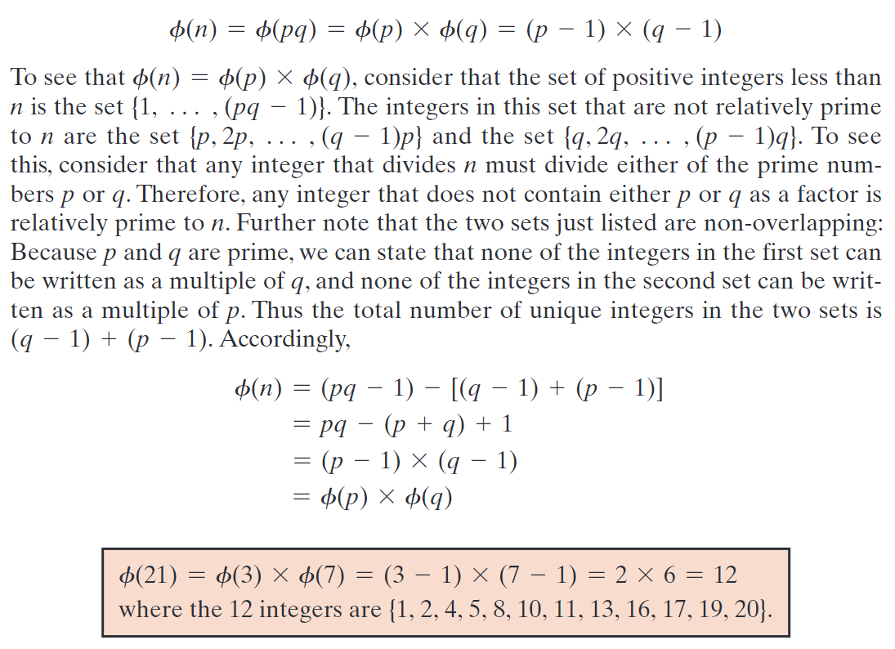
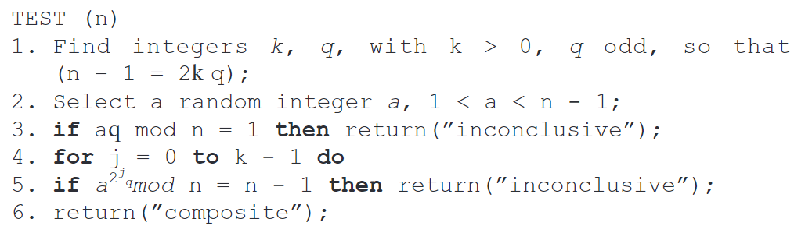
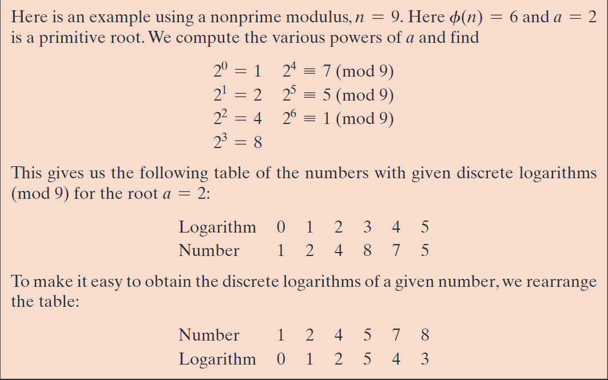

# Number Theory
## Divisability and The Division Algorithm
### Divisibility
Divisability
:  Let $a$ and $b$ be integers. We say that $a$ divides $b$ and write $a \mid b$ if there exists an integer $k$ such that $b = ak$.

Division Algorithm
:  Let $a$ and $b$ be integers with $a > 0$. Then there exist unique integers $q$ and $r$ such that $b = aq + r$ and $0 \leq r < a$.

## The Euclidean Algorithm

## Modular Arithmetic
### Congruence
Congruence
:  Let $a$, $b$, and $m$ be integers with $m > 0$. We say that $a$ is congruent to $b$ modulo $m$ and write $a \equiv b \pmod{m}$ if $m \mid (a - b)$.

### Modular Inverse
Modular Inverse of $a$ modulo $m$
:  Let $a$ and $m$ be integers with $a > 0$ and $m > 0$. Then there exists an integer $x$ such that $ax \equiv 1 \pmod{m}$ if and only if $a$ and $m$ are relatively prime.

### Modular arithmetic
Modular Addition
:  Let $a$, $b$, and $m$ be integers with $m > 0$. Then $(a + b) \pmod{m} = (a \pmod{m} + b \pmod{m}) \pmod{m}$.

Modular Multiplication
:  Let $a$, $b$, and $m$ be integers with $m > 0$. Then $(a \cdot b) \pmod{m} = (a \pmod{m} \cdot b \pmod{m}) \pmod{m}$.

Modular Exponentiation
:  Let $a$, $b$, and $m$ be integers with $m > 0$. Then $(a^b) \pmod{m} = ((a \pmod{m})^b) \pmod{m}$.

Extended Euclidean algorithm
:  Let $a$ and $b$ be integers. Then there exist integers $x$ and $y$ such that $ax + by = \gcd(a, b)$.

## Prime Numbers
### Prime Numbers
Prime Number
:  A prime number is an integer greater than 1 that has no positive integer divisors other than 1 and itself.

### The Fundamental Theorem of Arithmetic
The Fundamental Theorem of Arithmetic
:  Every integer greater than 1 can be expressed as a unique product of prime numbers, up to the order of the factors.

$$
  a = \Pi_{p \in \mathcal{P}} p^{e_p} \quad \text{where} \quad e_p \in \mathbb{N} \cup \{0\} \quad \text{and } \mathcal{P} \text{ is the set of all prime numbers}
$$

## Fermat's and Euler's Theorems
### Fermat's Little Theorem
Fermat's Little Theorem
:  Let $p$ be a prime number and $a$ be an integer not divisible by $p$. Then $a^{p-1} \equiv 1 \pmod{p}$.

Alternative Form: 
$$
  a^p \equiv a \pmod{p}
$$

$a$ needn't to be relatively prime to $p$

### Euler's Theorem
Euler's Totient Function
:  Let $n$ be a positive integer. Then $\phi(n)$ is the number of positive integers less than $n$ that are relatively prime to $n$.

Properties:
1. $\phi(1) = 1$
2. If $p$ is a prime number, then $\phi(p) = p - 1$
3. If $n$ is a product of distinct prime numbers, then $\phi(n) = n \prod_{p \in \mathcal{P}} (1 - \frac{1}{p})$

We can prove (3) under the assumption that $n$ is a product of 2 prime numbers $p$ and $q$:

Euler's Theorem
:  Let $n$ be a positive integer and $a$ be an integer not divisible by $n$. Then $a^{\phi(n)} \equiv 1 \pmod{n}$, where $\phi(n)$ is Euler's totient function.

Alternative Form:
$$
  a^n \equiv a \pmod{n}
$$

$a$ needn't to be relatively prime to $n$

## Testing for Primality
Two properties of prime numbers:
* if $p$ is prime and $a$ is an interger less than $p$, then $a^2 \pmod p = 1$ if and only if $a \pmod p = 1$ or $a \pmod p = -1$
* Let $p$ be a prime number greater than 2, We can then write $p-1 = 2^k q$ with $ k \gt 0 $, $q$ odd. Let $a$ be an integer in the range $1 < a < p-1$, then:
  * $a^q \pmod p = 1$
  * there exists a $j, 0 \le j \lt k$ such that $a^{2^j q} \pmod p = -1$

Miller-Rabin Primality Test
:  Let $n$ be a positive integer greater than 2. Then $n$ is prime if and only if for every integer $a$ in the range $1 < a < n$, one of the following holds:
  * $a^2 \pmod n = 1$
  * there exists a $j, 0 \le j \lt k$ such that $a^{2^j q} \pmod n = -1$

## The Chinese Remainder Theorem
The Chinese Remainder Theorem
:  Let $n_1, n_2, \ldots, n_k$ be pairwise coprime positive integers. Then for any integers $a_1, a_2, \ldots, a_k$, there exists an integer $x$ such that $x \equiv a_i \pmod{n_i}$ for all $i$ in the range $1 \le i \le k$.

## Discrete Logarithm
Recall Euler's Theorem:
$$
  a^{\phi(n)} \equiv 1 \pmod{n}
$$

Think about a more general expression:
$$
  a^m \equiv 1 \pmod{n}
$$

The least positive exponent $m$ which satisfies the above equation is called **the order of $a$ modulo $n$**. or:
* The exponent to which a belongs $\pmod n$
* The length of the period generated by $a$

Primitive Root:
* A primitive root modulo $n$ is an integer $a$ such that $a^m \pmod n = 1$ for all $m$ in the range $1 \le m \le \phi(n) - 1$.

Let's derive the concepts of Discrete Logarithm

- Consider a primitive root $a$ for some prime number $p$ (the argument can be developed for nonprimes as well)
- Any integer $b$ satisfies $ b \equiv r \pmod p , 0 \le r \le p-1$
- so $ b \equiv a^i \pmod p, 0 \le i \le p-1$
- so we can write $ i = dlog_{a,p} (b) $

