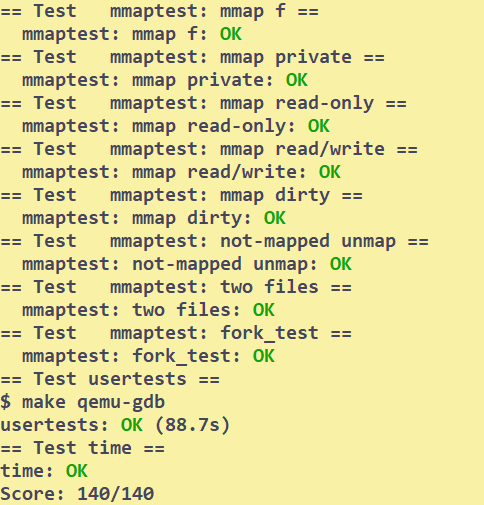

# mmap
## Setup
```bash
# to start 
git checkout mmap
make clean
```
Read lecture 17 notes to have a look.
## Tasks
You should finish this lab test by test.
```C
// add to proc.h
// - virtual memory area
#define VMANUM 16
// the vma is unused if no file owns it
struct vma {
  uint64 addr; // where the file is mapped
  int permission; // the area should be readable/writeble
  int flag; // map shared or private
  int length;
  struct file *file; // the file corresponding to the area
};
// add the vma table to struct proc
  struct vma vmas[VMANUM];  // - vma table
// add a handy function in proc.c
// find a vma contains va
// return 0 if not found
struct vma*
find_vma(uint64 va)
{
  struct proc *p = myproc();
  for(int i = 0; i < VMANUM; i++){
    if(p->vmas[i].file){
      if(va >= p->vmas[i].addr && va < (p->vmas[i].addr + p->vmas[i].length)){
        return &p->vmas[i];
      }
    }
  }
  return 0;
}
```
### mmap
```C
uint64
sys_mmap(void){
  struct proc *p = myproc();
  // - parse the parameters 
  int length,prot,flags,fd;
  argint(1,&length);
  argint(2,&prot);
  argint(3,&flags);
  argint(4,&fd);

  struct file *f = p->ofile[fd];
  filedup(f);

  if((flags & MAP_SHARED) && !(f->writable) && (prot & PROT_WRITE)){
    // ! permission error, file couldn't be written
    return -1;
  }
  // - find an unused region in the address space to map the file
  // 1. scan the pagetable to find a region not being used
  // ! if length > PGSIZE, you may need to find a continous region
  pte_t *pte;
  uint64 a = 0;

  int len = 0;

  int iteration = 0;
  while(len < length){
    if(iteration++ > 10)
      panic("mmap: no continous unused region");
    while((pte = walk(p->pagetable,a,0)) != 0){
      a += PGSIZE;
    }
    // - find the first unused address 
    // check if the next region is unused
    for(; len < length; len += PGSIZE){
      if((pte = walk(p->pagetable,a + len,0)) != 0){
        // ! not a continous unused region
        len = 0;
        break;
      }
    }
  }
  // - add a vma to proc's table
  struct vma *v = 0;
  for(int j = 0; j < VMANUM; j++){
    if(!(p->vmas[j].file)){
      // * not used
      v = &p->vmas[j];
      break;
    }
  }
  if(v){
    v->length = length;
    v->addr = a;
    v->file = f;
    v->permission = prot;
    v->flag = flags;
  } else {
    printf("mmap: no unused vma\n");
    return (uint64) -1;
  }
  // - map the needed pages
  if((mappages(p->pagetable,v->addr,length,0,PTE_U)) != 0){
    printf("mmap: map failed\n");
    return (uint64)-1;
  }
  return v->addr;
  // ! page fault will occur
  // check the table and see the permission
}
```
### munmap
```C
uint64
sys_munmap(void){
  struct proc *p = myproc();
  uint64 addr;
  int len;
  argaddr(0,&addr);
  argint(1,&len);

  addr = PGROUNDDOWN(addr);
  struct vma *v;
  if((v = find_vma(addr))){
    // - unmap the pages
    pte_t *pte;
    for(int i = 0; i < len; i += PGSIZE){
      if((pte = walk(p->pagetable,addr+i,0)) == 0){
        printf("munmap: page not mapped\n");
        return -1;
      }
      if((v->flag & MAP_SHARED) && (*pte & PTE_W)){
        int r = 0;
        // ! map shared, write to the file
        int max = ((MAXOPBLOCKS-1-1-2) / 2) * BSIZE;
        int off = 0;
        while(off < PGSIZE){
          int n1 = PGSIZE - off;
          if(n1 > max)
            n1 = max;
          begin_op();
          ilock(v->file->ip);
          r = writei(v->file->ip, 1, addr+i+off, (addr+i - v->addr+off), n1);
          iunlock(v->file->ip);
          end_op();
          if(r != n1){
            // error from writei
            printf("munmap: error on writing to file\n");
            break;
          }
          off += r;
        }
      }
      uvmunmap(p->pagetable,addr+i,1,(*pte & (PTE_R | PTE_W)));
    }
    // - page all unmapped, close the file
    int close = 1;
    for(int i = 0; i < v->length; i += PGSIZE){
      if((pte = walk(p->pagetable,v->addr+i,0)) != 0)
        close = 0;
    }
    if(close){
      fileclose(v->file);
      v->file = 0;
    }
  }else{
    printf("munmap: not a mmap addr\n");
    return -1;
  }
  return 0;
}
```

### others
```C
// in proc.c exit()
// add the following
  // - unmap all vmas
  struct vma *v;
  for(int i = 0; i < VMANUM; i++){
    if(p->vmas[i].file){
      v = &p->vmas[i];
      pte_t *pte;
      for(int j = 0; j < v->length; j += PGSIZE){
        pte = walk(p->pagetable,v->addr+j,0);
        if((*pte) != 0){
          if((v->flag & MAP_SHARED) && (*pte & PTE_W)){
            int r = 0;
            // ! map shared, write to the file
            int max = ((MAXOPBLOCKS-1-1-2) / 2) * BSIZE;
            int off = 0;
            while(off < PGSIZE){
              int n1 = PGSIZE - off;
              if(n1 > max)
                n1 = max;
              begin_op();
              ilock(v->file->ip);
              r = writei(v->file->ip, 1, v->addr+j+off, j+off, n1);
              iunlock(v->file->ip);
              end_op();
              if(r != n1){
                // error from writei
                printf("munmap: error on writing to file\n");
                break;
              }
              off += r;
            }
          }
          uvmunmap(p->pagetable,v->addr+j,1,(*pte & (PTE_R | PTE_W)));
        }
      }
      fileclose(v->file);
      v->file = 0;
    }
  }
```

```C
// in proc.c fork()
// add the following
  // - copy vmas 
  struct vma *v;
  for(int i = 0; i < VMANUM; i++){
    if(p->vmas[i].file){
      v = &p->vmas[i];
      np->vmas[i] = *v;
      if((mappages(np->pagetable,v->addr,v->length,0,PTE_U)) != 0){
        printf("fork: mappage failed\n");
      }
      filedup(np->vmas[i].file);
    }
  }
```
## Conclusion
Approximately 6h.


## Bugs
Indeed, it isn't a bug. But it wastes a lot of space.

when `uvmunmap`, the `pte` corresponding to the `va` will be set to 0. But you can still use the `va` to find the `pte`, even though it is now unused.

But I find the unused space in address space using the `pte`, so pages unmapped are not used, waste a lot of space.
