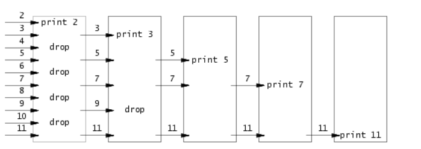
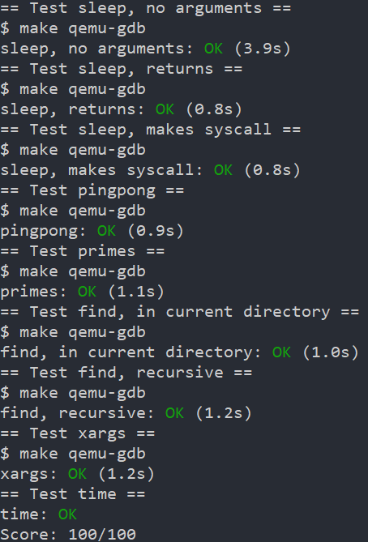

# Lab: Xv6 and Unix utilities
Lab site: [lab:util](https://pdos.csail.mit.edu/6.S081/2022/labs/util.html)
## Setup
See this [6.S081 Tools](https://pdos.csail.mit.edu/6.S081/2022/tools.html) to install the dependencies.
```bash
# After setup the environments, Do the followings
# Clone the git repo
git clone git://g.csail.mit.edu/xv6-labs-2022
# Checkout to the corresponding branch
git checkout util
# build and run xv6
make qemu
# xv6 has no ps command 
# but if you type Ctrl-p,t
# the kernel will print information about each process.
# To quit qemu type: Ctrl-a x
```
## Tasks
```bash
# Add your `sleep` to `UPROG` in Makefile
# to Grade all your program
make grade
# to Grade a specific program
./grade-lab-util sleep
# or:
make GRADEFLAGS=sleep grade
```
### sleep
Just a warmup. Learn how to pass arguments to command using:
```C
int
main(int argc, char *argv[])
{
    if (argc <= 1) {
        fprintf(2, "Usage: sleep time\n");
        exit(1);
    }
    sleep(atoi(argv[1]));
    exit(0);
}
```
### pingpong
A exercise on `read` and `write` plus `pipe` usage.
> If no data is available, **a read on a pipe waits for either data to be written or for all file descriptors referring to the write end to be closed**; in the latter case, read will return 0, just as if the end of a data file had been reached. The fact that read blocks until it is impossible for new data to arrive is one reason that **it’s important for the child to close the write end of the pipe before executing** wc above: if one of wc ’s file descriptors referred to the write end of the pipe, wc would never see EOF.

A pipe has a read-end and write-end, not just 2 fd to read from or write to.
To ping-pong a byte between 2 processes,we need a pair of pipes,one for each direction.

```C
int main(int argc,char* argv) {
    int pid;
    int p_P2C[2];
    int p_C2P[2];
    char buf[512];
    pipe(p_P2C);
    pipe(p_C2P);

    if (fork() == 0) {
        close(0);
        dup(p_P2C[0]); // Read from p[0]
        close(p_P2C[0]);
        close(p_P2C[1]);
        pid = getpid();
        while (read(0,buf,sizeof buf) > 0) {
            fprintf(1,"%d: received ping\n",pid);
            write(p_C2P[1],buf,1);
        }
    } else {
        pid = getpid();
        close(0);
        dup(p_C2P[0]);
        close(p_C2P[0]);
        close(p_C2P[1]);
        // Start Ping a byte
        write(p_P2C[1],"h",1);
        close(p_P2C[1]);
        if (read(0,buf,sizeof buf) > 0) {
            fprintf(1,"%d: received pong\n",pid);
            //write(p_P2C[1],buf,1);
        }
    }
    exit(0);
}

```
### primes
First,you must read through [Bell Labs and CSP Threads](https://swtch.com/~rsc/thread/) to figure out how to do it.

Here are the notes.
- communicating sequential processes (CSP)
- not of efficiency,but of clarity
- processes communicate by **sending or receiving values from named unbuffered channels**. Since the channels are unbuffered, **the send operation blocks until the value has been transferred to a receiver**, thus providing a mechanism for synchronization.
- The sieve of Eratosthenes can be simulated by a pipeline of processes executing the following pseudocode:
```bash
p = get a number from left neighbor
print p
loop:
    n = get a number from left neighbor
    if (p does not divide n)
        send n to right neighbor
```


- The main thread passes its pipe to the main prime thread,and send 2-35.
- in each thread
  - set the pipe to receive number from the left neighbor
  - set the first received number to the prime,if nothing read,exit
  - drop and create a new thread,pass pipe to it and send the left number.
```C
int fork2filt(int* p) {
    int prime;
    int buf;
    close(0);
    dup(p[0]);
    close(p[0]);
    close(p[1]);
    if (read(0,&buf,4) > 0) prime = buf;
    else exit(1);

    int pp[2];
    pipe(pp);
    if (fork() == 0) {
        fork2filt(pp);
    } else {
        close(pp[0]);
        fprintf(1,"prime %d\n",prime);
        while (read(0,&buf,4) > 0) {
            if (buf % prime == 0) continue;
            write(pp[1],&buf,4);
        }
        close(pp[1]);
        wait((int* ) 0);
    }
    exit(0);
}

int main(int argc,char* argv[]) {
    int p[2];
    pipe(p);
    if (fork() == 0)
    {
        fork2filt(p);
    } else {
        close(p[0]);
        for (int i = 2; i < 36; i++) {
            write(p[1],&i,4);
        }
        close(p[1]);
        // Wait for the main prime process to end
        wait((int*) 0);
    }
    exit (0);
}
```
### find
Find out how `ls` works
```C
{
...;
case T_DIR:
    // path/entry/ --- 1 + Dirsiz + 1
    if(strlen(path) + 1 + DIRSIZ + 1 > sizeof buf){
      printf("ls: path too long\n");
      break;
    }
    // make up path/ into buf
    strcpy(buf, path);
    p = buf+strlen(buf);
    *p++ = '/';
    // read entrys from fd
    while(read(fd, &de, sizeof(de)) == sizeof(de)){
      if(de.inum == 0)
        continue;
      memmove(p, de.name, DIRSIZ);
      p[DIRSIZ] = 0;
      // Get entry's stat
      if(stat(buf, &st) < 0){
        printf("ls: cannot stat %s\n", buf);
        continue;
      }
      printf("%s %d %d %d\n", fmtname(buf), st.type, st.ino, st.size);
    }
    break;
  }
```

```C
// Following are my solution
char* fmtname(char* path);
void find(char* path,char* pattern);
int main(int argc,char* argv[]) {
    if (argc != 3) {
        fprintf(2,"Usage: find dir pattern\n");
        exit(1);
    }
    char *path,*pattern;
    path = argv[1];
    pattern = argv[2];
    find(path,pattern);
    exit(0);
}
void find(char* path,char* pattern) {
    int fd;
    struct stat st;
    char buf[512], *p;
    struct dirent de;
    if((fd = open(path, 0)) < 0){
        fprintf(2, "find: cannot open %s a\n", path);
        return;
    }

    if(fstat(fd, &st) < 0){
        fprintf(2, "find: cannot stat %s\n", path);
        close(fd);
        return;
    }
    switch (st.type) {
        case T_DEVICE:
        case T_FILE:
            if (strcmp(fmtname(path),pattern) == 0) {
                fprintf(1,path);
                fprintf(1,"\n");
            }
            break;
        case T_DIR:
            if(strlen(path) + 1 + DIRSIZ + 1 > sizeof buf){
                printf("find: path too long\n");
                break;
            }
            strcpy(buf, path);
            p = buf+strlen(buf);
            *p++ = '/';
            while(read(fd, &de, sizeof(de)) == sizeof(de)){
                if(de.inum == 0)
                    continue;
                if(strcmp(de.name,".") == 0)
                    continue;
                if(strcmp(de.name,"..") == 0)
                    continue;
                memmove(p, de.name, DIRSIZ);
                p[DIRSIZ] = 0;
                find(buf,pattern);
            }
            break;
    }
    close(fd);
    return;
}
char* fmtname(char* path) {
    static char *p;
    p = "";
    for(p=path+strlen(path); p >= path && *p != '/'; p--)
        ;
    p++;
    return p;
}
```
### xargs
A simple case using `exec`
```C
char* getline();
int main(int argc,char* argv[]) {
    if (argc < 1) {
        fprintf(2,"Usage: xargs command [arguments...]");
        exit(1);
    }
    char* cmdArgv[MAXARG];
    for (int i = 1; i < argc; i++) {
        cmdArgv[i-1] = argv[i];
    }
    for(;;) {
        cmdArgv[argc-1] = getline();
        if(strcmp(cmdArgv[argc-1],"") == 0) break;
        if (fork() == 0)
        {   
            exec(cmdArgv[0],cmdArgv);
        } else {
            wait((int* ) 0);
        }
    }
    exit(0);
}

char* getline() {
    static char buf[512];
    buf[0] = 0;
    int id = 0;
    char s;
    while(read(0,&s,1) > 0) {
        if(s == '\n') break;
        buf[id++] = s;
    }
    buf[id] = '\0';
    return buf;
}

```
## Conclusion
| sleep | pingpong | primes | find | xargs | total |
| --- | --- | --- | --- | --- | --- |
| 10' | 20' | 70' | 90' | 50' | 4h |



This lab is useful to warmup for xv6.

## Bugs
!!! Warn Don't return a local variable!!!
```C
// Don't do this
char* str;
str = "hello world";
return str;
// Use static
static char* str;
str = "hello world";
return str;
```