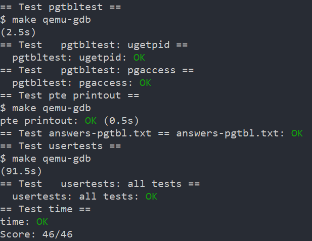

# Page Tables
## Prerequisites
Reading: 
* xv6Book ch3
* RISC-V manual
source files:
* kernel/memlayout.h: the layout of the memory
* kernel/vm.c: Most of the Virtual Machine codes
* kernel/kalloc.c: codes for allocating and freeing physical memory

```bash
# To Start 
git checkout pgtbl
make clean 
```
## Tasks
### Speed up system calls
To learn how to insert mappings into a page table.Do a optimization for `getpid()` syscall.
- read `memlayout.h`: `struct usyscall` and `USYSCALL`
```C
#ifdef LAB_PGTBL
#define USYSCALL (TRAPFRAME - PGSIZE)

struct usyscall {
  int pid;  // Process ID
};
```
so `USYSCALL` is a page under trapframe
`struct usyscall` contains just a `pid`
```C
// in proc.h
// add a usyscall page
struct usyscall *usyscall;

// in allocproc
// Allocate a usyscall page.
if((p->usyscall = (struct usyscall *)kalloc()) == 0){
  freeproc(p);
  release(&p->lock);
  return 0;
}
p->usyscall->pid = p->pid;

// in freeproc
if(p->usyscall)
  kfree((void*)p->usyscall);
p->usyscall = 0;

// in proc_freepagetable
uvmunmap(pagetable,USYSCALL,1,0);

// in proc_pagetable
// map the usyscall page just below the trapframe page
if(mappages(pagetable,USYSCALL,PGSIZE,
            (uint64)(p->usyscall), PTE_U | PTE_R) < 0)
{
  uvmunmap(pagetable, TRAMPOLINE, 1, 0);
  uvmunmap(pagetable, TRAPFRAME, 1, 0);
  uvmfree(pagetable, 0);
  return 0;
}
```

### Print a page table
Follow the hints and mimic the source files, it is easy to done.
```C
int 
pgPrint(int level,pagetable_t pagetable)
{
  for (int i = 0;i < 512; i++){
    pte_t pte = pagetable[i];
    if(pte & PTE_V){
      for(int j = 0;j < level; j++){
        printf(" ..");
      }
      uint64 child = PTE2PA(pte);
      printf("%d: pte %p ",i,pte);
      printf("pa %p\n",child);
      if((pte & (PTE_R|PTE_W|PTE_X)) == 0){
      // this PTE points to a lower-level page table.
        pgPrint(level+1,(pagetable_t)child);
      }
    }
  }
  return 0;
}


int 
vmprint(pagetable_t pagetable)
{
  printf("page table %p\n",pagetable);
  return pgPrint(1,pagetable); 
}


```

### Detect which pages have been accessed
```C
char *buf;
unsigned int abits;
...
printf("pgaccess_test starting\n");
if (pgaccess(buf, 32, &abits) < 0)
  ...
```
From the above snippet,we can see how to declare the `pgaccess` syscall.
Follow the hints, this lab is easy to finish.
```C
int
sys_pgaccess(void)
{
  // lab pgtbl: your code here.
  struct proc *p = myproc();
  // * Declare the variable to hold the parameters
  uint64 usrePageVa; // the starting virtual address of the first user page to check
  int pageNum; // the number of pages to check
  uint64 userAbits; // a user address to a buffer to store the results into a bitmask
  // * Parse the parameters
  argaddr(0,&usrePageVa);
  argint(1,&pageNum);
  argaddr(2,&userAbits);
  if(pageNum >= 512*512*512){
    printf("Ask to scan too many pages!!!\n");
    return -1;
  }
  uint64 bitmasks = 0;
  for(int i=0; i < pageNum; i++){
    pte_t *pte = walk(p->pagetable,usrePageVa+i*PGSIZE,0);
    if(*pte & PTE_V){
      if(*pte & PTE_A){ // 1L << 6 according to the spec
        bitmasks |= 1 << i;
        *pte &= ~PTE_A;
      }
    }
    
  }
  // * Copy out the usesrbits
  if(copyout(p->pagetable,userAbits,(char *)(&bitmasks),sizeof(bitmasks))){
    return -1;
  }
  return 0;
}
```

```C
int pgaccess(char*,int,unsigned int*)
```

in `kernel/sysproc.c`
## Conclusion
| speedUp | printTable | Detect |
| --- | --- | --- |
| 30' | 40' | 40' |



## Bugs
This lab is not so hard. I have wasted so much time on a fault that regard the `pgaccess` test as a part of the `ugetpid` test. So much time wasted on the no-result debugging.