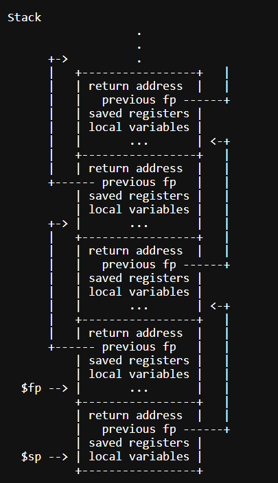
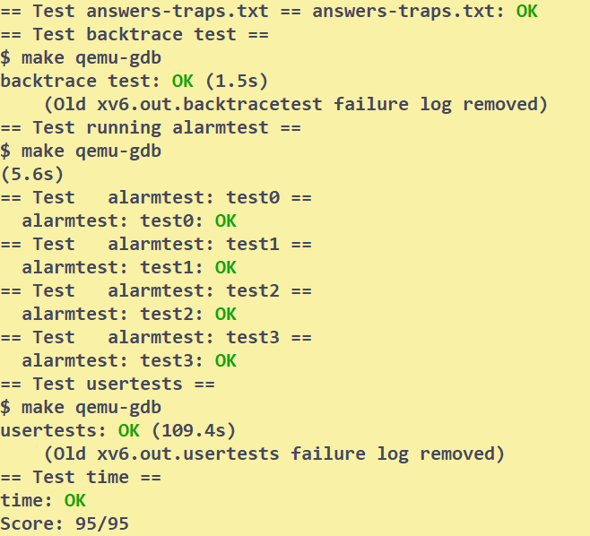

# Traps
## Setup
Reading:
* xv6Book ch4
* RISC-V Manual

Source file:
* `kernel/trampoline.S`: the assembly involved in changing from user space to kernel space and back
* `kernel/trap.c`: code handling all interrupts

```bash
# to start the lab
git checkout traps
make clean
```
## Tasks
### RISC-V Assembly
All the answers given in the lecture notes.The most important points for this task are:
* `jalr` puts `pc+4` into ra
* big-endian and little-endian
* `a0,a1,...` stores the syscall parameters
* function parameters are on the stack
### Backtrace
This task requires the understanding of passing arguments between functions.

The key point is that `(fp-8)` saves the return address and `(fp-16)` saves the corresponding stack frame.
* Don't forget dereference the frame pointer
* all the frames of the same process are stored in the same page,so compare the `PGROUNDOWN` to detect the bound.

```C
void 
backtrace(void)
{
  uint64 sf_ptr = r_fp();
  uint64 pgdown = PGROUNDDOWN(sf_ptr);
  uint64 npgdown = pgdown;
  uint64 ra_ptr;

  printf("backtrace: \n");
  while(npgdown == pgdown){
    ra_ptr = sf_ptr - 8;
    sf_ptr = *(uint64*) (sf_ptr -16);
    npgdown = PGROUNDDOWN(sf_ptr);
    printf("%p\n",*(uint64*)(ra_ptr));
  }
  return;
}
```
### Alarm
This task is quite hard unless you deeply understand how traps are handled.
```C
// Register the syscalls
// Add the follows to struct proc in proc.h
  int ticks; // alarm interval
  int cnt; // Counter
  uint64 handler; // handler address
    struct trapframe *hdlerFrame; // Store the states:back-up the trapframe
  int isReturned; // if not returned,shouldn't call handler

// in trap.c:usertrap()
  if(which_dev == 2){
    if(p->ticks == 0){
      yield();
    } else{
      p->cnt += 1;
      if (p->cnt >= p->ticks && p->isReturned){
        // - Wait until return
        p->isReturned = 0;
        // - reset the counter
        p->cnt = 0; 
        // - Store the registers and pc
        memmove(p->hdlerFrame,p->trapframe,sizeof(struct trapframe));
        p->trapframe->epc = p->handler;
      }
    }
  }
// in sysproc.c
uint64 
sys_sigalarm(void)
{
  struct proc* p = myproc();
  argint(0,&(p->ticks));
  // * install the handler in the process
  argaddr(1,&(p->handler));
  return 0;
}

uint64
sys_sigreturn(void)
{
  struct proc* p = myproc();
  memmove(p->trapframe,p->hdlerFrame,sizeof(struct trapframe));
  p->isReturned = 1;
  return p->trapframe->a0;
}
```
## Conclusion
| asm | backtrace | alarm |
| --- | --- | --- |
| 20' | 60' | 180' |



## Bugs
1. misunderstand the stack frame.Use it directly without dereferencing.
2. not deeply understand how trap works. Waste a lot of time do sth useless.