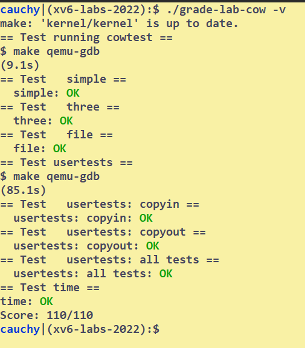

# Copy-on-Write Fork for xv6
## Setup
COW fork(): 
* **creates just a pagetable** for the child, with PTEs for user memory pointing to the parent's physical pages. 
* **marks all the user PTEs** in both parent and child as **read-only**. 
* When either process tries to **write one of these COW pages**, the CPU will **force a page fault**. 
* The kernel **page-fault handler** detects this case, 
  * **allocates a page** of physical memory for the faulting process, 
  * **copies** the original page into the new page, 
  * **modifies the relevant PTE** in the faulting process to refer to the new page, this time with the **PTE marked writeable**. 
* When the page fault handler returns, the user process will be able to write its copy of the page.

**A given physical page** may be referred to by multiple processes' page tables, and **should be freed only when the last reference disappears**.
```bash
# To Start 
git checkout cow
make clean

# To validate your answer
make qemu
$ cowtest
$ usertests -q
```

## Tasks
### Copy on Write
```C
// a record for each PTE that indicates whether it is a cow mapping
// in risc-v PTE, reserved software bits in the PTE are [9:8]
// add a mark to riscv.h
#define PTE_COW (1L << 8) // * whether is a cow mapping
// add a macro to index the refCnts list
#define REF_INDEX(pa) (PGROUNDDOWN(pa)- KERNBASE)/PGSIZE
```
#### uvmcopy {#uvmcopy}
In this file, Our goal is to:
* map parent pages to child, but not allocate new memory
* clear `PTE_W` if exists
* set `PTE_COW` to indicate that it is a cow page
* increment the reference count

```C
int
uvmcopy(pagetable_t old, pagetable_t new, uint64 sz)
{
  pte_t *pte;
  uint64 pa, i;
  uint flags;
  for(i = 0; i < sz; i += PGSIZE){
    if((pte = walk(old, i, 0)) == 0)
      panic("uvmcopy: pte should exist");
    if((*pte & PTE_V) == 0)
      panic("uvmcopy: page not present");
    pa = PTE2PA(*pte);
    flags = PTE_FLAGS(*pte);
    if(flags & PTE_W) {
      // * set cow 
      flags &= ~ PTE_W;
      flags |= PTE_COW;
      *pte &= ~PTE_W;
      *pte |= PTE_COW;
    }
    // Simply map, not allocate new memory
    if(mappages(new, i, PGSIZE, pa, flags) != 0){ 
      goto err;
    }
    // * increment ref count 
    refCnts[REF_INDEX(pa)] += 1;
  } 
  return 0;
err:
  uvmunmap(new, 0, i / PGSIZE, 1);
  return -1; 
}
```

#### usertrap {#usertrap}
In this file, our goal is to:
* detect page-fault exception
  * in risc-v, `scause[XLEN-1]=0`
  * `scause[XLEN-2:0]=12`: instruction page fault
  * `scause[XLEN-2:0]=13`: load page fault
  * `scause[XLEN-2:0]=15`: store page fault
  * for cow, it should be a **store page fault**, so check `scause==15`
* handle page-fault exception
  * check whether it is a cow page-fault by checking PTE_COW
  * if yes
    * allocate a new page:if failed, kill the process
    * copy from old page to new page
    * set new page the necessary `PTE_W` bits
    * unmap old page and install new page
  * if not
    * just kill the page

```C
// scause indicates the type of page fault
// stval contains the virtual address that couldn't be translated
  if(r_scause() == 15){
    // * a store page-fault
    if(killed(p)){
      exit(1);
    }

    pte_t *pte;
    uint64 addr = PGROUNDDOWN(r_stval());
    if(addr >= MAXVA){
      printf("usertrap: Outbound the MAXVA\n");
      setkilled(p);
    } else if((pte = walk(p->pagetable,addr,0)) == 0){
      printf("usertrap: pte should exist\n");
      setkilled(p);
    } else if((*pte & PTE_V) == 0){
      printf("usertrap: page not present\n");
      setkilled(p);
    } else if((*pte & PTE_COW) == 0){
      printf("usertrap: Not a cow pagefault\n");
      setkilled(p);
    } else {
      char* mem;
      uint flags;
      uint64 pa;
      pa = PTE2PA(*pte);
      if((mem = kalloc()) == 0){
        printf("usertrap: No more memory\n");
        setkilled(p);
      } else {
        memmove(mem,(char*)pa,PGSIZE);

        flags = PTE_FLAGS(*pte);
        flags |= PTE_W; // * set the PTE_W
        flags &= ~PTE_COW; // * unset the PTE_COW
        // * remap to a new page
        uvmunmap(p->pagetable,addr,1,1);
        if(mappages(p->pagetable,addr,PGSIZE,(uint64)mem,flags) != 0){
          panic("usertrap: map failed");
          kfree(mem);
          setkilled(p);
        }
      }
    }
  } else if(r_scause() == 13){
    // a load page fault
    printf("usertrap: load page fault\n");
    setkilled(p);
  } ...
```
#### kalloc {#kalloc}
In this file, our goal is to:
* keep a reference count for each physical page
* shouldn't destroy the kernel

```C
// in kalloc.c
// * Defining the reference count list
#define REF_MAX (PHYSTOP-KERNBASE)/PGSIZE
int refCnts[REF_MAX] = {0};

// in kfree()
// it's important to do the check in the kfree
// otherwise, it will repeat so many times
void
kfree(void *pa)
{
  struct run *r;

  if(((uint64)pa % PGSIZE) != 0 || (char*)pa < end || (uint64)pa >= PHYSTOP)
    panic("kfree");
  
  uint64 refOffset = REF_INDEX((uint64)pa);

  if(refCnts[refOffset] <= 1){
    // Fill with junk to catch dangling refs.
    memset(pa, 1, PGSIZE);
    refCnts[refOffset] = 0; // * set the ref cnt to 0

    r = (struct run*)pa;

    acquire(&kmem.lock);
    r->next = kmem.freelist;
    kmem.freelist = r;
    release(&kmem.lock);
  } else {
    refCnts[refOffset] -= 1;
  }
}
// in kalloc()
  if(r){
    memset((char*)r, 5, PGSIZE); // fill with junk
    refCnts[REF_INDEX((uint64)r)] = 1; // * initialize the ref cnt to 1
  }
```
#### copyout {#copyout}
Because copyout will write to a page, and the page, as a result of cow, is always with `PTE_W` unset, i.e. a cow page. So mimic the memory allocation in the usertrap() and the work is done.
```C
int
copyout(pagetable_t pagetable, uint64 dstva, char *src, uint64 len)
{
  uint64 n, va0, pa0;
  pte_t *pte;
  uint64 flags;
  while(len > 0){
    va0 = PGROUNDDOWN(dstva);
    pa0 = walkaddr(pagetable, va0);
    if(pa0 == 0)
      return -1;
    if((pte = walk(pagetable,va0,0)) == 0){
      panic("copyout: pte should exist");
    }
    flags = PTE_FLAGS(*pte);
    if((*pte & PTE_V) == 0){
      panic("copyout: page not present");
    }
    if(flags & PTE_COW){
      char* mem;
      if((mem = kalloc()) == 0){
        // ! no more free space,kill p
        panic("copyout: No more memory!");
      } else {
        memmove(mem,(char*)pa0,PGSIZE);
        flags |= PTE_W; // * set the PTE_W
        flags &= ~PTE_COW; // * unset the PTE_COW
        // * remap to a new page
        uvmunmap(pagetable,PGROUNDDOWN(va0),1,1);
        if(mappages(pagetable,PGROUNDDOWN(va0),PGSIZE,(uint64)mem,flags) != 0){
          panic("copyout: map failed");
          kfree(mem);
        }
        pa0 = (uint64)mem;
      }
    }
    n = PGSIZE - (dstva - va0);
    if(n > len)
      n = len;
    memmove((void *)(pa0 + (dstva - va0)), src, n);

    len -= n;
    src += n;
    dstva = va0 + PGSIZE;
  }
  return 0;
}
```
## Conclusion
| CoW |
| --- |
| 6h |



## Bugs
* Page faults should kill the process only, not panic the kernel

