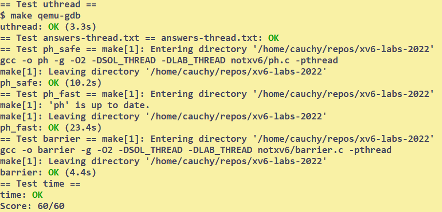

# Multithreading
## Setup
Reading:
* xv6Book:ch7
```bash
# To start
git checkout thread
make clean
```
## Tasks
### Uthread
```bash
# to test
make qemu
$ uthread
# and will output as the guide
make grade
# say your solution passed the uthread test
```
```C
// add a context in struct thread
struct thread {
  char       stack[STACK_SIZE]; /* the thread's stack */
  int        state;             /* FREE, RUNNING, RUNNABLE */
  struct context context;       /* switch will save context here */
}; 
// copy swtch into thread_switch
// in thread_create 
  t->context.ra = (uint64)func;
  t->context.sp = (uint64)t->stack + STACK_SIZE - 1;
// in thread_schedule
    /* YOUR CODE HERE
     * Invoke thread_switch to switch from t to next_thread:
     * thread_switch(??, ??);
     */
    thread_switch(&t->context,&current_thread->context);
```
It may be confusing that how can we return the the point where we leave. 
To accomplish this, let's trace a possible route:
* thread A calls `yield`
* `yield` calls `schedule`
* `schedule` calls `switch`
  * now when switch back, it will continue in the `schedule`.
  * but there is no more statement, so `schedule` returns to `yield`
  * `yield` returns to thread A

So it is not directly return the point. Don't misunderstand this.
### Using threads
```C
pthread_mutex_t lock[NBUCKET]; // a lock per bucket
// initialize in main
// - Init the locks
for(int i = 0; i < NBUCKET; i++)
    pthread_mutex_init(&lock[i], NULL);
// in put()
if(e){
    // update the existing key.
    e->value = value;
} else {
    // the new is new.
    pthread_mutex_lock(&lock[i]);       // acquire lock
    insert(key, value, &table[i], table[i]);
    pthread_mutex_unlock(&lock[i]);     // release lock
}
```
### Barrier
```C
static void 
barrier()
{
  pthread_mutex_lock(&bstate.barrier_mutex);
  bstate.nthread += 1;
  if(bstate.nthread >= nthread){
    bstate.nthread = 0;
    bstate.round += 1;
    pthread_mutex_unlock(&bstate.barrier_mutex);
    pthread_cond_broadcast(&bstate.barrier_cond);     // wake up every thread sleeping on cond
  } else {
    pthread_cond_wait(&bstate.barrier_cond, &bstate.barrier_mutex);
    pthread_mutex_unlock(&bstate.barrier_mutex); // when be waken up,hold the lock,should be released
  }
  
}
```

## Conclusion
| uthread | using threads | barrier |
| --- | --- | --- |
| 3h | 20' | 30' |


## Bugs
* misunderstand the thread switch.
  * it is easy to have the illusion that when loading `ra` and return, the pc will directly become the thread process point.
* in barrier: forget to unlock when be waken up --- deadlock

