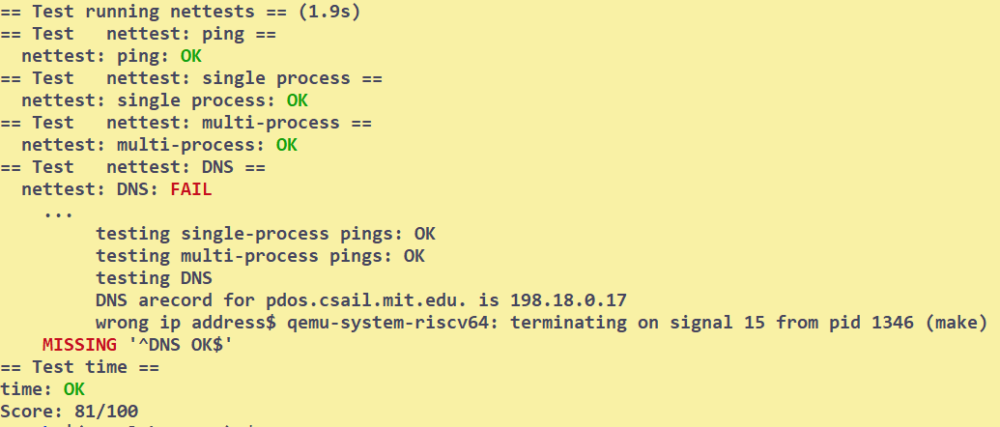

# Networking
## Setup
Reading:
* xv6Book: ch5
* Manual: 
  * ch2: overview of the device
  * ch3: receiving and transmitting overviews
  * ch14: understand the init code 
  * ch4.1(not subsections)
  * ch13(as a ref)
```bash
# to start 
git checkout net
make clean
# to display the recorded packets
tcpdump -XXnr packets.pcap
```
## Tasks
### Your Job
```C
/*
  following the hints, the lab could be done quickly
  however, you may encounter some problem in test... 
*/
int
e1000_transmit(struct mbuf *m)
{
  acquire(&e1000_lock);
  uint32 idx = regs[E1000_TDT];
  struct tx_desc *desc = &tx_ring[idx];
  if ((desc->status & E1000_TXD_STAT_DD) == 0){
    printf("e1000 transmit: error.\n");
    release(&e1000_lock);
    return -1;
  }
  if (tx_mbufs[idx]){
    mbuffree(tx_mbufs[idx]);
    tx_mbufs[idx] = 0;
  }
  desc->addr = (uint64)m->head;
  desc->length = (uint16)m->len;
  desc->cmd |= E1000_TXD_CMD_EOP | E1000_TXD_CMD_RS;
  tx_mbufs[idx] = m;
  // Update the TDT
  regs[E1000_TDT] = (regs[E1000_TDT] + 1) % TX_RING_SIZE;
  release(&e1000_lock);
  return 0;
}

static void
e1000_recv(void)
{
  // Don't add lock here. lock has been acquired and released in net
  uint32 idx = (regs[E1000_RDT] + 1) % RX_RING_SIZE;
  struct rx_desc *desc = &rx_ring[idx];
  while(desc->status & E1000_RXD_STAT_DD){
    rx_mbufs[idx]->len = desc->length;
    net_rx(rx_mbufs[idx]);
    rx_mbufs[idx] = mbufalloc(0);
    if(!rx_mbufs[idx]){
      panic("e1000");
    }
    desc->addr = (uint64)rx_mbufs[idx]->head;
    desc->status = 0;
    regs[E1000_RDT] = idx;
    idx = (regs[E1000_RDT] + 1) % RX_RING_SIZE;
    desc = &rx_ring[idx];
  }
  return;
}
```
## Conclusion
| Job |
| --- |
| ?h |


## Bugs
* declare a varible is a little different.
  * in this lab, you must use a pointer to the descriptor, not declare a varible.
* in a while loop, you must update the descriptor
* you may encounter problems in the tests like me. I suspect that the DNS test failed because IP changed...