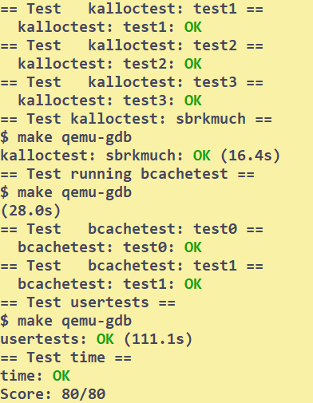

# Locks
## Setup
```bash
# to start 
git checkout lock
make clean
```

You should read the following contents of the xv6 book:
* ch6: lock
* ch3.5: to do the **memory allocator** task
* ch8.1-8.3: to do the **buffer cache** task

## Tasks
### Memory Allocator
Your Job:
* per-cpu free lists
* stealing when a CPU's free list is empty

```bash
# to test your implementation
$ kalloctest
```

```C
struct {
  struct spinlock lock;
  struct run *freelist;
} kmem[NCPU]; // - kmem per cpu

void
kinit()
{
  for(int i = 0;i < NCPU; i++){
    // TODO: string formatting may be better
    initlock(&kmem[i].lock,"kmem");
  }
  // - the cpu running freerange will get all the free memory
  freerange(end, (void*)PHYSTOP);
}

void
kfree(void *pa)
{
  // ! disable interrupt
  push_off();
  int id = cpuid();
  pop_off();

  struct run *r;

  if(((uint64)pa % PGSIZE) != 0 || (char*)pa < end || (uint64)pa >= PHYSTOP)
    panic("kfree");

  // Fill with junk to catch dangling refs.
  memset(pa, 1, PGSIZE);

  r = (struct run*)pa;

  acquire(&kmem[id].lock);
  r->next = kmem[id].freelist;
  kmem[id].freelist = r;
  release(&kmem[id].lock);
}

void *
kalloc(void)
{
  // ! disable interrupt
  push_off();
  int id = cpuid();
  pop_off();

  struct run *r;

  acquire(&kmem[id].lock);
  r = kmem[id].freelist;
  if(r) {
    kmem[id].freelist = r->next;
    release(&kmem[id].lock);
  } else {
    release(&kmem[id].lock);
    // - free-list empty, steal others
    for(int i = 0;i < NCPU; i++){
      acquire(&kmem[i].lock);
      r = kmem[i].freelist;
      if(r){
        kmem[i].freelist = r->next;
        release(&kmem[i].lock);
        break;
      } else {
        release(&kmem[i].lock);
      }
    }
  }

  if(r)
    memset((char*)r, 5, PGSIZE); // fill with junk
  return (void*)r;
}

```
### Buffer cache
This task is really hard...
We should carefully analyse where the bottomneck is:
#### shared resourse
This is different from the previous task.

To parallel the operations, we must analyse the shared resourses.

In the previous task, the shared resourse is the freelist shared by `NCPU`. We can split the list into several small ones.

Indeed, buffer cache can also utilize this technique. We can split the buffer to raise the parallel level.

Indeed, we really do it in this way. We hash the `blockno` to a bucket and use the bucket to parallelize the lookup operation.

```C
#define BUCKETS 13
struct bucket {
  struct spinlock lock;
  struct buf head;
};

struct {
  struct spinlock lock;
  struct buf buf[NBUF];
  struct bucket buckets[BUCKETS];
} bcache;
```
What's the main problem?
The main problem, indeed, is the way we find an unused buffer.
We have many choices:
1. we can lock the bcache and find
   * This requires that when we release the buffer, we should make sure that making it unused atomicly.
   * That is, when `refcnt--`, it may be possible that we are simutaneously finding an unused buffer.
   * So this requires locking the bcache in the release part
2. This doesn't work...
   * it could decrease the contention, but not work so well.
   * the best way is to make `relse` only `refcnt--` and do no other works
   * So when we need an unused buffer, we are not finding it globally. The unused buffer may lie in several bucket, so we find it in each bucket.

```C
// Look through buffer cache for block on device dev.
// If not found, allocate a buffer.
// In either case, return locked buffer.
static struct buf*
bget(uint dev, uint blockno)
{
  struct buf *b;
  struct buf *h;
  // - check the bucket
  int idx = blockno % BUCKETS;
  acquire(&bcache.buckets[idx].lock);
  h = &bcache.buckets[idx].head;
  b = h->next;
  while(b != h){
    if(b->blockno == blockno && b->dev == dev){
      // - buf cached in the bucket
      b->refcnt++;
      goto getBuf;   
    }
    b = b->next;
  }
  // ! not in the bucket
  release(&bcache.buckets[idx].lock);
  // - check bucket by bucket to find a unused
  for(int i = 0; i < BUCKETS; i++){
    acquire(&bcache.buckets[i].lock);
    h = &bcache.buckets[i].head;
    b = h->next;
    while(b != h){
      if(b->refcnt == 0){
        // - get it from the bucket
        b->dev = dev;
        b->blockno = blockno;
        b->valid = 0;
        b->refcnt = 1;
        b->prev->next = b->next;
        b->next->prev = b->prev;
        release(&bcache.buckets[i].lock);
        goto mount;
      }
      b = b->next;
    }
    release(&bcache.buckets[i].lock);
  }
  panic("bget: no buffers");

mount:
  acquire(&bcache.buckets[idx].lock);
  h = &bcache.buckets[idx].head;
  b->next = h->next;
  h->next->prev = b;
  h->next = b;
  b->prev = h;
getBuf:
  release(&bcache.buckets[idx].lock);
  acquiresleep(&b->lock);
  return b;
}
/*
  Indeed, Single Link is enough.
  I just maintain it for familiarize data structures...
*/
```
```C
// Release a locked buffer.
// Move to the head of the most-recently-used list.
void
brelse(struct buf *b)
{
  if(!holdingsleep(&b->lock))
    panic("brelse");

  releasesleep(&b->lock);

  int idx = b->blockno % BUCKETS;
  acquire(&bcache.buckets[idx].lock);
  b->refcnt--;
  release(&bcache.buckets[idx].lock);
}
```

```C
void
binit(void)
{
  struct buf *b;
  initlock(&bcache.lock, "bcache");
  // - init the buckets
  for(int i = 0; i < BUCKETS; i++){
    b = &bcache.buckets[i].head;
    b->next = b;
    b->prev = b;
    initlock(&bcache.buckets[i].lock,"bcache");
  }
  // - add all buf to bucket 0
  b = &bcache.buckets[0].head;
  // - add all bufs to the freelist
  for(int i = 0; i < NBUF; i++){
    initsleeplock(&bcache.buf->lock,"buffer");
    bcache.buf[i].next = b->next;
    b->next->prev = &bcache.buf[i];

    b->next = &bcache.buf[i];
    bcache.buf[i].prev = b;
  }
}
// You can also modify bpin and bunpin
```
## Conclusion
| allocator | buffer cache |
| :---: | :---: |
| 1h | 10+h |



## Bugs
* Test time will be too long because
  * deadlock
  * contention too hard
* In the beginning, I implemented the hash map incorrectly...
* I may need to learn some data structures...
