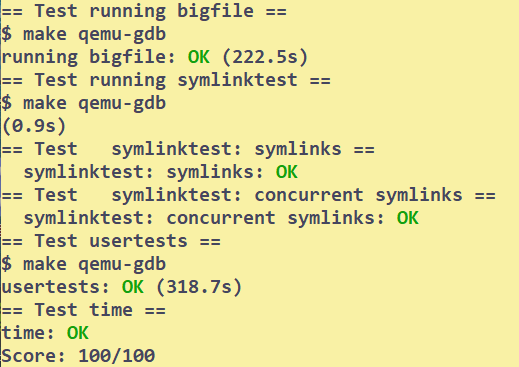

# File System
## Setup
```bash
# to start 
git checkout fs
make clean
```
Read xv6 Book ch8 to finish this lab.
## Tasks
### large files
Your will mainly modify `bmap` in `fs.c`
```C
// First modify the structure of addr array in fs.h
#define NDIRECT 11
#define NINDIRECT (BSIZE / sizeof(uint))
#define NDINDIRECT NINDIRECT * NINDIRECT // - 256 * 256
#define MAXFILE (NDIRECT + NINDIRECT + NDINDIRECT) // - add doubly-indirect

// On-disk inode structure
struct dinode {
  short type;           // File type
  short major;          // Major device number (T_DEVICE only)
  short minor;          // Minor device number (T_DEVICE only)
  short nlink;          // Number of links to inode in file system
  uint size;            // Size of file (bytes)
  // - modified: 11 + 1 + 1 | direct[0:10] | doubly-indirect[11] | singly-indirect[12] |
  uint addrs[NDIRECT+2];   // Data block addresses
};

// Don't forget to modify inode in file.h
// make sure addr[] have the same number of elements
struct inode {
  uint dev;           // Device number
  uint inum;          // Inode number
  int ref;            // Reference count
  struct sleeplock lock; // protects everything below here
  int valid;          // inode has been read from disk?

  short type;         // copy of disk inode
  short major;
  short minor;
  short nlink;
  uint size;
  uint addrs[NDIRECT+2];
};

```

```C
// Then mimics the original bmap logic to add a new check 
bn -= NINDIRECT;
ioffset = bn / NINDIRECT; // offset in the first-level block
boffset = bn - ioffset * NINDIRCT; // offset in the second-level block
// now bn = 
if(bn < NDINDRECT){
    if((addr = ip->addrs[NDIRECT+1]) == 0){
        addr = balloc(ip->dev);
        if(addr == 0)
            return 0;
        ip->addrs[NDIRECT+1] = addr;
    }
    bp = bread(ip->dev,addr); // loading indirect block
    a = (uint*) bp->data;
    if((addr = a[ioffset]) == 0){
        addr = balloc(ip->dev);
        if(addr){
            a[ioffset] = addr;
            log_write(bp);
        }
    }
    brelse(bp);
    bp = bread(ip->dev,addr); // loading the doubly-indirect block
    a = (uint*) bp->data;
    if((addr = a[boffset]) == 0){
        addr = balloc(ip->dev);
        if(addr){
            a[boffset] = addr;
            log_write(bp);
        }
    }
    brelse(bp);
    return addr;
}
```

```C
static uint
bmap(struct inode *ip, uint bn)
{
  uint addr, *a;
  struct buf *bp;

  if(bn < NDIRECT){
    if((addr = ip->addrs[bn]) == 0){
      addr = balloc(ip->dev);
      if(addr == 0)
        return 0;
      ip->addrs[bn] = addr;
    }
    return addr;
  }
  bn -= NDIRECT;

  if(bn < NINDIRECT){
    // Load indirect block, allocating if necessary.
    if((addr = ip->addrs[NDIRECT]) == 0){
      addr = balloc(ip->dev);
      if(addr == 0)
        return 0;
      ip->addrs[NDIRECT] = addr;
    }
    bp = bread(ip->dev, addr);
    a = (uint*)bp->data;
    if((addr = a[bn]) == 0){
      addr = balloc(ip->dev);
      if(addr){
        a[bn] = addr;
        log_write(bp);
      }
    }
    brelse(bp);
    return addr;
  }

  panic("bmap: out of range");
}
```
### Symbolic links
Note that target does not need to exist for the system call to succeed.
So it is indeed just a special case of `create` and stores the information in some place(like the `inode's data blocks`)
```C
// Use create will make the code short
// but i rewrite it like create to gain a better understanding
uint64
sys_symlink(void)
{
  // - parse the parameters
  char target[MAXPATH], path[MAXPATH];
  char name[DIRSIZ];

  if(argstr(0,target,MAXPATH) < 0 || argstr(1,path,MAXPATH) < 0)
    return -1;
  struct inode *ip,*dp;

  begin_op();
  if((dp = nameiparent(path,name)) == 0){
    end_op();
    return -1;
  }

  ilock(dp);
  if((ip = dirlookup(dp,name,0)) != 0){
    iput(ip);
    iunlockput(dp);
    end_op();
    return -1;
  }

  if((ip = ialloc(dp->dev,T_SYMLINK)) == 0){
    iunlockput(dp);
    end_op();
    return -1;
  }
  ilock(ip);
  ip->major = dp->major;
  ip->minor = dp->minor;
  ip->nlink = 1;
  // - store the target path into inode's data blocks
  if((writei(ip, 0, (uint64)target, 0, sizeof(target))) < sizeof(target)){
    goto fail;
  }
  if(dirlink(dp,name,ip->inum) < 0){
    goto fail;
  }
  iunlockput(ip);
  iunlockput(dp);
  iupdate(ip);
  end_op();
  return 0;

fail:
  printf("symlink fail\n");
  ip->nlink = 0;
  iupdate(ip);
  iunlockput(ip);
  iunlockput(dp);
  end_op();
  return -1;
}
```

```C
// in sys_open
  // ! a symlink
  if(ip->type == T_SYMLINK && !(omode & O_NOFOLLOW)){
    int depth = 0;
    if((ip = follow(ip,&depth)) == 0){
      end_op();
      return -1;
    }
    ilock(ip);
  }
// follow the symbolic link
/*
  follow a symbolic link recursively
  caller must hold the lock of link
 */
struct inode* follow(struct inode* link,int* depth)
{
  if(((*depth)++) >= 10){
    printf("follow: loop link\n");
    goto fail;
  }
  char path[MAXPATH];
  // struct inode *ip;
  if(readi(link, 0, (uint64)path, 0, MAXPATH) != MAXPATH){
    printf("symlink has no target\n");
    goto fail;
  }
  // - now get the new path,try open the path
  iunlockput(link);
  if((link = namei(path)) == 0){
    // ! not found
    printf("follow: not exist\n");
    return 0;
  }
  if(link->type != T_SYMLINK){
    // printf("get %s,type: %d,nlink:%d,nref:%d\n",path,ip->type,ip->nlink,ip->ref);
    return link;
  }
  ilock(link);
  return follow(link, depth);

fail:
  iunlockput(link);
  return 0;
}
```
## Conclusion
| large file | symlink |
| --- | --- |
| 1h | 2h |


## Bugs
Core coding time is 1+2 h. 
But I spent much more than that on debug...

!!! warning Don't return a local variable!!!

```C
// in follow
struct inode* follow(struct inode* link,int* depth)
{
  struct inode* i;
  ...
  return i;
}
// This couldn't work!
```
It may work accidentally. But it's a bug.