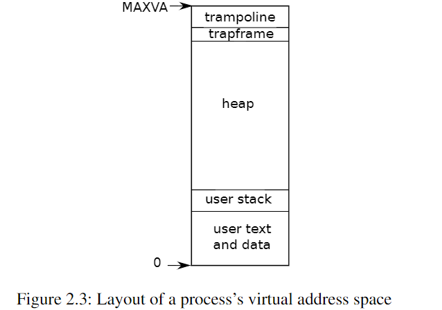

# Operating System Organization
An OS must fulfill
- Multiplexing
- Isolation
- Interaction

## Abstracting Physical Resources
Why bothered to have a OS? --- Library Approach
>  It’s more typical for applications to **not trust each other**, and to **have bugs**, so one often wants stronger isolation than a cooperative scheme provides 

- Isolation
- not to be aware of time-sharing
- Interaction Using File Descripters

## User/Supervised Mode,System Calls
application `foo` failed shouldn't fail the OS

>  To achieve **strong isolation**, the operating system must arrange that applications **cannot modify (or even read) the operating system’s data structures and instructions** and that applications **cannot access other processes’ memory**

RISC-V has 3 modes:
* machine mode: All instructions
* supervisor mode: Privileged instructions --- run on kernel space
* user mode: Limited ---run on user space

> CPUs provide a special instruction that **switches the CPU from user mode to supervisor mode** and **enters the kernel at an entry point** specified by the kernel

RISC-V: the `ecall` instruction

## Kernel Organization
> Monolithic Kernel: the **entire operating system resides in the kernel**, so that the implementations of all system calls run in supervisor mode
> 
> MicroKernel:  **minimize the amount of operating system code** that runs in supervisor mode, and execute the bulk of the operating system in user mode.
> 
> There is much debate among developers of operating systems about which organization is better, and there is no conclusive evidence one way or the other. Furthermore, **it depends much on what “better” means**: faster performance, smaller code size, reliability of the kernel, reliability of the complete operating system (including user-level services), etc.

## Code:xv6 Organization
The xv6 kernel sources are in the `kernel/` directory.

Inter-Module interfaces are defined in `defs.h`

`defs.h` just define the structs and functions used by different parts.It mainly looks like the follows:
```C
struct buf;
struct context;
struct file;
struct inode;
...

// bio.c
void            binit(void);
struct buf*     bread(uint, uint);
void            brelse(struct buf*);
void            bwrite(struct buf*);
void            bpin(struct buf*);
void            bunpin(struct buf*);

// console.c
void            consoleinit(void);
void            consoleintr(int);
void            consputc(int);
...
```

## Process Overview
The unit of Isolation: Process

Mechanisms used by kernel to implement process:
- user/supervisor mode flag
- address spaces: by page-tables in xv6
- time-slicing of threads



```C
// in kernel/riscv.h
// one beyond the highest possible virtual address.
// MAXVA is actually one bit less than the max allowed by
// Sv39, to avoid having to sign-extend virtual addresses
// that have the high bit set.
#define MAXVA (1L << (9 + 9 + 9 + 12 - 1))
```
> the **trampoline page** contains the code to **transition in and out of the kernel** and mapping the **trapframe** is necessary to **save/restore the state of the user process**

states of a process are stored in `struct proc`,located in `kernel/proc.h:85`
```C
struct proc {
  struct spinlock lock;

  // p->lock must be held when using these:
  enum procstate state;        // Process state
  void *chan;                  // If non-zero, sleeping on chan
  int killed;                  // If non-zero, have been killed
  int xstate;                  // Exit status to be returned to parent's wait
  int pid;                     // Process ID

  // wait_lock must be held when using this:
  struct proc *parent;         // Parent process

  // these are private to the process, so p->lock need not be held.
  uint64 kstack;               // Virtual address of kernel stack
  uint64 sz;                   // Size of process memory (bytes)
  pagetable_t pagetable;       // User page table
  struct trapframe *trapframe; // data page for trampoline.S
  struct context context;      // swtch() here to run process
  struct file *ofile[NOFILE];  // Open files
  struct inode *cwd;           // Current directory
  char name[16];               // Process name (debugging)
};

```
Each process has 2 stacks. Process’s thread alternates between actively using its **user stack** and its **kernel stack**.

- Process can make a system call using `ecall`
  - raise priviledge
  - change pc to a kernel-defined entry point
  - switch to kernel stack
  - execute kernel instructions
- Kernel can switch back using `sret`
  - switch to user stack
  - lower priviledge
  - resumes executing user instructions

`p->state`: whether the process is allocated, ready to run, running, waiting for I/O, or exiting.

`p->pagetable`: holds the process's pagetable

> In summary, a process bundles **two design ideas: an address space** to give a process the illusion of its own memory, and, **a thread**, to give the process the illusion of its own CPU

## Code:starting xv6,the first process and system call
!!! attention This Part is of the most importance to do the lab !

* powers on
  * initialize itself and run a boot loader to load xv6 kernel into memory
  * start at `_entry` (`kernel/entry.S`)
* codes at `_entry` loads a stack pointer register `sp`
  * Now the kernel has a stack
  * `_entry` call `start`(`kernel/start.c`)
* `start` performs some configuration and switch from machine mode to supervisor mode
  * to enter supervisor mode,`mret` instruction
  * change into `main`(`kernel/main.c`)
* `main` initialize devices and subsystems
  * call `userinit`(`kernel/proc.c`) to create the 1st process
  * the process make the 1st system call
  * `initcode.S` load `SYS_EXEC`(`kernel/syscall.h`) into a7 and call `ecall` to re-enter kernel
  * once the call returns,it returns to user space in the /init process.`init`(`user/init.c`) create a new console device,starts a shell.
* The system is up!

## Security Model
- The operating system must assume that a **process’s user-level code will do its best to wreck the kernel or other processes**
- Kernel code is expected to be **bug-free**, and certainly to **contain nothing malicious**.

## Real World
Modern OS support **several threads within a process**, to allow a single process to exploit multiple CPUs.