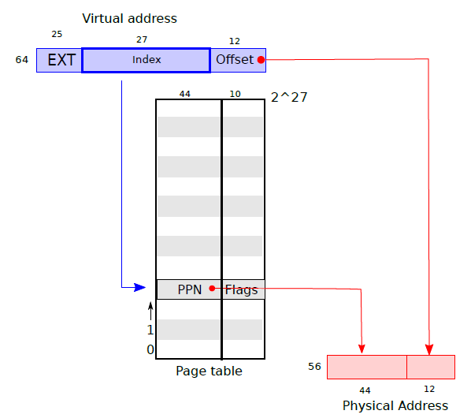
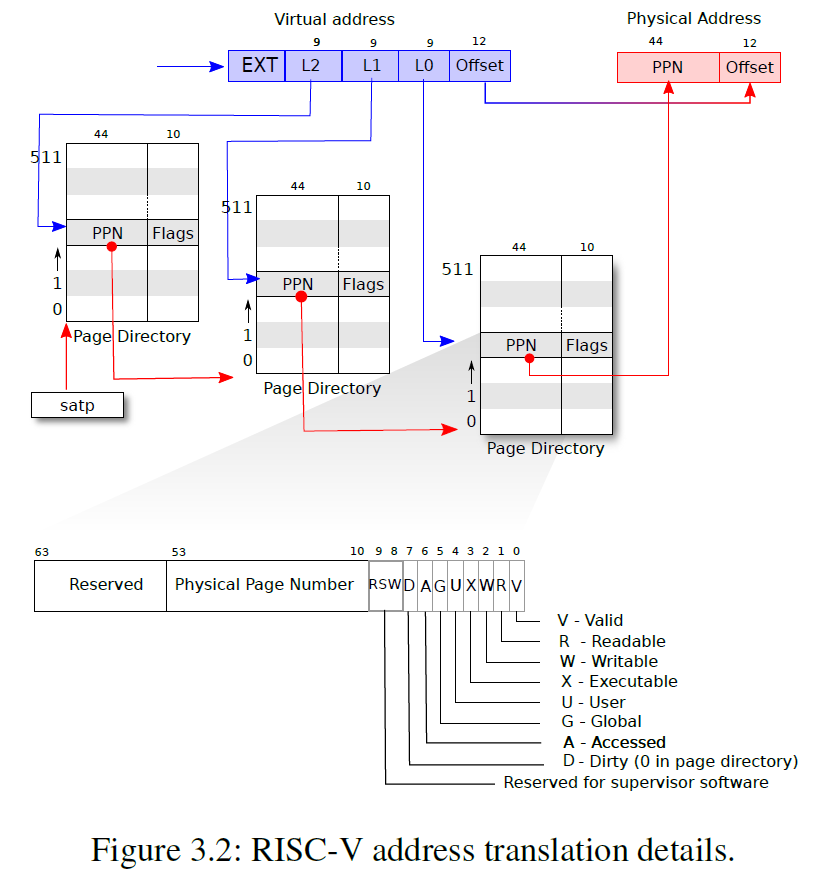
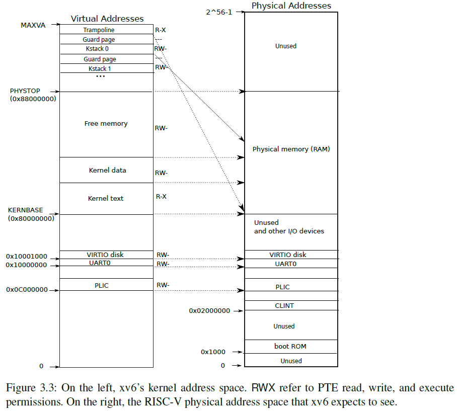
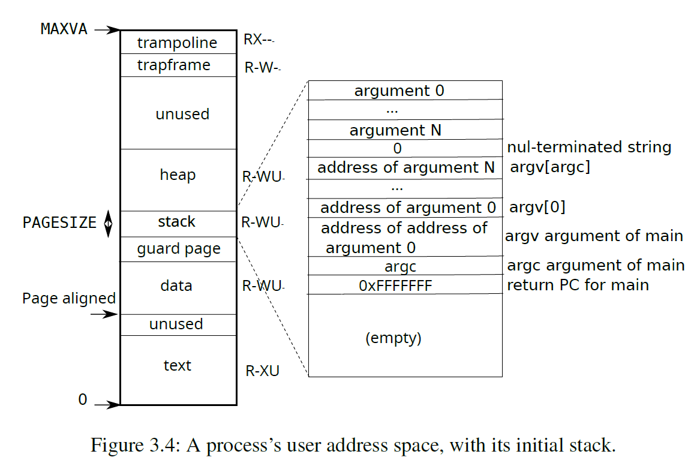

# ch3: Page Tables
Provides each process with its own private address space and memory.

Xv6 performs tricks:
* Mapping the **same memory** (a trampoline page) in **several address spaces**
* Guarding kernel and user stacks with **an unmapped page**
## Paging Hardware
PTE: Page Table Entry
PPN: Physical Page Number

* A **page** has 4096 bytes
* use the 27-bit to index the page table,get a 44-bit PPN
* concatenate the PPN with the lower 12-bit offset to form a physical addr

- In the common case in which **large ranges of virtual addresses have no mappings**, the three-level structure can omit entire page directories
- a potential downside of three levels is that the CPU must **load three PTEs** from memory

To avoid the cost of loading PTEs from physical memory, a RISC-V CPU **caches page table entries** in a Translation Look-aside Buffer (TLB).

refer to `kernel/riscv.h` to find more about page hardware-related structures

> To tell a CPU to use a page table, the kernel must **write the physical address of the root pagetable page into the `satp` register**. A CPU will translate all addresses generated by subsequent instructions using the page table pointed to by its own satp
## Kernel address space

A process has 2 page tables:
* one for describing user address space
* one for describing kernel address space

Notice that in the above figure, a couple of virtual addr are not direct-mapped:
* trampoline page
* kernel stack: with guard page belows it

## Code: creating an address page
Refer to `kernel/vm.c` to find code for manipulating addr spaces and page tables. 
- `pagetable_t`: a ptr to risc-v root page
  - either a kernel page table
  - or one of a process page table
- `walk()`: finds the PTE for a VA
- `mappages()`: install PTE for new mappings
- functions start with `kvm` manipulate kernel page table
- functions start with `uvm` manipulate user page table
- `copyin()/copyout()`:copy from/to user virtual address

A description of the boot sequence

## Physical Memory Allocation
- The kernel must **allocate and free** physical memory at run-time for page tables, user memory, kernel stacks, and pipe buffers.
- Xv6 uses the physical memory between the end of the kernel and `PHYSTOP` for run-time allocation.
  - allocates and frees whole 4096-byte pages at a time
  - keeps track of which pages are free by threading a linked list through the pages themselves

## Code: Physical Memory Allocator
Refer to `kernel/kalloc.c` to see the details.

- a free list of physical memory pages that are available for allocation.
- the element in the list is `struct run`
- store each free page’s `run structure` in the free page itself
- protected by a `spinlock`
## Process Address Space

- set permissions for each space harden the process
- a guard page to detect stack overflow
- a heap for more memory requirement

## Code:sbrk
`sbrk` is a syscall for a process to shrink or grow its memory.
- use `growproc` at `kernel/proc.c:260` to call `uvmalloc/uvmdealloc`

## Code:exec
`exec` is a system call that replaces a process’s user address space with data read from a file.

Xv6 binaries are formatted in ELF format(`kernel/elf.h`)
- an ELF header `struct elfhdr`
- program section headers `struct proghdr`
  - one for instruction
  - one for data

1. quick check the file contains a well-formed binary
2. `exec` allocates a new page table and loads:
   1. instruction
   2. data
   3. stack
3. place a invalid page below stack

## Real World
- far more sophisticated paging
- malloc-like allocator

allocator-lab can refer to 15-213's `malloc lab`
## Appendix
Related Files

- kernel/riscv.h: page hardware-related structures
- kernel/memlayout.h: the constants for xv6’s kernel memory layout.
- kernel/vm.c:Most of the xv6 code for manipulating address spaces and page tables
