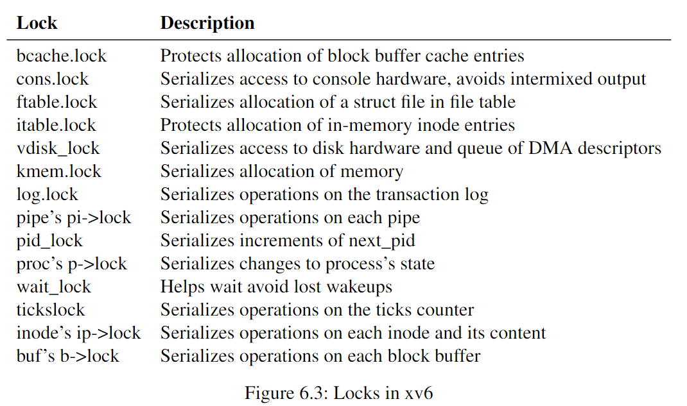

# Locking
**Concurrency**: situations in which **multiple instruction streams are interleaved**, due to multiprocessor parallelism, thread switching, or interrupts.

Strategies aimed at correctness under concurrency, and abstractions
that support them, are called **concurrency control techniques**.

A **lock** provides **mutual exclusion**, ensuring that only one CPU at a time can hold the lock.

## Races
**A race** is a situation in which **a memory location is accessed concurrently**, and **at least one access is a write**.

A lock protects data means that the lock protects some collection of **invariants** that apply to the data.

**Invariants** are properties of data structures that are **maintained across operations**.

The sequence of instructions between acquire and release is often called a **critical section**.

> Proper use of a lock ensures that **only one CPU at a time can operate on the data structure in the critical section**, so that no CPU will execute a data structure operation when the data structure’s invariants do not hold

We say that multiple processes **conflict** if they want the same lock at the same time, or that the lock experiences **contention**.

## Code: Locks
```C
// Mutual exclusion lock.
struct spinlock {
  uint locked;       // Is the lock held?

  // For debugging:
  char *name;        // Name of lock.
  struct cpu *cpu;   // The cpu holding the lock.
};
```

```C
// Acquire the lock.
// Loops (spins) until the lock is acquired.
void
acquire(struct spinlock *lk)
{
  push_off(); // disable interrupts to avoid deadlock.
  if(holding(lk))
    panic("acquire");

  // On RISC-V, sync_lock_test_and_set turns into an atomic swap:
  //   a5 = 1
  //   s1 = &lk->locked
  //   amoswap.w.aq a5, a5, (s1)
  while(__sync_lock_test_and_set(&lk->locked, 1) != 0)
    ;

  // Tell the C compiler and the processor to not move loads or stores
  // past this point, to ensure that the critical section's memory
  // references happen strictly after the lock is acquired.
  // On RISC-V, this emits a fence instruction.
  __sync_synchronize();

  // Record info about lock acquisition for holding() and debugging.
  lk->cpu = mycpu();
}

// Release the lock.
void
release(struct spinlock *lk)
{
  if(!holding(lk))
    panic("release");

  lk->cpu = 0;

  // Tell the C compiler and the CPU to not move loads or stores
  // past this point, to ensure that all the stores in the critical
  // section are visible to other CPUs before the lock is released,
  // and that loads in the critical section occur strictly before
  // the lock is released.
  // On RISC-V, this emits a fence instruction.
  __sync_synchronize();

  // Release the lock, equivalent to lk->locked = 0.
  // This code doesn't use a C assignment, since the C standard
  // implies that an assignment might be implemented with
  // multiple store instructions.
  // On RISC-V, sync_lock_release turns into an atomic swap:
  //   s1 = &lk->locked
  //   amoswap.w zero, zero, (s1)
  __sync_lock_release(&lk->locked);

  pop_off();
}
```

## Code: Using Locks
A hard part about using locks is 
* deciding how many locks to use
* which data and invariants each lock should protect

Basic Principles:
* any time a variable can be written by one CPU at the same time that another CPU can read or write it, a lock should be used to **keep the two operations from overlapping**
* if **an invariant involves multiple memory locations**, typically **all of them need to be protected by a single lock** to ensure the invariant is maintained

It is important for efficiency **not to lock too much**, because **locks reduce parallelism**.


## Deadlock and Lock Ordering
If a code path through the kernel must **hold several locks at the same time**, it is important that all code paths **acquire those locks in the same order**.
If not, there exists a risk of **Deadlock**.
The need for **a global lock acquisition order** means that locks are effectively part of each function’s specification: **callers must invoke functions in a way that causes locks to be acquired in the agreed-on order**

## Re-entrant locks
**re-entrant locks(recursive locks)**: if **the lock is held by a process** and if that **process attempts to acquire the lock again**, then the kernel could just allow this (since the process already has the lock), instead of calling panic, as the xv6 kernel does.

However, that re-entrant locks **make it harder to reason about concurrency**: re-entrant locks break the intuition that locks cause critical sections to be atomic with respect to other critical sections
* when in critical section, call another function that acquire the lock
* the function will run, but the lock ought to be mutual exclusive.

## Locks and Interrupt Handlers
Some xv6 spinlocks protect data that is used by both threads and interrupt handlers
If a spinlock is used by an interrupt handler, a CPU must never hold that lock with interrupts enabled

## Instruction and Memory Ordering
Out-of-Order Execution or Memory access may cause some problem
```C
l = malloc(sizeof *l);
l->data = data;
acquire(&listlock);
l->next = list; // if reordered after release(&listlock), ...
list = l;
release(&listlock);
```
`__sync_synchronize()` is a **memory barrier**: it tells the compiler and CPU to not reorder loads or stores across the barrier.

xv6 use this in `acquire()` and `release()`.

## Sleep Locks
**Yielding while holding a spinlock is illegal** because it might lead to deadlock if a second thread then tried to acquire the spinlock

Sometimes xv6 needs to **hold a lock for a long time**. we’d like **a type of lock that yields the CPU while waiting to acquire**, and allows yields (and interrupts) while the lock is held.

Xv6 provides such locks in the form of **sleep-locks**.

> Because sleep-locks leave interrupts enabled, **they cannot be used in interrupt handlers**. Because acquiresleep may yield the CPU, **sleep-locks cannot be used inside  spinlock critical sections**

## Real World
If you program with locks, it is wise to use a tool that attempts to identify races

Most operating systems support **POSIX threads (Pthreads)**, which allow a user process to have several threads running concurrently on different CPUs

It is possible to implement locks without atomic instructions [10], but it is expensive,

Locks can be expensive if many CPUs try to acquire the same lock at the same time

To avoid the expenses associated with locks, many operating systems use lock-free data structures and algorithms.