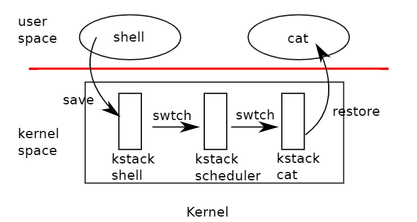

# Scheduling
## Multiplexing
Xv6 multiplexes by switching each CPU from one process to another in two situations:
* `sleep` and `wakeup` machanism switched when a process wait for something
* force a switch when a process compute for a long period without sleeping

challenges:
*  how to switch from one process to another?
*  how to force switches in a way that is transparent to user processes
*  all of the CPUs switch among the same shared set of processes, and a locking plan is necessary to avoid races.
*  a process’s memory and other resources must be freed when the process exits, but it cannot do all of this itself
*  each core of a multi-core machine must remember which process it is executing so that system calls affect the correct process’s kernel state
*  Care is needed to avoid races that result in the loss of wakeup notifications.
  

## Code: Context Switching
The xv6 scheduler has a dedicated thread (saved registers and stack) per CPU


* `swtch` performs **save and restore** for a kernel thread switch.
  * save and restore 32 RISC-V registers,called **contexts**
```C
// in def.h
void swtch(struct context* old, struct context* new);
// in proc.h
// Saved registers for kernel context switches.
struct context {
  uint64 ra;
  uint64 sp;

  // callee-saved
  uint64 s0;
  uint64 s1;
  uint64 s2;
  uint64 s3;
  uint64 s4;
  uint64 s5;
  uint64 s6;
  uint64 s7;
  uint64 s8;
  uint64 s9;
  uint64 s10;
  uint64 s11;
};

```
## Code: Scheduling
A process that wants to give up the cpu must:
* acquire its own process lock `p->lock`
* release any other lock it is holding
* update it own state `p->state`
* call `sched` 
```C
// Give up the CPU for one scheduling round.
void
yield(void)
{
  struct proc *p = myproc();
  acquire(&p->lock);
  p->state = RUNNABLE;
  sched();
  release(&p->lock);
}
```
* `sched` calls `swtch` to switch from `p->context` to `cpu->context` and transfer control to `scheduler`
* **The scheduler** continues its for loop, finds a process to run, switches to it, and the cycle repeats

Procedures that intentionally transfer control to each other via thread switch are sometimes referred to as **coroutines**
*   `sched` and `scheduler` are coroutines.
  
```C
// Per-CPU process scheduler.
// Each CPU calls scheduler() after setting itself up.
// Scheduler never returns.  It loops, doing:
//  - choose a process to run.
//  - swtch to start running that process.
//  - eventually that process transfers control
//    via swtch back to the scheduler.
void
scheduler(void)
{
  struct proc *p;
  struct cpu *c = mycpu();
  
  c->proc = 0;
  for(;;){
    // Avoid deadlock by ensuring that devices can interrupt.
    intr_on();

    for(p = proc; p < &proc[NPROC]; p++) {
      acquire(&p->lock);
      if(p->state == RUNNABLE) {
        // Switch to chosen process.  It is the process's job
        // to release its lock and then reacquire it
        // before jumping back to us.
        p->state = RUNNING;
        c->proc = p;
        swtch(&c->context, &p->context);

        // Process is done running for now.
        // It should have changed its p->state before coming back.
        c->proc = 0;
      }
      release(&p->lock);
    }
  }
}
```
## Code: mycpu and myproc
Xv6 often needs a pointer to the current process’s proc structure
* maintains a `struct cpu` for each cpu,records:
  * process currently running
  * saved registers for the scheduler thread
  * count of nested spinlocks
* `mycpu()` returns a pointer to the current cpu's `struct cpu`(in `tp` register)
  * The compiler guarantees never to use the tp register

> **The return values of cpuid and mycpu are fragile**: if the timer were to interrupt and cause the thread to yield and then move to a different CPU, a previously returned value would no longer be correct. To avoid this problem, **xv6 requires that callers disable interrupts, and only enable them after they finish using the returned struct cpu**.

## Sleep and wakeup
Isolation could be done by scheduler and locks, but we still need interaction.
* `sleep` allows a kernel thread to wait for a specific event
* another thread can call `wakeup` to indicate that threads waiting for an event should resume
* Sleep and wakeup are often called **sequence coordination** or **conditional synchronization mechanisms**.

A semaphore maintains a count and provides two operations. 
* The “V” operation (for the producer)increments the count.
* The “P” operation (for the consumer) waits until the count is non-zero,and then decrements it and returns. 
```C
// Naive Implementation, but too expensive
void
V(struct semaphore *s)
{
    acquire(&s->lock);
    s->count += 1;
    release(&s->lock);
}
void
P(struct semaphore *s)
{
    while(s->count == 0);
    acquire(&s->lock);
    s->count -= 1;
    release(&s->lock);
}
// Optimized, but with problem
void
V(struct semaphore *s)
{
    acquire(&s->lock);
    s->count += 1;
    wakeup(s);
    release(&s->lock);
}
void
P(struct semaphore *s)
{
    while(s->count == 0)
        sleep(s);
    acquire(&s->lock);
    s->count -= 1;
    release(&s->lock);
}
```
The **lost-wakeup** problem:
* when P check `count==0` and haven't `sleep`, V increment count and call `wakeup` but found no process are waiting.
```C
void
P(struct semaphore *s)
{
    acquire(&s->lock);
    while(s->count == 0)
        sleep(s);
    s->count -= 1;
    release(&s->lock);
} // not work, cause deadlocks

void
P(struct semaphore *s)
{
    acquire(&s->lock);
    while(s->count == 0)
        sleep(s,&s->lock); // pass the lock to V and reacquire when be wakeup-ed
    s->count -= 1;
    release(&s->lock);
} 

```
## Code: Sleep and wakeup
```C
// Atomically release lock and sleep on chan.
// Reacquires lock when awakened.
void
sleep(void *chan, struct spinlock *lk)
{
  struct proc *p = myproc();
  
  // Must acquire p->lock in order to
  // change p->state and then call sched.
  // Once we hold p->lock, we can be
  // guaranteed that we won't miss any wakeup
  // (wakeup locks p->lock),
  // so it's okay to release lk.

  acquire(&p->lock);  //DOC: sleeplock1
  release(lk);

  // Go to sleep.
  p->chan = chan;
  p->state = SLEEPING;

  sched();

  // Tidy up.
  p->chan = 0;

  // Reacquire original lock.
  release(&p->lock);
  acquire(lk);
}

// Wake up all processes sleeping on chan.
// Must be called without any p->lock.
void
wakeup(void *chan)
{
  struct proc *p;

  for(p = proc; p < &proc[NPROC]; p++) {
    if(p != myproc()){
      acquire(&p->lock);
      if(p->state == SLEEPING && p->chan == chan) {
        p->state = RUNNABLE;
      }
      release(&p->lock);
    }
  }
}
```

> No harm is done **if two uses of sleep/wakeup accidentally choose the same channel: they will see ==spurious wakeups==**, but looping as described above will tolerate this problem.


## Code: Pipes
```C
struct pipe {
  struct spinlock lock;
  char data[PIPESIZE];
  uint nread;     // number of bytes read
  uint nwrite;    // number of bytes written
  int readopen;   // read fd is still open
  int writeopen;  // write fd is still open
};

int
pipewrite(struct pipe *pi, uint64 addr, int n)
{
  int i = 0;
  struct proc *pr = myproc();

  acquire(&pi->lock);
  while(i < n){
    if(pi->readopen == 0 || killed(pr)){
      release(&pi->lock);
      return -1;
    }
    if(pi->nwrite == pi->nread + PIPESIZE){ //DOC: pipewrite-full
      wakeup(&pi->nread);
      sleep(&pi->nwrite, &pi->lock);
    } else {
      char ch;
      if(copyin(pr->pagetable, &ch, addr + i, 1) == -1)
        break;
      pi->data[pi->nwrite++ % PIPESIZE] = ch;
      i++;
    }
  }
  wakeup(&pi->nread);
  release(&pi->lock);

  return i;
}

int
piperead(struct pipe *pi, uint64 addr, int n)
{
  int i;
  struct proc *pr = myproc();
  char ch;

  acquire(&pi->lock);
  while(pi->nread == pi->nwrite && pi->writeopen){  //DOC: pipe-empty
    if(killed(pr)){
      release(&pi->lock);
      return -1;
    }
    sleep(&pi->nread, &pi->lock); //DOC: piperead-sleep
  }
  for(i = 0; i < n; i++){  //DOC: piperead-copy
    if(pi->nread == pi->nwrite)
      break;
    ch = pi->data[pi->nread++ % PIPESIZE];
    if(copyout(pr->pagetable, addr + i, &ch, 1) == -1)
      break;
  }
  wakeup(&pi->nwrite);  //DOC: piperead-wakeup
  release(&pi->lock);
  return i;
}

```

## Code: Wait,exit and kill
```C
// Wait for a child process to exit and return its pid.
// Return -1 if this process has no children.
int
wait(uint64 addr)
{
  struct proc *pp;
  int havekids, pid;
  struct proc *p = myproc();

  acquire(&wait_lock);

  for(;;){
    // Scan through table looking for exited children.
    havekids = 0;
    for(pp = proc; pp < &proc[NPROC]; pp++){
      if(pp->parent == p){
        // make sure the child isn't still in exit() or swtch().
        acquire(&pp->lock);

        havekids = 1;
        if(pp->state == ZOMBIE){
          // Found one.
          pid = pp->pid;
          if(addr != 0 && copyout(p->pagetable, addr, (char *)&pp->xstate,
                                  sizeof(pp->xstate)) < 0) {
            release(&pp->lock);
            release(&wait_lock);
            return -1;
          }
          freeproc(pp);
          release(&pp->lock);
          release(&wait_lock);
          return pid;
        }
        release(&pp->lock);
      }
    }

    // No point waiting if we don't have any children.
    if(!havekids || killed(p)){
      release(&wait_lock);
      return -1;
    }
    
    // Wait for a child to exit.
    sleep(p, &wait_lock);  //DOC: wait-sleep
  }
}
```

```C
// Exit the current process.  Does not return.
// An exited process remains in the zombie state
// until its parent calls wait().
void
exit(int status)
{
  struct proc *p = myproc();

  if(p == initproc)
    panic("init exiting");

  // Close all open files.
  for(int fd = 0; fd < NOFILE; fd++){
    if(p->ofile[fd]){
      struct file *f = p->ofile[fd];
      fileclose(f);
      p->ofile[fd] = 0;
    }
  }

  begin_op();
  iput(p->cwd);
  end_op();
  p->cwd = 0;

  acquire(&wait_lock);

  // Give any children to init.
  reparent(p);

  // Parent might be sleeping in wait().
  wakeup(p->parent);
  
  acquire(&p->lock);

  p->xstate = status;
  p->state = ZOMBIE;

  release(&wait_lock);

  // Jump into the scheduler, never to return.
  sched();
  panic("zombie exit");
}
```

```C
// Kill the process with the given pid.
// The victim won't exit until it tries to return
// to user space (see usertrap() in trap.c).
int
kill(int pid)
{
  struct proc *p;

  for(p = proc; p < &proc[NPROC]; p++){
    acquire(&p->lock);
    if(p->pid == pid){
      p->killed = 1;
      if(p->state == SLEEPING){
        // Wake process from sleep().
        p->state = RUNNABLE;
      }
      release(&p->lock);
      return 0;
    }
    release(&p->lock);
  }
  return -1;
}
```
## Process Locking
`p->lock` must be held while reading or writing any of the following struct proc fields:
* `p->state`
* `p->chan`
* `p->killed`
* `p->xstate`
* `p->pid`

Here’s the full set of things that p->lock does:
* Along with `p->state`, it `prevents races in allocating proc[] slots` for new processes.
* Conceals a **process** from view while it is **being created or destroyed**.
* Prevents a parent’s wait from collecting a process that has set its state to ZOMBIE but has not yet yielded the CPU. 
* Prevents another core’s scheduler from deciding to run a yielding process after it sets its state to RUNNABLE but before it finishes `swtch`
* Ensures that only one core’s scheduler decides to run a `RUNNABLE` processes.
* Prevents a timer interrupt from causing a process to yield while it is in `swtch`.
* Along with the condition lock, it helps prevent `wakeup` from overlooking a process that is calling `sleep` but has not finished yielding the CPU.
* Prevents the victim process of `kill` from exiting and perhaps being re-allocated between kill’s check of `p->pid` and setting `p->killed`.
* It makes `kill`’s check and write of `p->state` atomic

The `p->parent` field is protected by the global lock `wait_lock` rather than by `p->lock`

## Real World
The xv6 scheduler implements a simple scheduling policy, which **runs each process in turn**. This policy is called **round robin**.Real OS may allow process to have **priorities**.

`sleep` and `wakeup` are a simple and effective synchronization method, but there are many others.

Scanning the entire set of processes in wakeup is inefficient. A better solution is to **replace the `chan` in both `sleep` and `wakeup` with a data structure that holds a list of processes sleeping on that structure**

The implementation of **wakeup wakes up all processes that are waiting on a particular channel**, and it might be the case that **many processes are waiting for that particular channel**. The operating system will **schedule all these processes and they will race to check the sleep condition**. Processes that behave in this way are sometimes called a **==thundering herd==**,and it is best avoided

**Semaphores** are often used for synchronization.

**Terminating processes and cleaning them up** introduces much complexity.

A real operating system would find **free proc structures** with an explicit free list **in constant time** 
