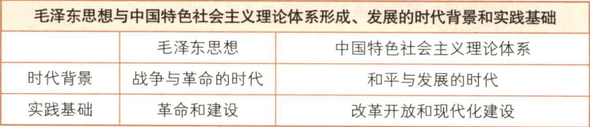
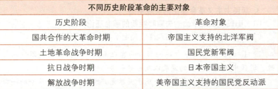

# Chapter 1
## 毛泽东思想的形成与发展
- [x] 历史条件
  - 时代背景：战争与革命成为时代主题
  - 实践基础：党领导人民的革命和建设实践
- 形成和发展过程
  - 开始萌芽：大革命时期
    - 新民主主义革命基本思想的提出
    - 解决了无产阶级领导权的中心问题，即如何领导农民斗争的问题
  - 初步形成：土地革命时期
    - 指明中国革命的发展规律
    - 提出并深入阐述农村包围城市，武装夺取政权的思想
  - 成熟：遵义会议后到全民族抗战时期
    - 系统阐述了新民主主义革命理论
    - 1945年中共七大写入党章
    - 辩证法两部著作：《实践论》、《认识论》
  - 继续发展：解放战争时期和新中国成立后
    - 明确提出把马列主义基本原理同中国实际“第二次结合，找出在中国怎样建设社会主义的道路”
## 主要内容和活的灵魂
- [x] 主要内容
  - 主题：革命与建设
  - 新民主主义革命理论、社会主义革命和社会主义建设理论、革命军队建设和军事战略的理论、政策和策略的理论、思想政治工作和文化工作的理论、党的建设理论。
- [x] 活的灵魂
  - 实事求是：基本点与精髓
    - 含义：一切从实际出发，理论联系实际，坚持在实践中检验真理和发展真理
    - 马克思主义的根本观点
    - 共产党人认识世界、改造世界的根本要求
    - 党的思想路线、基本思想方法、工作方法领导方法
    - 确立于民主革命时期
  - 群众路线
    - 含义：一切为了群众，一切依靠群众，从群众中来，到群众中去,把党的正确主张变为群众的自觉行动。
    - 党的根本工作路线和生命线
    - 党永葆青春活力和战斗力的传家宝
  - 独立自主
    - 含义
      - 坚持独立思考，走自己的路
      - 坚定不移地维护民族独立、捍卫国家主权，把立足点放在依靠自己力量的基础上
      - 积极争取外援，开展国际经济文化交流，学习外国一切对我们有益的先进事物
    - 中华民族的优良传统、精神之魂
    - 立党立国的重要原则
    - 百年奋斗得出的历史结论
## 历史地位
- 毛泽东思想
  - [x] 地位
    - 马克思主义中国化时代化的第一个重大理论成果
    - 中国革命和建设的科学指南
    - 党和人民宝贵的精神财富
  - 科学评价毛泽东和毛泽东思想
    - 毛泽东一生中的全部思想包含其晚年所犯的错误
    - 毛泽东思想是被实践证明了的关于中国革命和建设的正确的理论原则和经验总结，不包括毛泽东晚年所犯的错误。
    - 毛泽东的功绩是第一位的，错误是第二位的。
      - 我们要将毛泽东晚年的错误同经过长期历史检验形成科学理论的毛泽东思想区别开来，完整准确地理解毛泽东思想、坚持和发展毛泽东思想
    - 毛泽东思想并不是毛泽东个人的思想，而是中国共产党第一代领导人集体智慧的结晶。
      - 毛泽东著作中包含的许多基本原理、原则和科学方法，是有普遍意义的，不管现在还是今后对我们都具有重要的指导作用。
# Chapter 6
## 邓小平理论
- [x] 首要的基本的理论问题
  - 什么是社会主义、怎样建设社会主义
- 社会主义的本质
  - 解放生产力，发展生产力，消灭剥削，消除两极分化，最终实现共同富裕
  - 意义
    - 突出强调了“解放生产力，发展生产力”在社会主义发展中的重要地位，纠正了过去关于发展生产力的一些错误观念
    - 突出强调了“消灭...共同富裕”，从`生产关系`和`发展目标`角度认识和把握社会主义本质，实质上体现了社会主义发展的`价值目标`，体现了发展`手段`和发展`目的`的统一，把对社会主义的认识提高到`新的科学水平`
    - 为坚持和完善公有制指出了明确方向
- [x] 精髓：解放思想，实事求是
- [x] 主要内容
  - 社会主义初级阶段理论
    - 党的十三大系统地论述了社会主义初级阶段理论
    - 社会主义初级阶段是特指我国在生产力落后、商品经济不发达条件下建设社会主义必然要经历的特定阶段
    - 两层含义
      - 我国已经进入社会主义社会，必须坚持而不能离开社会主义
      - 我国的社会主义社会还处在不发达的阶段，必须正视而不能超越初级阶段
    - 意义
      - 揭示了当代中国的历史方位
      - 对马克思主义关于社会主义发展阶段理论的重大发展和重大突破
      - 为建设中国特色社会主义提供了总依据
    - 基本路线
      - 一个中心：经济建设（最根本的拨乱反正）
      - 两个基本点
        - 坚持四项基本原则
        - 坚持改革开放、自力更生、艰苦创业
  - 社会主义根本任务和发展战略理论
    - 根本任务：发展生产力
  - 社会主义改革开放理论
    - 新时期最鲜明的特征
    - 改革
      - 深刻的社会变革、第二次革命、实现现代化的必由之路
        - 社会制度的自我完善和发展，不是一个阶级推翻另一个阶级
        - 对体制的根本变革，不是对原有经济体制细枝末节的修补
      - 社会主义社会发展的直接动力
    - 开放
      - 开放也是改革，对外开放是建设中国特色社会主义的一项基本国策
      - 对中国经济发展停滞落后历史教训深刻总结的结果
      - 对世界所有国家开放
        - 正确对待资本主义社会创造的现代文明成果
        - 要高度珍惜并坚决维护中国人民经过长期奋斗得来的独立自主权利
 
  - 社会主义市场经济理论
    - 南方谈话标志着初步形成
    - 计划经济和市场经济不是划分社会制度的标志
    - 计划和市场都是经济手段，对经济活动的调节各有优劣，社会主义实行市场经济是要把两者的优势结合起来
    - 市场经济作为资源配置的手段本身不具有制度属性，可以和不同的社会制度结合，从而表现出不同的性质
    - 意义
      - 实现了马克思主义政治经济学的重大创新
      - 是中国特色社会主义政治经济学的重要组成部分
      - 为社会主义市场经济体制改革目标的确立和中国特色社会主义经济建设提供了指南
  - 两手抓，两手都要硬
    - 物质文明和精神文明
    - 建设和法制
    - 改革开放和惩治腐败
  - 一国两制与祖国统一
  - 中国特色社会主义外交和国际战略
    - 时代主题：和平与发展
    - 和平问题：东西问题
    - 发展问题（经济问题）：南北问题（也是核心问题）

  - 建设中国特色社会主义的关键在于坚持、改善、加强党的领导
- [x] 历史地位
  - 马列主义和毛思想的继承与发展
  - 中国特色社会主义理论体系的开篇之作
  - 改革开放和社会主义现代化建设的科学指南
# Chapter 7
## 三个代表重要思想
- [x] 核心观点
  - 中国共产党始终代表
    - 中国先进生产力的发展要求
    - 中国先进文化的前进方向
    - 中国最广大人民的根本利益
  - 立党之本、执政之基、力量之源
- 贯彻三个代表重要思想
  - 关键：坚持与时俱进
  - 核心：坚持党的先进性
  - 本质：坚持执政为民
- [x] 主要内容
  - 发展是党执政兴国的第一要务
    - 改革是动力，发展是目的，稳定是前提
  - 建立社会主义市场经济体制
  - 全面建设小康社会
    - 十五大新“三步走”战略
  - 建设社会主义政治文明
  - 实施“引进来”和“走出去”相结合的对外开放战略
    - 标志着对外开放进入新阶段
  - 推进党的建设新的伟大工程
- [x] 历史地位
  - 中国特色社会主义理论体系的丰富发展
    - 创造性回答了建设什么样的党、怎样建设党的问题
  - 加强和改进党的建设，推进中国特色社会主义事业的强大理论武器
# Chapter 8
## 科学发展观
- [x] 科学内涵
  - 第一要义：推动经济社会发展
  - 核心立场：以人为本
  - 基本要求：全面协调可持续
  - 根本方法：统筹兼顾
- [x] 主要内容 
  - 加快转变经济发展方式
  - 发展社会主义民主政治
    - 坚持党的领导、人民当家作主、依法治国有机统一
    - 党的领导是根本保证
    - 人民当家作主是本质和核心
    - 依法治国是基本方略
  - 推进社会主义文化强国建设
  - 构建社会主义和谐社会
    - 社会和谐是本质属性
  - 推进生态文明建设
  - 全面提高党的建设科学化水平
    - 主线：加强党的执政能力建设，先进性和纯洁性建设
- [x] 历史地位
  - 中特理论体系在新世纪新阶段的接续发展
    - 创造性回答了实现什么样的发展、怎样发展
  - 全面建设小康社会、加快推进社会主义现代化的根本指针

---
# Chapter 2 
## 新民主主义革命理论
### 形成依据
三个方面，分别是国情、时代特征、实践基础
#### 国情
- 重要性：认清中国国情是认清和解决中国革命问题的`基本依据`
- 性质：半殖民地半封建社会
- 主要矛盾：帝国主义和中华民族(主要)、封建主义和人民大众的矛盾
- 社会性质和主要矛盾决定根本任务：
  - 推翻帝国主义、封建主义和官僚资本主义的统治
  - 从根本上推翻反动腐朽的政治上层建筑，变革阻碍生产力发展的生产关系
  -  为建设富强民主的国家、确立人民当家作主的政治制度、改善人民生活扫清障碍，创造必要的前提。
-  社会性质和主要矛盾决定革命性质：资产阶级民主革命
#### 时代特征
- 俄国十月革命的胜利
  - 旧资产阶级民主主义革命 -> 新资产阶级民主主义革命
  - 旧的世界资产阶级革命的一部分 -> 世界无产阶级社会主义革命的一部分
- 五四运动的爆发
  - 进入新资产阶级民主主义革命的崭新阶段
#### 实践基础
- 旧革命的失败呼唤新的革命理论
- 新革命的实践探索形成新理论的理论基础
### 总路线
1939年《中国革命和中国共产党》第一次提出，1948年《在晋绥干部会议上的讲话》完整表述
- 无产阶级领导的，人民大众的，反对帝国主义、封建主义和官僚资本主义的革命。
  - 领导力量
    - 领导权是革命的中心问题、是新民主主义理论的核心问题、区别新旧革命的根本标志
    - 条件
      - 基本条件
        - 坚决斗争并取得胜利
        - 给予被领导者物质福利，至少不损害其利益
        - 政治教育
      - 关键：工农联盟为基础的广泛的统一战线
      - 基本策略：坚持独立自主原则，既联合又斗争
      - 坚强支柱：无产阶级领导的农民主体的革命武装
      - 根本保证：加强党的建设
  - 动力：人民大众的
    - 工人阶级（领导阶级）
    - 农民阶级（主力军）
    - 城市小资产和民族资产阶级
  - 对象
    - 帝国主义
      - 首要的
      - 推翻帝国主义是中国走向独立富强的前提
    - 封建主义
      - 帝国主义统治中国和封建军阀专制统治的社会基础
      - 经济现代化和政治民主化的主要的、直接的障碍
    - 官僚资本主义
      - 买办的、封建的国家垄断资本主义
  - 性质和前途
    - 性质：新资产阶级民主主义革命
      - 无产阶级社会主义革命的一部分
      - 领导力量是无产阶级及其先锋队（根本区别）
      - 指导思想是马列主义
      - 前途是社会主义
    - 比较民主主义革命和社会主义革命
      - 性质不同
      - 必要准备和必然趋势
      - 必须分两步走
      - 认清区别和联系才能正确领导革命
### 基本纲领
总路线的具体展开和体现，指明革命的具体奋斗目标
- 政治纲领
  - 推翻帝国主义和封建主义的统治，建立一个无产阶级领导的、以工农联盟为基础的、各革命阶级联合专政的新民主主义的共和国
- 经济纲领（新民主主义共和国经济建设的根本方针）
  - 没收封建地主阶级的土地归农民所有（革命主要内容）
  - 没收官僚资本阶级的垄断资本归新民主主义国家所有
  - 保护民族工商业
- 文化纲领
  - 民族的
    - 内容：反对帝国主义压迫，主张中华民族的尊严和独立
    - 形式：具有鲜明民族品格、民族形式和民族特色，有中国作风和中国气派，同时大量吸收外国优秀文化
  - 科学的
    - 反对封建和迷信
    - 实事求是、客观真理及理论与实践的一致性
    - 反对割裂历史，反对虚无主义，发展民族新文化，提高民族自信心
  - 大众的
    - 为绝大多数工人阶级和劳动群众服务
    - 普及于大众又提高大众
### 道路
初步形成农村包围城市的革命道路理论：1927年后提出“工农武装割据”思想 
确立：六届六中全会
- 必然性
  - 基本国情
    - 内无民主外无独立决定斗争形式只能是武装斗争
    - 农业大国，农民占绝大多数，是革命可靠的同盟军和主力军
  - 特殊国情
    - 社会政治经济发展极端不平衡，存在不少统治薄弱环节
    - 人民饱受剥削压迫，革命愿望强烈，革命群众基础好
    - 革命形势继续向前发展提供客观条件
    - 正式红军的存在提供坚强后盾
    - 党的领导有力量和政策不失误提供主观条件
- 内容
  - 基本内容：土地革命
    - 依靠的基本力量：贫农
    - 主要和直接任务：满足贫雇农群众的要求
  - 主要形式：武装斗争（有力保证）
  - 战略阵地：农村根据地建设（依托）
### 基本经验
- 统一战线
  - 必要性
    - 阶级状况：两头小中间大的社会
    - 中国革命的长期性、残酷性、发展的不平衡性
  - 可能性：交织在一起的诸多矛盾
  - 两个联盟
    - 基础、基本的、主要的：工人阶级同农民阶级、广大知识分子及其他劳动者的联盟，主要是工农联盟
    - 非基本的、辅助性的、不可缺少的：工人阶级与非劳动人民的联盟，主要是与民族资产阶级的联盟
  - 经验
    - 建立巩固的工农联盟
    - 正确对待资产阶级，既联合又斗争
    - 区别对待方针：发展进步、争取中间、孤立顽固
    - 坚持独立自主，保持党在政治、组织、思想上的独立性
- 武装斗争
  - 党对军队的绝对领导（根本原则、根本前提、核心）
  - 全心全意为人民服务的军队（唯一宗旨、基本前提、根本准则、出发点和归宿）
  - 革命的政治工作
  - 正确的战略战术
- 党的建设
  - 必要性
    - 农民和小资产阶级出身党员占多数
    - 长期在农村发展，无产阶级思想和非无产阶级思想是主要矛盾
  - 内容
    - 思想建设放在首位，以无产阶级思想克服改造非无产阶级思想
    - 加强组织建设：民主集中制
    - 加强作风建设
      - 理论联系实际
      - 密切联系群众
      - 批评和自我批评
    - 联系党的政治路线
### 意义
- 解决了在一个以农民为主体的、落后的半殖民地半封建的东方大国里进行革命的一系列理论问题
- 揭示了近代中国革命的发展规律，极大地丰富了马克思主义的理论宝库
- 马克思主义中国化的重要理论成果， 开辟了马克思主义中国化的发展道路，
- 在新民主主义革命理论的指导下，中国共产党领导中国人民取得了新民主主义革命的伟大胜利，建立了中华人民共和国。

# Chapter 3
## 新民主主义 -> 社会主义
- 时间：中华人民共和国成立到社会主义改造基本完成 1949-1956
- 性质：新民主主义社会（过渡性社会）
- 经济成分
  - 国营经济：社会主义性质、领导地位、主要
  - 合作社经济
  - 个体经济：绝对优势，处于“十字路口”、主要
  - 私人资本主义经济：主要
  - 国家资本主义经济
- 阶级
  - 工人阶级
  - 农民阶级和其他小资产阶级
  - 民族资产阶级
- 主要矛盾
  - 1952土改基本完成后，工人阶级和资产阶级的矛盾逐步成为主要矛盾
- 总路线
  - 一化三改
    - 社会主义工业化
    - 对个体农业、手工业和资本主义工商业的社会主义改造
  - 特点
    - 建设与改造并举，体现化改结合，体现解放和发展生产力，变革生产关系和发展生产力的有机统一
  - 依据
    - 理论依据：马列主义过渡时期理论及其中国化后的理论
    - 现实依据
      - 国营经济相对强大提供物质基础
      - 农业互助组和初级合作社的经验总结提供重要依据
      - 利用和限制资本主义工商业的经验是重要因素
      - 有利的国际环境
## 道路与经验
- 个体农业改造：首先进行，通过合作化把个体经济改造为集体经济
  - 道路：互助合作
  - 原则
    - 自愿互利
    - 典型示范
    - 国家帮助
  - 方针：积极领导、稳步前进
  - 步骤：循序渐进，互助组 -> 初级农业生产合作社 -> 高级农业生产合作社
- 个体手工业改造
  - 方针同上
  - 步骤：手工业供销小组 -> 手工业供销合作社 -> 手工业生产合作社
  - 方法：说服教育、示范和国家帮助 
- 资本主义工商业改造：通过国家资本主义形式改造为国有经济
  - 和平赎买
    - 可能性
      - 民族资产阶级仍具有两面性
      - 长期保持着统一战线关系
      - 人民民主专政的国家政权和掌握经济命脉的强大的社会主义国营经济
      - 国家对粮食的统购包销，资本主义企业的工人监督等
  - 低级到高级的国家资本主义的过渡形式
    - 统购包销 -> 局部公私合营 -> 全行业公私合营
  - 制度改造和人的改造相结合，改造资本主义工商业者为社会主义劳动者
- 经验
  - 社会主义工业化建设和社会主义改造并举
  - 积极引导、逐步过渡的方式
  - 和平方式进行改造

## 确立和意义
- 社会主义基本制度的确立
  - 1956年底，社会主义基本改造完成，社会主义公有制已成为我国社会的经济基础，标志着中国历史上长达数千年的阶级剥削制度的结束和社会主义基本制度的确立。建立起社会主义经济制度是我国进入社会主义社会最主要的标志
  - 政治：确立了党领导的人民民主专政的社会主义基本政治制度
  - 阶级关系发生变化
  - 改造的基本完成和各方面变化表明社会主义制度基本确立，标志着我国进入社会主义初级阶段，进入全面建设社会主义的历史阶段
- 意义
  - 是中国历史上最深刻、最伟大的社会变革，为当代中国一切发展进步奠定了制度基础，也为中国特色社会主义制度的创新和发展提供了重要前提。
  - 提高工人阶级和劳动人民的积极性和创造性，促进生产力发展
  - 劳动人民成为国家主人 ————阶级关系最根本的变革
  - 世界社会主义运动史的又一个伟大胜利
  - 证明马列主义的真理性，丰富和发展了科学社会主义理论

---
# Chapter 4
## 理论成果
- 调动一切积极因素为社会主义事业服务
  - 十大关系
    - 重工业和农业、轻工业
    - 沿海工业和内地工业
    - 经济建设和国防建设
    - 国家、生产单位和生产者个人
    - 中央和地方
    - 汉族和少数民族
    - 党和非党
    - 革命和反革命
    - 是非关系
    - 中国和外国
  - 明确提出以苏为鉴，独立自主地探索适合中国情况的社会主义建设道路
  - 标志着党探索中国社会主义建设道路的良好开端
  - 基本方针：调动一切积极因素为社会主义事业服务
- 正确处理人民内部矛盾的问题
  - 社会主义社会同样充满矛盾，矛盾推动社会不断向前发展
  - 基本矛盾
    - 生产力和生产关系
    - 经济基础和上层建筑
    - 性质：非对抗性
    - 特点：又相适应又相矛盾，相适应是基本方面
  - 政治上可划分为敌我矛盾和人民内部矛盾
    - 性质：对抗性（根本利益对立）与非对抗性（根本利益一致）
    - 解决方法：敌我矛盾采用专政（分清敌我）、内部矛盾采取民主（分清是非）
    - 内部矛盾
      - 总方针：民主方法（讨论、批评、说服教育）
      - 具体方针
        - 政治思想领域
          - 团结-批评-团结方针
          - 说服教育、讨论方法
        - 物质利益、分配
          - 统筹兼顾、适当安排
          - 兼顾国家、集体、个人各方面利益
        - 人民群众与政府机关
          - 民主集中制
          - 克服政府机关的官僚主义
          - 加强对群众的思想教育
        - 科学文化领域
          - 百花齐放、百家争鸣
        - 党和民主党派
          - 长期共存、互相监督
        - 民族之间
          - 民族平等
          - 团结互助
  - 社会主义国家政治生活主题：正确处理人民内部矛盾问题
- 走中国工业化道路
  - 采取正确的经济建设方针
  - 调整和完善所有制结构
    - 毛泽东、周恩来、刘少奇提出把资本主义经济作为社会主义经济的补充
    - 朱德提出要注意发展手工业和农业多种经营
    - 陈云提出“三个主体，三个补充”的设想
  - 积极探索适合我国情况的经济体制和运行机制
- 意义
  - 科学揭示社会主义社会的发展动力
  - 为正确处理各种矛盾，创造良好社会环境和政治环境提供理论依据
  - 为社会主义改革奠定理论基础
## 意义
- 巩固和发展了社会主义制度
- 为开创中国特色社会主义提供了宝贵经验、理论准备、物质基础
- 丰富了科学社会主义的理论和实践
# Chapter 5
- 中国特色社会主义理论体系是中国共产党人在`followings`逐步形成和发展起来的
  - 国际背景：对国际形势深刻变化和世界发展新趋势的深刻把握中
  - 历史条件：对建设社会主义正反两方面经验的认真总结和对我国发展历史方位的科学判断中
  - 实践基础：对中国特色社会主义建设实践经验的科学总结中
- 形成过程
  - 1982年十二大，邓小平理论的主题(中国特色社会主义)形成。
    - 从此，“中国特色社会主义” 成为我们党的全部理论和实践创新的主题
  - 十二大到十三大
    - 提出了许多科学论断
    - 形成了一系列方针政策
    - 对应的理论观点
  - 1987年十三大，邓小平理论的轮廓形成
  - 1992年南方谈话，邓小平理论逐步走向成熟
  - 1997年十五大，邓小平理论正式提出
- [x] 发展过程
  - 三个代表思想 --- 跨世纪发展
  - 科学发展观 --- 在新世纪新阶段的接续发展
  - 习思想 --- 在新时代的新篇章
--- 
### 问题1：马克思主义中国化就是运用马克思主义解决中国的实际问题
  - 该说法片面
  - 马克思主义中国化是指将马克思主义基本原理同中国具体实际相结合、同中华优秀传统文化相结合
  - 具体地讲，就是把马克思主义的基本原理进一步和中国实践、中国历史、中国文化结合起来，使马克思主义在中国实现民族化和具体化。
  - 任何时候的中国实际都不是孤立存在着的，它总是处于一定的时代背景和一定的国际环境之中。
  - 既是在革命和建设的实践中学习和运用理论，用理论指导实践的过程
  - 又是在吸取实践经验教训的基础上加深对理论的认识并丰富和发展理论的过程
### 问题2：邓小平理论、三个代表、科学发展观的基本问题

### 问题3：毛泽东思想和中国特色社会主义理论体系的时代背景和实践基础

### 问题4：不同历史阶段革命的对象
