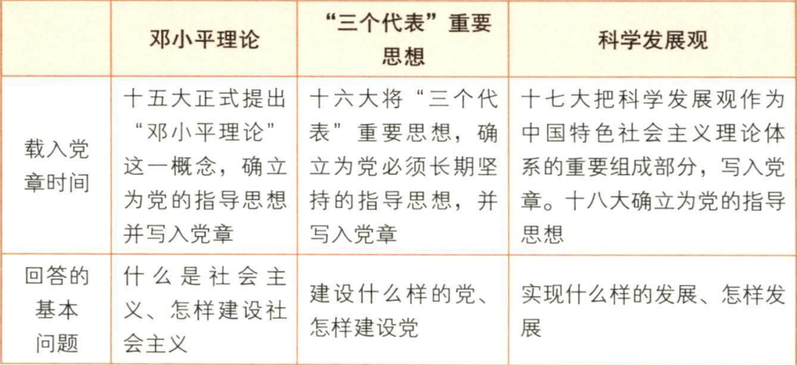

# Review By Questions
仅作复习提示用
## 简答题
- 简述党在中国社会主义建设道路的初步探索中取得了哪些重要的理论成果
  - 调动一切积极因素为社会主义事业服务的思想
    - 坚持党的领导
    - 发展社会主义民主政治
    - 有一个如何认识社会主义发展阶段和社会主义建设规律的问题
  - 正确认识和处理社会主义社会矛盾的思想
    - 基本矛盾
  - 走中国工业化道路的思想
    - 以农业为基础，以工业为主导，以农轻重为序发展国民经济的总方针，以及一整套“两条腿走路”的工业化发展思路，
-  简述社会主义改革开放理论的主要内容
   -  新时期最鲜明的特点是改革开放。
   -  改革作为一次新的革命，不是也不允许否定和抛弃已经建立起来的社会主义基本制度，它是社会主义制度的自我完善和发展。
   -  改革不是一个阶级推翻另一个阶级那种原来意义上的革命，也不是原有经济体制的细枝末节的修补，而是对体制的根本性变革。
   -  改革是社会主义社会发展的直接动力。以是否有利于发展社会主义社会的生产力，是否有利于增强社会主义国家的综合国力，是否有利于提高人民的生活水平为标准。
   -  对外开放是建设中国特色社会主义的一项基本国策：
      -  对外开放是对世界所有国家的开放。它不仅是经济领域的开放，还包括科技、教育、文化等领域的开放。
      -  实行对外开放要正确对待资本主义社会创造的现代文明成果。
      -  对外开放要高度珍惜并坚决维护中国人民经过长期奋斗得来的独立自主权利。
## 辨析题
- 社会主义社会不能发展市场经济
  - 错误
  - 计划经济和市场经济不是划分社会制度的标志
  - 计划和市场都是经济手段，对经济活动的调节各有优劣，社会主义实行市场经济是要把两者的优势结合起来
  - 市场经济作为资源配置的手段本身不具有制度属性，可以和不同的社会制度结合，从而表现出不同的性质
  - 意义
    - 实现了马克思主义政治经济学的重大创新
    - 是中国特色社会主义政治经济学的重要组成部分
    - 为社会主义市场经济体制改革目标的确立和中国特色社会主义经济建设提供了指南
- 